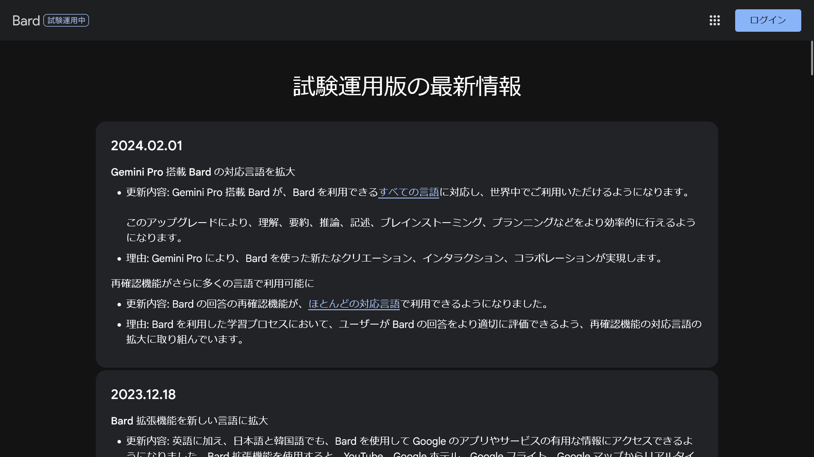
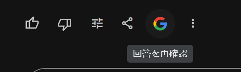

2024年2月2日（日本時間）、GoogleがAIチャットボット「Bard」のアップデートを発表しました。これにより、**BardのGemini Proと呼ばれる高性能なAIモデルが日本語を含む全言語に対応しました**。

今回は、Google Bardの最新アップデートについて、その内容と背景をわかりやすく解説します。

## Bardとは？

Google Bardは、**チャットAIの一種**です。ユーザーが入力した質問や指示に対して、自然言語を使って返答します。

OpenAIのChatGPTやMicrosoftのCopilotと同様に、対話型AI技術をベースにしていますが、Googleが独自に開発したもので、Googleならではの情報アクセス力と組み合わさっているのが特徴です。

## Gemini Proとは？

**Gemini Proは、Bardの脳みそともいえるAIモデル**で、2023年12月に最初に[公開](https://blog.google/products/bard/google-bard-try-gemini-ai/)されました。これは、テキストだけでなく、画像、音声、動画、コードなど、さまざまなタイプの情報を理解し、行動に移すために設計された高度なマルチモーダル推論能力を持っています。

それまでのモデルと比べて格段に能力が高く、さまざまな基準において、とくに**理解力や要約、推論、計画作成などの能力が向上**しています。

しかし、これまでBardのGemini Proは英語でしか使えませんでした。英語以外の言語では、Gemini Proではない古いモデルが使用されていました。

API経由では日本語を含む多くの言語に対応していましたが、Bardの公式サイトでは英語のみの対応でした。

## 2024年2月のアップデート内容

*画像：[Bardのニュースや最新情報 - Google Bard](https://bard.google.com/updates)より*

今回、GoogleはGemini Proの全言語サポートを含むアップデートを発表しました。

### すべての言語でGemini Proが利用可能に

2024年2月1日のアップデートにより、**Gemini Pro搭載のBardは、Bardが利用できる[全言語](https://support.google.com/bard/?p=gemini_pro_countries)に対応しました**。

これはつまり、日本語を含む世界中の数多くの言語で、Gemini Proの高度なAI機能を用いた理解、要約、推論、記述、ブレインストーミング、プランニングが可能になったということです。

### 再確認機能の多言語対応

さらに、Bardの回答内容の精度を確かめる「回答の再確認」機能も、[多くの言語](https://support.google.com/bard?p=exup_dc_exp)で利用可能になりました。これにより、ユーザーはBardの回答をさらに適切に評価できるようになり、学習プロセスがより向上するとのことです。

## Gemini Proの使い方

Gemini Proを使うには、[Bardの公式サイト](https://bard.google.com)を開き、通常どおりにBardと対話します。Gemini Proが利用可能な言語であれば、自動的にGemini Proが利用されます。

なお、筆者がBardに「あなたはGemini Proですか？」と尋ねたところ、次のような応答が返ってきました。

> 私には Gemini Pro が搭載されています。Gemini Pro は、Google による最先端  AI 言語モデルのひとつです。 私の知識と機能はテキストとコードの膨大なデータセットに基づいているため、世界中のユーザーをサポートすることができます。

## 回答の再確認の使い方

Gemini ProやChatGPTなどを含む大規模言語モデル（LLM）は、ときどき虚偽の情報をでっち上げる「幻覚」という症状を起こすことが知られています。LLMの出力は参考程度に留め、信頼性の高い情報源を確認する必要があります。

今回のアップデートでは、回答の正確性の確認を補助するための機能がほとんどの言語で利用可能になりました。

Bardの回答を再確認するには、回答の下部に表示されるGoogleのロゴをクリックします。

しばらく待つと、回答の確認結果が表示されます。

緑色にハイライトされた部分は、Google検索でBardの記述と似ているコンテンツが見つかったことを示しています。該当するコンテンツのリンクが表示されますが、Bardが必ずしもそのコンテンツから回答を生成したわけではないことに注意してください。

オレンジ色にハイライトされた部分は、Bardの記述と異なるコンテンツが見つかったか、関連性のあるコンテンツが見つからなかったことを示しています。リンクがあれば、そのリンクが表示されます。

それぞれのハイライトされた箇所をクリックすると、Google検索で見つかったコンテンツが表示されます。

なお、ハイライトされなかった部分は十分な情報が見つからなかったか、事実にもとづく情報の提供を目的としていない部分です。

## まとめ

今回のアップデートで、Google BardがグローバルなAIチャットボットとしての地位をより強固なものにするだけでなく、より自然に、そして幅広い言語で高度な対話体験を提供できるようになります。

2023年のMade by Googleで、GoogleはBardを搭載したGoogleアシスタント「Assistant with Bard」の開発を[発表](https://blog.google/products/assistant/google-assistant-bard-generative-ai/)しています。Assistant with Bardはまだ公開されていませんが、Bardがすべての言語でGemini Proを利用できるようになったことでAssistant with Bardへの期待も高まります。

## 参考

- [Bardのニュースや最新情報 - Google Bard](https://bard.google.com/updates)
- [Bard の回答を再確認する - パソコン - Bard ヘルプ](https://support.google.com/bard/answer/14143489?hl=ja)
