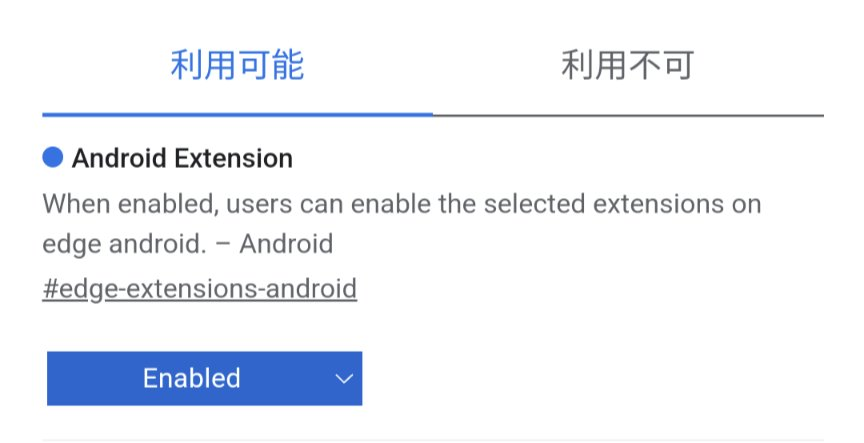
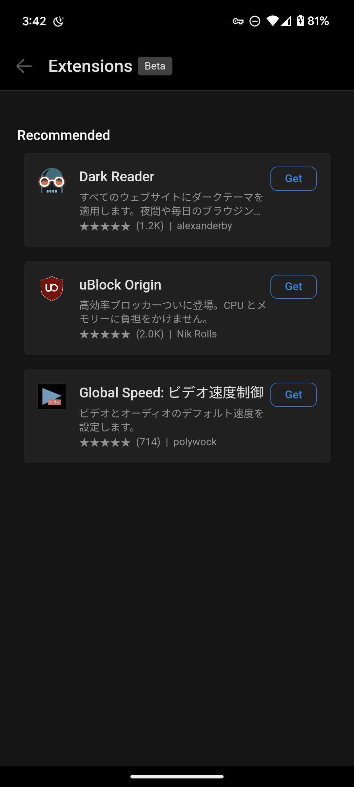

AndroidでのWebブラウジング体験が、Android版Microsoft Edgeの最新アップデートで大きく変わるかもしれません。

**CanaryビルドのMicrosoft EdgeがAndroid上で拡張機能のサポートを開始しました**。

これまでAndroidで拡張機能をサポートしていた主要ブラウザーはFirefoxだけでしたが、この新たな動きで選択肢が広がる可能性があります。この記事では、この変更の重要なポイントと使い方を詳しく解説します。

## Android版Microsoft Edgeで拡張機能サポート開始

Android上でのWebブラウズは、情報検索からオンラインショッピング、動画のストリーミングに至るまで、私たちの日常に欠かせないものとなっています。

また、ブラウザーに拡張機能をインストールすることでさまざまな追加の機能を利用できます。

これまで拡張機能の恩恵を受けるにはPCやAndroid版Firefoxが必要でした。

ところが、**Microsoft EdgeのCanaryビルドの最新のアップデートで、一部の拡張機能を利用できるようになりました**。

### 拡張機能とは？

拡張機能とは、ブラウザーの機能を拡張し、より快適なWebブラウジング体験を提供するための追加のアプリのようなものです。

たとえば、広告ブロッカー、ダークモード、動画速度調整など、多様な用途に合わせた拡張機能が存在します。

## 拡張機能の利用開始方法

*Edgeで拡張機能を有効にするフラグ*

Microsoft EdgeのCanaryビルドで拡張機能を利用するためには、次の手順に従ってください。

1. Android端末でMicrosoft EdgeのCanaryビルドをインストールします
2. Edgeで`edge://flags`にアクセスする
3. ［#edge-extensions-andoird］を［Enabled］に設定し、Edgeを再起動する
4. 再起動後、メニューから［すべてのメニュー］>［Extensions］を選択すると、拡張機能のインストール画面が表示される

:::caution
Canaryビルドは、非常に初期の開発段階で公開されるソフトウェア版です。不安定な動作やバグが含まれる可能性があるため、注意してください。
:::

### 利用可能な拡張機能

現時点で利用可能な拡張機能は、次の3つです。

- **Dark Reader**（すべてのWebページをダークモードにする拡張機能）
- **uBlock Origin**（広告ブロッカー）
- **Global Speed**（動画の再生速度を変更する拡張機能）

広告ブロッカーやダークモード機能、動画の再生速度を調整する機能など、すぐに役立つものから始められます。

今後他の拡張機能もサポートされるかどうかは不明ですが、人気で有名な拡張機能がサポートされることを期待しています。

## まとめ

Android版Microsoft Edgeでの拡張機能サポート開始は、スマホでのWeb閲覧が進化する大きな一歩です。

とくに、広告ブロックやダークモードが好きな方にとっては待ち望んだニュースかもしれません。ぜひ、Android版Edgeの拡張機能を試してみてください。
