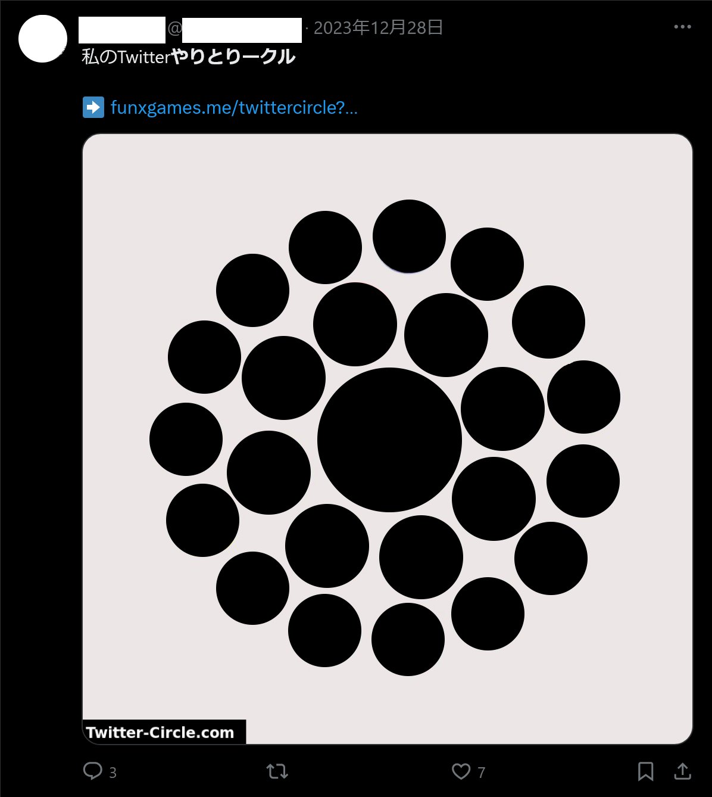
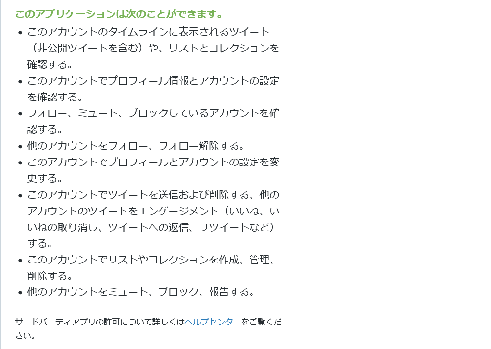
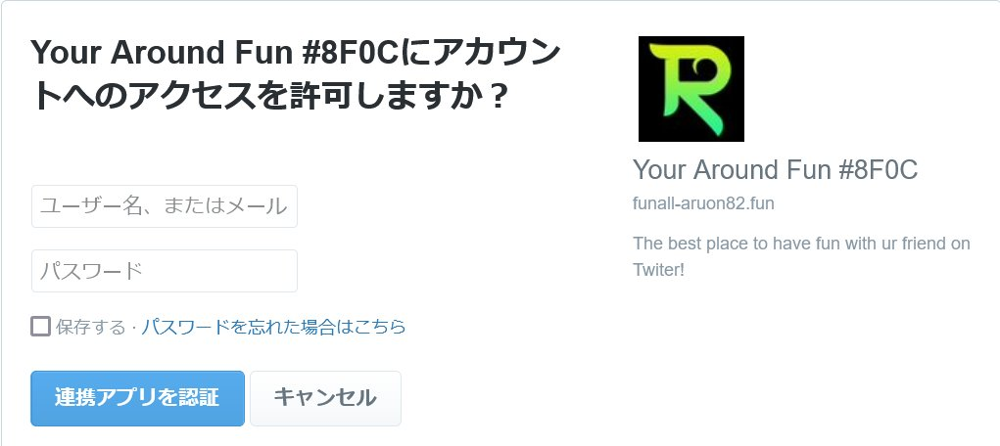
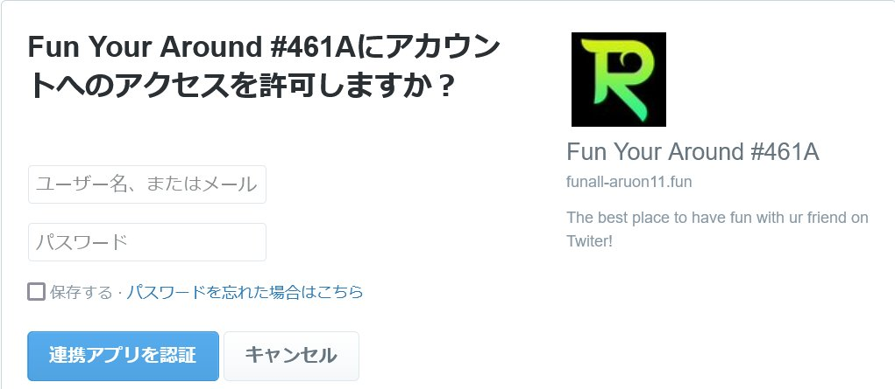
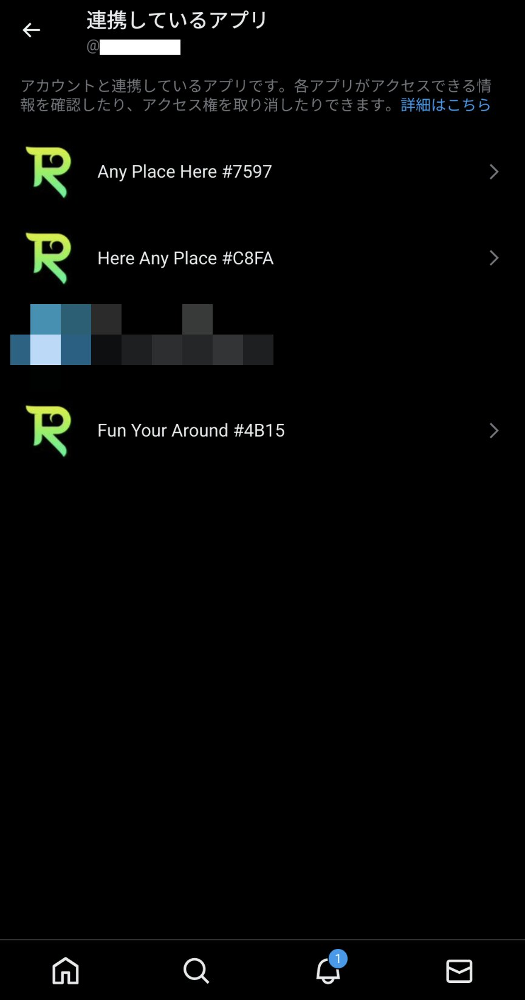

Twitter（X）で「**私のTwitter家族**」「**私のTwitterやりとりークル**」などを見かけたことはありませんか？

実は、これは**悪質なスパム**です。また、**犯罪組織がかかわっている可能性**もあります。この記事では、「私のTwitter家族」「私のTwitterやりとりークル」などの問題点や危険性について解説します。

*「私のTwitterやりとりークル」のスクリーンショット。ユーザー名やアイコンなどを加工*

ツイートバージョン（内容はこの記事と同じ）はこちら。

<blockquote class="twitter-tweet" data-dnt="true" data-theme="dark">
【⚠️注意喚起⚠️】 「あなたが2024年のバレンタインを一緒に過ごすTwitterの特別な人」 「私のTwitterやりとりークル」 というやつはスパムなので注意。  ・犯罪組織が関わっている可能性が高い（詳細はリプで後述） ・連携するとTwitterアカウントを操作され、知らないアカウントをフォローしてしまう… <a href="https://t.co/pwABNJ82ZZ">pic.twitter.com/pwABNJ82ZZ</a>
&mdash; ろぼいん (@keita_roboin) <a href="https://twitter.com/keita_roboin/status/1753958776951206379?ref_src=twsrc%5Etfw">February 4, 2024</a></blockquote> 

## 要約

詳しく書くと長くなるので、要点だけを知りたい人のために要約します。

- 「私のTwitter家族」「私のTwitterやりとりークル」などは**スパム**
- アカウント連携をしてしまうとアカウントを操作され、**知らないアカウントをフォローしてしまう**
- **サイバー犯罪組織が関与している可能性が高い**
  - 犯罪組織の資金源になっている可能性も

ということで、ここからはこれらについて根拠も含めて詳しく解説します。

## アカウント連携をするとどうなるか

Twitterでこんなサイトを見かけたことはありませんか？

- 「あなたが2024年のバレンタインを一緒に過ごすTwitterの特別な人は」
- 「私のTwitterやりとりークル」
- 「私のTwitter家族」
- 「Twitter家系図」

これらはすべて**悪質なスパム**です。

これらのツイートには、funxgames[.]meというURLが添付されています。このURLにアクセスすると、roundyearfun[.]orgというサイトにリダイレクトされます。

この記事では、これをRound Year Funと呼びます。

Round Year Funにアクセスすると、Twitterのアカウント連携を求められます。そして、**アカウント連携をするとアカウントを操作され、知らないアカウントを勝手にフォローしてしまいます**。

実際に連携して検証したところ、連携した直後に見知らぬアカウントを5つフォローしていました。

Forbesに寄稿された記事でも、同様の指摘がされています。

- [That ‘Twitter Family Tree’ Trend Is Secretly Following Random Accounts Without Your Consent](https://www.forbes.com/sites/jacksonweimer/2021/04/10/that-twitter-family-tree-trend-is-secretly-following-random-accounts--without-your-consent/)

実は、アカウント連携の画面をよく見ると、Round Year Funはプロフィールの設定の変更やツイート、アカウントのフォローなどの権限を要求しています。

アカウント連携するとRound Year Funにこれらの権限を与えてしまうわけです。

これらの権限は、本来は正当なサービスが正当な目的で利用するためのものです。たとえば、ライブ配信アプリでは簡単にライブの告知をできるように、ツイートの権限を要求することがあります。

しかし、Round Year Funはこれらを悪用しています。

また、連携画面に表示されるサービス名には、いくつものバリエーションがあります。通常は、表示されるサービス名は1つです。複数用意して分散させることで、Twitterによってアプリを停止されるリスクを減らしていると考えられます。

## 犯罪組織が関わっている？

興味深いことに、「私のTwitterやりとりークル」「私のTwitter家族」などには**サイバー犯罪組織が関与している可能性があります**。

先ほど説明したように、これらのツイートに添付されているURLにアクセスするとRound Year Funにリダイレクトされます。

セキュリティー企業のトレンドマイクロによる調査では、**Round Year Funの背後にサイバー犯罪組織が存在している可能性が指摘されています**。

- [Windows, Android Users Targeted by Maikspy Spyware](https://www.trendmicro.com/tr_tr/research/18/e/maikspy-spyware-poses-as-adult-game-targets-windows-and-android-users.html)

この調査によると、Round Year Funは「Maikspy」というスパイウェアのC&Cサーバーとして運用されていたとのことです。

簡単に言い換えると、Round Year Funは「**コンピューターウイルスに指示を出したり、ウイルスを使って盗み取ったデータを収集したりしている司令塔**」ということになります。

:::note
厳密にはスパイウェアとウイルスは違いますが、ここでは「スパイウェアは情報を盗み取るウイルスのこと」という理解で大丈夫です。
:::

C&Cサーバーとして使われていただけなら、サーバーが乗っ取られていたという可能性もあります。しかし、Round Year FunのTwitterアカウントが前述のスパイウェアの宣伝をツイートしていたらしいので、ほぼ確実に黒だと思われます。

この調査結果は、サイバー犯罪グループがRound Year Funを運営しているか、操作できる状態にあることを示しています。

前述の調査は2018年のものなので、現在もC&Cサーバーとして運用されているかは分かりません。しかし、Round Year Funはかなり怪しいといえます。

## 知らないアカウントをフォローしてしまう「だけ」ではない

Round Year Funにアカウントを連携すると、知らないアカウントをフォローしてしまうだけではありません。

前述のように、Round Year Funはツイートやリツイートの権限も要求しています。また、サイバー犯罪組織が関わっている可能性が高いことが指摘されています。

これはあくまで可能性の話ですが、アカウント連携した人たちのアカウントを操作して「**ウイルスをダウンロードするように誘導するツイートを投稿する**」といったことも可能なわけです。

あくまで「そういったこともできる」という話ではあります。

しかし、サイバー犯罪組織が関わっている可能性が高い以上、そういったことが起こらないとは言い切れません。

**「Round Year Funは知らないアカウントをフォローしてしまう『だけ』」と考えるのは危険**です。

-----

ところで、Round Year Funは勝手にアカウントをフォローして何がしたいのでしょうか？

ここからは根拠のないただの妄想なので、話半分に聞いてください。

私は、あれは「そういうサービス」だと考えています。

「お金を払うとフォロワーを増やしてくれるサービス」ってありますよね？いわゆる「フォロワーを買う」というやつです。要するにアレではないかなと考えています。

1. フォロワーを増やしたい人がお金を払う
2. Round Year Funにアカウント連携した人たちのアカウントを使って↑の人をフォローする

ということです。先ほども書いたようにこれはただの妄想なので、外部から確認する方法はありません。

しかし、もしこれが当たっていたら **「私のTwitterやりとりークル」「私のTwitter家族」などは犯罪組織の資金源**ということになりますね。根拠のない妄想ではありますが。

いずれにしても、犯罪組織が関わっている可能性が高いことと、勝手に知らないアカウントをフォローしてしまうことは事実なので、使わない方がいいといえます。

## 連携を解除するには？

Round Year Funはアカウントを乗っ取っているわけではなく、アカウント連携を悪用しているに過ぎません。

そのため、**連携を解除すればそれ以降はアカウントを操作されることはありません**。ただし、勝手にフォローしてしまったアカウントは、**手動でフォローを解除する必要があります**。

連携を解除するには、設定の［セキュリティとアカウントアクセス］>［アプリとセッション］>［連携しているアプリ］から黄緑のRのロゴの連携を切ってください。

なお、［連携しているアプリ］に表示される名前にはいくつかのバリエーションがあります。

また、**「私のTwitter家族」「私のTwitterやりとりークル」などのツイート（ポスト）の削除も忘れないようにしてください**。そのまま放置しておくと他の人がリンクを開いてしまい、被害を広げてしまう可能性があります。

## まとめ

「私のTwitter家族」「私のTwitterやりとりークル」などの危険性や犯罪組織が関わっている可能性について解説しました。

これらのツイートを見かけても、リンクを開かないようにしてください。また、すでにアカウント連携してしまった場合は、すぐに連携を解除してください。

もし、「私のTwitter家族」「私のTwitterやりとりークル」などをやっている人を見かけたら、この記事を教えてあげてください。

この記事のツイートバージョン（内容は同じ）もあるので、ぜひ拡散をお願いします。

<blockquote class="twitter-tweet" data-dnt="true" data-theme="dark">
【⚠️注意喚起⚠️】 「あなたが2024年のバレンタインを一緒に過ごすTwitterの特別な人」 「私のTwitterやりとりークル」 というやつはスパムなので注意。  ・犯罪組織が関わっている可能性が高い（詳細はリプで後述） ・連携するとTwitterアカウントを操作され、知らないアカウントをフォローしてしまう… <a href="https://t.co/pwABNJ82ZZ">pic.twitter.com/pwABNJ82ZZ</a>
&mdash; ろぼいん (@keita_roboin) <a href="https://twitter.com/keita_roboin/status/1753958776951206379?ref_src=twsrc%5Etfw">February 4, 2024</a></blockquote>
