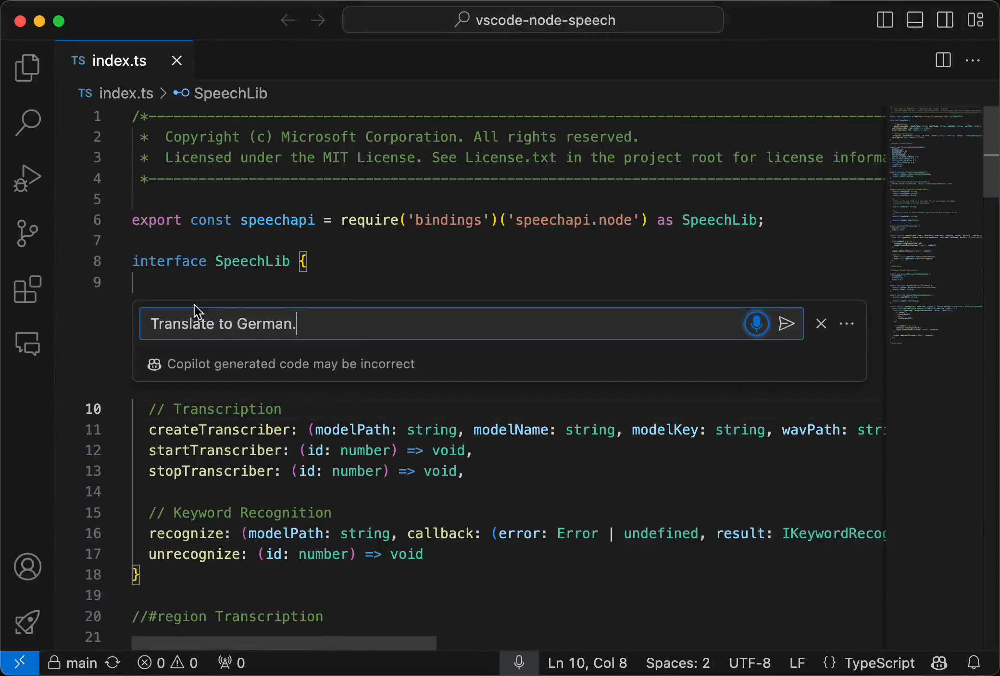
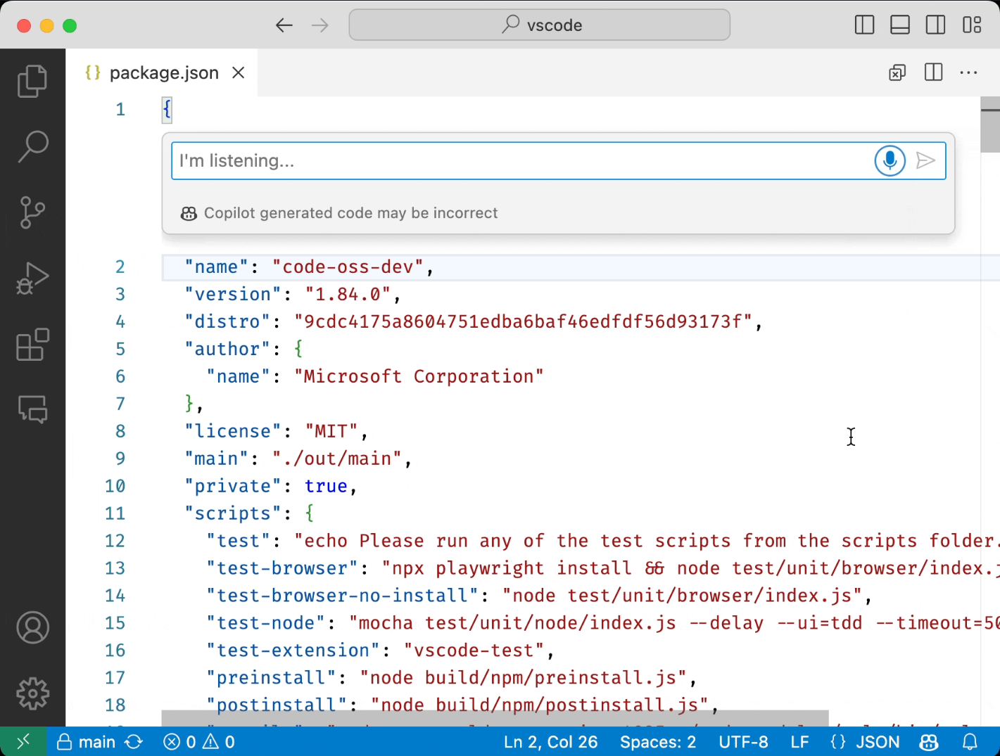

Visual Studio Code (VS Code) に便利な機能が追加されました。

今回追加された「**Hey Code**」ボイスコマンドを使えば、音声でプログラミングのサポートを受けられるようになり、開発の効率が大幅に向上します。この記事では、「Hey Code」機能の魅力と、使い始めるための基本的な情報について解説します。

## 「Hey Code」とは？

*画像：[Visual Studio Code January 2024](https://code.visualstudio.com/updates/v1_86#_use-hey-code-voice-command)より*

「Hey Code」とは、**VS Codeで新たに導入されたボイスコマンド機能**です。この機能を有効にすることで、声による指示でGitHub Copilot Chatとの音声セッションを開始できます。

音声認識はすべてローカルで処理され、サーバーに送信されることはありません。

「Hey Code」コマンドに続けてさまざまな指示をすることで、コーディングの補助を受けられます。

## 「Hey Code」を利用するための設定方法

「Hey Code」機能を使い始めるためには、いくつかの設定が必要です。

まずは、VS Codeに必要な拡張機能をインストールしましょう。「Hey Code」機能を使用するには、「[GitHub Copilot Chat](https://marketplace.visualstudio.com/items?itemName=GitHub.copilot-chat)」と「[VS Code Speech](https://marketplace.visualstudio.com/items?itemName=ms-vscode.vscode-speech)」の2つの拡張機能が必要です。

### GitHub Copilot Chat

*画像：[GitHub Copilot Chat - Visual Studio Marketplace](https://marketplace.visualstudio.com/items?itemName=GitHub.copilot-chat)より*

GitHub Copilot Chat拡張機能とは、**GitHub Copilotの会話型AIアシスタンス機能をVS Codeで利用するためのものです**。バグのトラブルシューティングや新機能の開発時など、どんな課題にも対応できるよう支援します。

:::note
GitHub Copilotは、30日間の無料トライアルを提供しています。有効なGitHub Copilotライセンスが必要になります。
:::

### VS Code Speech

*画像：[VS Code Speech - Visual Studio Marketplace](https://marketplace.visualstudio.com/items?itemName=ms-vscode.vscode-speech)より*

**VS Codeに話しかけるためには、VS Code Speech拡張機能が必要です**。この拡張機能は、音声からテキストへの変換機能をVS Codeに追加します。すべての音声データは、インターネット接続なしにローカルで処理されます。

:::note
現在、サポートされている言語は英語のみですが、将来的には他の言語もサポートされる予定です。
:::

### 拡張機能のインストール

これらの拡張機能は、次の手順でインストールできます。

1. VS Codeを開く
2. サイドバーの拡張機能アイコンをクリックする
3. 検索ボックスに「GitHub Copilot Chat」と入力し、検索結果から該当の拡張機能を見つける
4. ［インストール］ボタンをクリックしてインストールする
5. 同様に、検索ボックスに「VS Code Speech」と入力し、検索結果から拡張機能をインストールする

### 「Hey Code」機能を有効にする

拡張機能をインストールしたら、次は「Hey Code」機能を有効にします。

1. VS Codeの設定を開く（`cmd + ,` もしくは `ctrl + ,`）
2. 設定の検索ボックスに`accessibility.voice.keywordActivation`と入力する
3. `accessibility.voice.keywordActivation`を見つけ、`chatInView`、`quickChat`、`inlineChat`、`chatInContext`の中から、好みに合わせて選択する

:::tip
`accessibility.voice.keywordActivation`が見つからない場合は、VS Codeを再起動してみてください。
:::

なお、それぞれのオプションの意味は次の通りです。

- `chatInView`: Chatビューから音声チャットを開始
- `quickChat`: Quick Chatコントロールからクイック音声チャットを開始
- `inlineChat`: エディターのインラインチャットから音声チャットを開始
- `chatInContext`: エディターにフォーカスがある場合はインラインチャットから、それ以外ではChatビューから音声チャットを開始

## まとめ

「Hey Code」機能の導入により、VS Codeでの開発作業がこれまで以上に直感的でスムーズになります。GitHub Copilotとの統合により、コーディングの質と効率が大きく向上します。また、音声データのローカル処理によりプライバシーも保護されます。

ぜひ、「Hey Code」機能を使ってみてください。

## 参考

- [Visual Studio Code January 2024](https://code.visualstudio.com/updates/v1_86#_use-hey-code-voice-command)
- [GitHub Copilot Chat - Visual Studio Marketplace](https://marketplace.visualstudio.com/items?itemName=GitHub.copilot-chat)
- [VS Code Speech - Visual Studio マーケットプレイス](https://marketplace.visualstudio.com/items?itemName=ms-vscode.vscode-speech)
