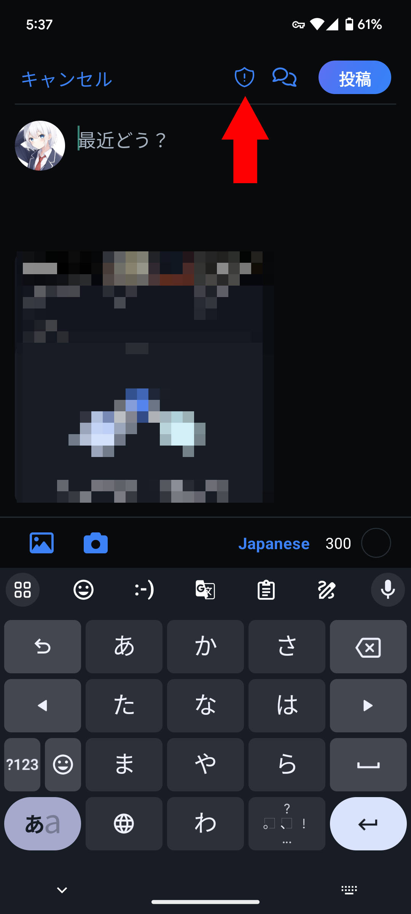

import ArticleCard from "@components/ArticleCard.astro";

新しいSNS「Bluesky」は、2024年2月7日にようやく招待制を廃止し、だれでも参加できるようになりました。しかし、そこではセンシティブなコンテンツに対して、非常に厳しいルールが設けられています。

今回は、Blueskyでセンシティブなコンテンツを投稿する際に **「必ず」必要となる専用のフラグの付け方**について、詳しく説明します。

なお、センシティブなコンテンツを表示する方法は、こちらの記事で解説しています。

<ArticleCard link="/article/2024/02/08/how-to-enable-sensitive-contents-on-bluesky/" />

## なぜフラグを付ける必要があるの？

Blueskyでは、**センシティブなコンテンツに対して必ずフラグを付ける必要があります**。これを怠ると、**投稿が削除されるだけでなく、アカウントが凍結されるリスクも**伴います。

実際、Blueskyを利用し始めたイラストレーターの間で、フラグ付けを怠ったためにアカウントが次々に凍結されている事例が報告されています。そのため、センシティブなコンテンツを投稿する際には、フラグの設定を怠らないようにしましょう。

## センシティブフラグの付け方

では、実際にセンシティブなコンテンツを投稿する際に、どうやってフラグを付ければいいのでしょうか。

まずは投稿画面を開きます。画像を添付したら、投稿画面の右上にあるアイコン（**盾の中にビックリマークがあるマーク**）をクリックします

表示された選択肢から［**提案**］［**ヌード**］［**ポルノ**］の中からもっとも適切なものを選びます。

- **提案**は挑発的な内容、成人向けの写真に適しています（おそらく「suggestive」の誤訳）。ただし、これは比較的軽度のコンテンツ向けです。
- **ヌード**は芸術的、または性的でないヌードに対して使用します。少しセンシティブなイラストに最適です。
- **ポルノ**は性的行為や性的なヌードを含むコンテンツに設定します。がっつりセンシティブな内容に対して使用するフラグです。

必要なフラグを選択したら、［完了］をクリックします。これでセンシティブフラグの設定は完了です。

:::caution
センシティブ設定をすると、その内容を表示しない設定をしているユーザーには表示されないというデメリットがあります。

しかし、センシティブ設定を怠るとアカウントが凍結される可能性が高まるため、設定は必ず行うようにしましょう。
:::

## まとめ

センシティブなコンテンツを扱うことは、クリエイティブな発信において避けられない側面もあります。しかし、Blueskyのような新しいプラットフォーム上で活動を続けるためには、ルールを守ることが何よりも大切です。

Blueskyを使用する際には、この記事を参考にしてセンシティブフラグを正しく設定するようにしてください。
