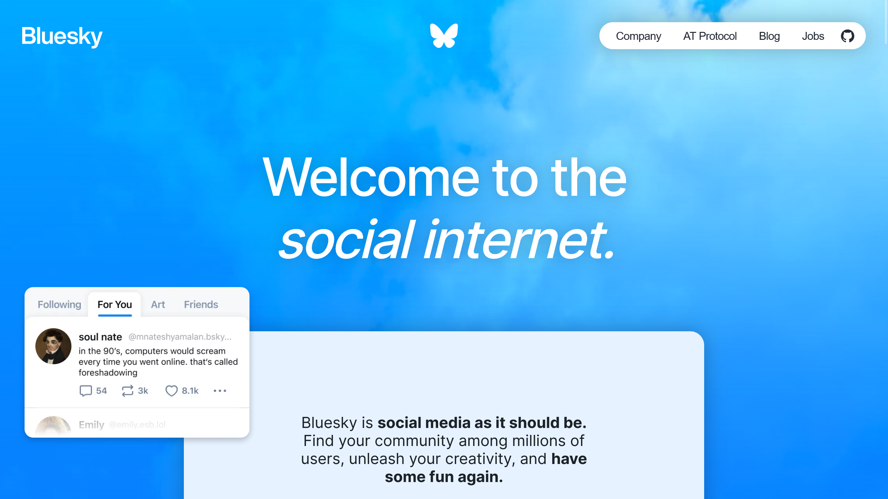
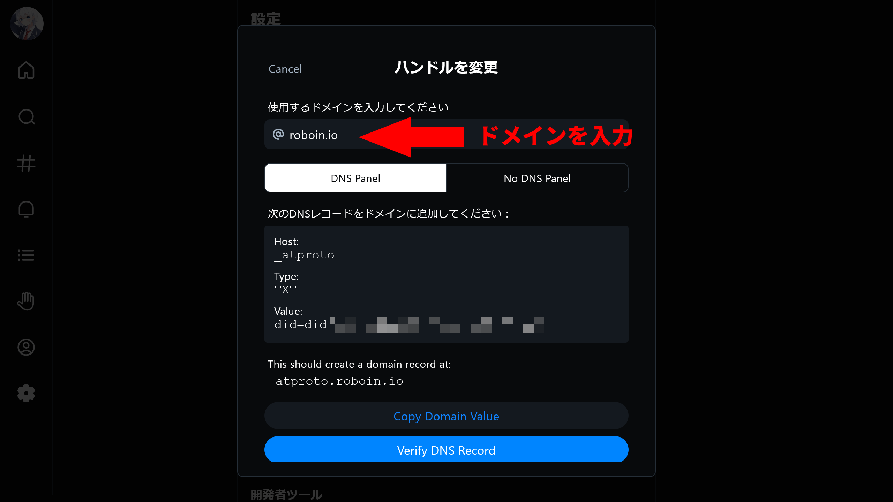
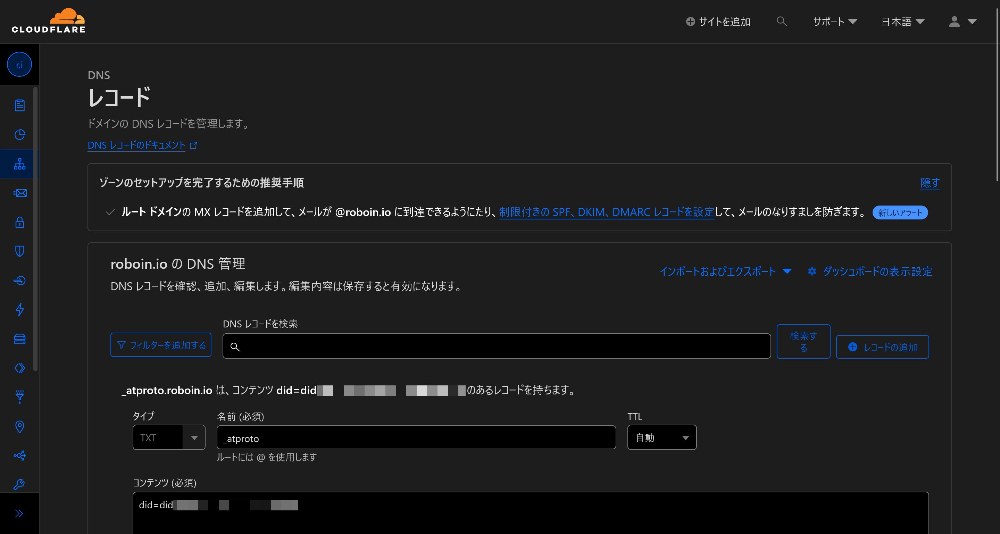

import ArticleCard from "@components/ArticleCard.astro";

分散型SNSの世界は日々進化していますが、最近とくに注目を集めているのがBlueskyです。Blueskyの特徴と本人確認の方法をしっかり理解することで、新しいSNSを最大限に活用できるようになります。

この記事では、**Blueskyの基本情報から本人確認の具体的な手順までを分かりやすく解説します**。

## Blueskyとは

*[Blueskyの公式サイト](https://bsky.social/about/)のスクリーンショット*

Blueskyは、次のような特徴をもつ新しいSNSです。

- **分散型のSNS**
- **ATプロトコルを採用**している
- ユーザーが**自分でフィードのアルゴリズムを選択**したり、開発したりできる
- MisskeyやMastodon、Threadsといった**ActivityPubとは互換性がない**
- 以前は**招待コードが必要**だったが、2024年2月7日からは**不要**になった

とくにATプロトコルの採用は、ユーザーのデータ所有権やフィードコントロールの自由度の向上に大きく貢献しています。ATプロトコルを採用したSNS同士で相互にやり取りできるため、ユーザーは自分のデータをより自由に扱えるようになります。

なお、ThreadsやMisskeyの使い方はこちらの記事で解説しています。

<ArticleCard link="/article/2023/07/06/meta-twitter-competing-app-threads/" />

<ArticleCard link="/article/2024/01/08/how-to-start-your-misskey-life/" />

## 本人確認について

Blueskyでのユーザー識別子であるハンドル（@から始まる文字列）は、通常ピリオドを使用することはできません。

しかし、自分がドメインを所有している場合には例外があり、その**ドメイン名をハンドルとして設定することが可能**です。

そのため、公式サイトを持っている場合は、そのドメインを使って本人確認ができます。

:::caution
ハンドルを変更する場合、以前使っていたハンドルは放棄する形になるため、再利用される可能性がある点には注意が必要です。
:::

:::note[ドメインとは？]
ドメインは、インターネット上での住所のようなものです。URLにはドメインが含まれます。

たとえば、Googleなら``google.com``、Amazonなら``amazon.com``、このブログなら``roboin.io``がドメインです。
:::

## Blueskyでの本人確認方法

Blueskyで自分のドメインを使って本人確認するには、次の手順を踏みます。

### 1. ハンドルの変更を開始する

まずBlueskyで［設定］>［ハンドルを変更］>［自分のドメインを持っています］を選択します。

### 2. ドメイン名を入力

表示されたテキストボックスに、本人確認に使用したい自分のドメイン名を入力します。

### 3. DNSレコードを追加

次に、ドメインのDNS設定を管理している場所で、Blueskyの指示に従いDNSレコードを追加します。たとえばCloudflareを使っている場合、次の手順を踏みます。

- DNSレコードの設定画面を開く
- ［レコードの追加］ボタンをクリック
- ［タイプ］で［TXT］を選択
- 名前に``_atproto``と入力
- ［コンテンツ］にはBlueskyに表示される［Value:］の値を入力

### 4. DNSが設定不可の場合

DNSの設定を変更できない場面もあります。その場合は［No DNS Panel］を選択します。``https://<ドメイン>/.well-known/atproto-did``にファイルを作成し、指示されたテキストデータをそのファイルに入力します。

たとえば、ドメインが``example.com``の場合は、``https://example.com/.well-known/atproto-did``にファイルを作成します。拡張子は不要です。

### 5. 確認作業

すべての設定が終わったら、［Verify DNS Record］または［Verify Text File］をクリックして、Bluesky側での確認処理が終わるのを待ちます。

## まとめ

Blueskyでの本人確認は意外とシンプルですが、ドメインの所有という前提があります。この方法を利用すれば、他のユーザーと差別化を図れます。

自分のドメインを持っている場合は、ぜひそのドメインをハンドルに設定してみてください。
