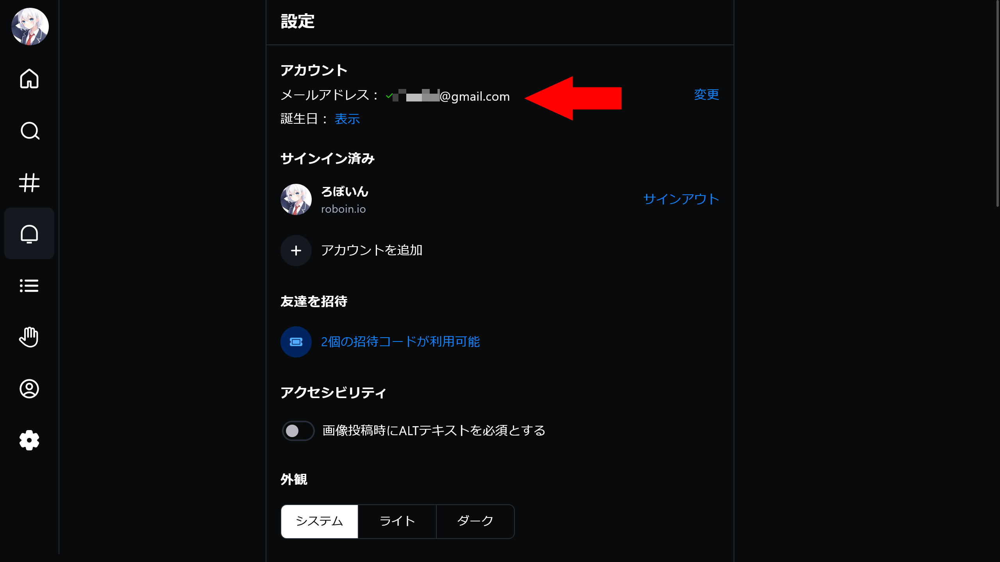
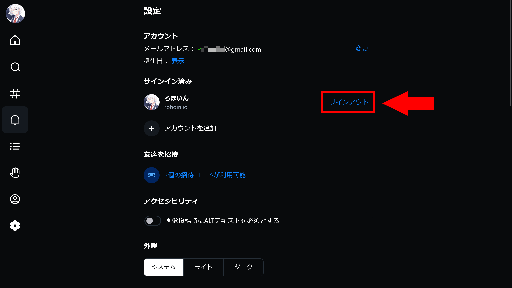
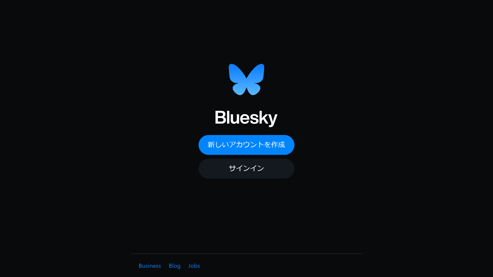
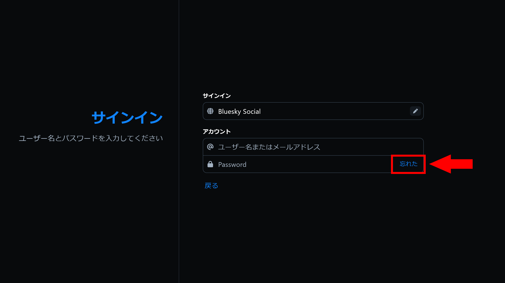
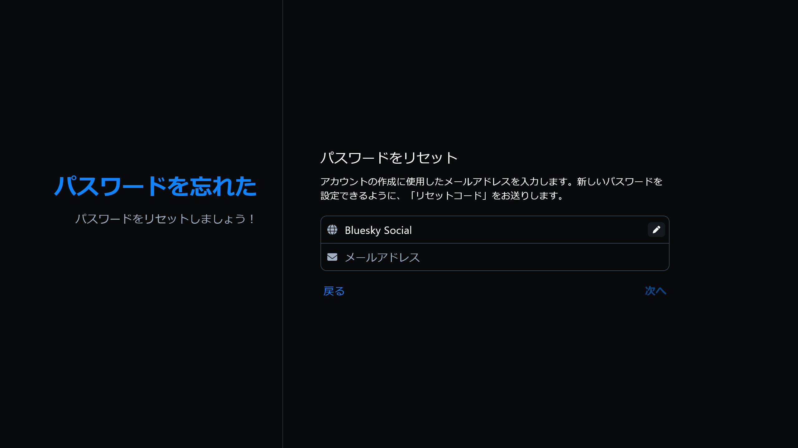

import ArticleCard from "@components/ArticleCard.astro";

**Bluesky（ブルースカイ）** は分散型のSNSで、Twitterの代替として注目されています。2024年2月7日には招待制が廃止されて誰でもアカウントを作れるようになったことで、ますます多くの人が利用するようになりました。しかし、新しいサービスであるため、使い方がわからないことも多いのではないでしょうか。

今回は、**Blueskyでパスワードを忘れてしまった場合や変更したい場合のリセット方法について詳しく解説します**。

## パスワードの変更方法が分からない？

Blueskyは、使いやすいインターフェースと透明性の高いSNSとして注目を集めています。

しかし、記事執筆時点ではパスワードを変更する方法は公式には存在していません。では、パスワードを忘れた場合、どのようにしてリセットすればいいのでしょうか？

## パスワードリセットの前にメールアドレスを確認しよう

パスワードをリセットする前に、まずは自分のメールアドレスを確認しておくことが大切です。**パスワードのリセットには、Blueskyに登録した際のメールアドレスが必要となります**。

Blueskyのアカウントを作成するときに登録したメールアドレスを忘れてしまった場合は、次の手順で確認してください。メールアドレスを覚えている場合でも、**安全のために確認しておくことをオススメします**。

1. Blueskyにログインした状態で、メニューから［**設定**］を選択する
2. 設定画面の上部にアカウントに関連付けられた**メールアドレス**が表示されるので、確認する

*Blueskyの設定画面のスクリーンショット*

設定がどこにあるか分からない場合は、次の記事を参考にしてください。

<ArticleCard link="/article/2024/02/13/how-to-open-bluesky-settings/" />

:::caution
メールアドレスを忘れた場合やメールアドレスが分からない場合は、パスワードをリセットできません。
:::

## Blueskyでパスワードをリセットする方法

では、実際にパスワードをリセットする手順について解説します。

:::note
この記事の内容は、Web版のBluesky公式クライアントと、筆者のGoogle Pixel 6にインストールしたAndroidアプリで動作確認しています。iOSアプリでは確認していませんが、同様の手順でパスワードをリセットできるはずです。
:::

### アカウントからログアウト

まずBlueskyのアカウントからログアウトします。

ログアウトするには設定を開き、該当するアカウントの［サインアウト］をクリックします。

### Blueskyにアクセス

Blueskyからログアウトしたら、ブラウザーからBlueskyにアクセスし、［サインイン］をクリックします。

### ［忘れた］をクリック

［Password］欄の［忘れた］をクリックしてください。これにより、パスワードのリセット画面が表示されます。

### メールアドレスを入力

パスワードのリセット画面が表示されるので、先ほど確認したメールアドレスを入力します。メールアドレスを入力したら、［次へ］をクリックしてください。

### メールでリセットコードを受け取る

入力したメールアドレス宛に、パスワードリセット用のコードが送られてきます。指示に従い、パスワードをリセットしてください。

この手順で、パスワードをリセットしてBlueskyアカウントに再びアクセスできるようになります。

一般的なWebサイトではメールに添付されたリンクを開くだけでパスワードを変更できますが、Blueskyではリセットコードが送られてくるという点が異なります。

<small>（技術的には、コードをユーザーに入力してもらうかURLパラメーターに付加するかというだけの違いですけどね）</small>

:::tip
リセットメールが届かない場合は、迷惑メールフォルダーをチェックしてみてください。

また、**リセットコードは他人に共有しないでください**。リセットコードを共有してしまうと、他の人が勝手にパスワードを変更できてしまう可能性があります。
:::

:::note[コラム：安全なパスワードの作り方]
[総務省のサイト](https://www.soumu.go.jp/main_sosiki/cybersecurity/kokumin/business/business_staff_01.html)によると、パスワードは「ある程度長いランダムな英数字の並びが好ましい」とされています。

ランダムな英数字だと覚えにくいという場合は、無関係な複数の単語を組み合わせたり数字を挟んだりすることが推奨されています。

また、パスワード管理アプリなどを使うと、強固なパスワードの生成と保存の両方ができるのでオススメです。
:::

## まとめ

Blueskyで簡単にパスワードをリセット方法は存在していませんが、いくつかの手順を踏むことでリセットできます。この記事を参考に、Blueskyでパスワードを忘れた場合の対処法を覚えておきましょう。

また、[BlueskyのGitHubリポジトリー](https://github.com/bluesky-social/social-app)の情報によると、パスワードを簡単にリセットできる機能を開発中のようです。記事執筆時点ではまだ実装されていませんが、内部トラッカーに登録されているとのことなので、今後のアップデートでリリースされるかもしれません。

機能の実装状況が気になる場合は、次のIssueをチェックしてみてください。

https://github.com/bluesky-social/social-app/issues/413

https://github.com/bluesky-social/social-app/issues/250
