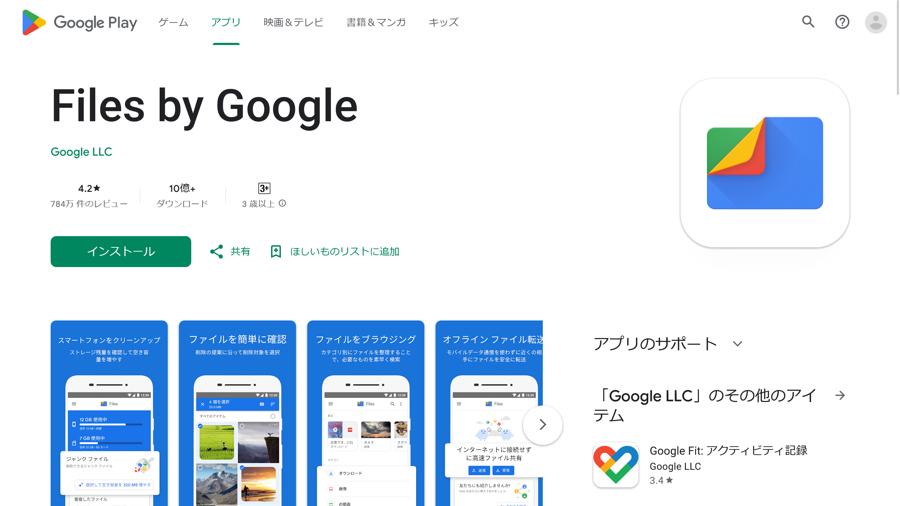

デジタル社会において、プライバシー保護は非常に重要なテーマです。スマートフォンに保存される情報量は日増しに増え、その中には他人に見られたくない内容も含まれることがあります。

そんなときに役立つのが、Files by Googleアプリの「**安全なフォルダ**」機能です。この記事では、その設定方法や使い方、さらに注意点まで詳しく説明します。

## Files by Googleとは？

*[Files by Googleのストアページ](https://play.google.com/store/apps/details?id=com.google.android.apps.nbu.files)のスクリーンショット*

「[Files by Google](https://play.google.com/store/apps/details?id=com.google.android.apps.nbu.files)」とは、**Googleが開発したAndroid端末用のファイル管理アプリ**です。

不要なファイルの削除やファイルの整理、さらにはクラウド上とのファイル共有などさまざまな機能があります。その中でも「安全なフォルダ」機能は、とくにプライバシーに配慮した機能として特徴的です。

## 安全なフォルダとは？

安全なフォルダは、Files by Googleアプリ内にある機能の1つで、スマートフォンに保存される大切なファイルをプライバシー保護するための機能です。

**ファイルやフォルダーにロックをかけ、他人に見られたくない情報を安全に保管できます**。また、安全なフォルダ内のファイルは、他のアプリからも見ることができないようになっています。

この機能はAndroid 8.0以上の端末で利用できます。

## 安全なフォルダの設定方法

ここからは、安全なフォルダの設定方法について説明します。

### PINまたはパターンの設定

まずは、安全なフォルダのロックに使うPINまたはパターンを設定します。

1. Android端末で「Files by Google」アプリを開く
2. トップ画面で［コレクション］までスクロールする
3. ［安全なフォルダ］を選択し、PINかパターンのどちらかを選ぶ
   - ［PIN］を選んだ場合はPINを入力して確認し、［次へ］をタップする
   - パターンを選んだ場合はパターンを入力して確認し、［次へ］をタップする

:::danger
**設定したPINやパターンを忘れると、安全なフォルダ内のファイルにアクセスできなくなります**。PINやパターンを忘れないようにしましょう。
:::

### ファイルの移動

ファイルを安全なフォルダに移動させるには、Files by Googleアプリ内で移動したいファイルを選択し、縦にドットが3つ並んだメニューから［安全なフォルダに移動］をタップします。

このとき、すでに設定したPINまたはパターンを入力する必要があります。

## 安全なフォルダの使い方

### ファイルの閲覧

安全なフォルダに保存したファイルを見るには、Files by Googleのトップ画面の［コレクション］>［安全なフォルダ］の順に進み、PINまたはパターンを入力します。

### ファイルの移動

フォルダー内のファイルを元の場所に戻す際も、同じく［安全なフォルダ］から必要なファイルを選んで［移動］をタップします。

ファイルが多数ある場合は、それらをまとめて選択して移動させることも可能です。

## ロックの変更

設定したPINやパターンを変更する際は、画面左上のメニューボタンから［設定］>［安全なフォルダ］>［ロックの変更］を選び、新しいロック方式を設定します。

## 注意点

Files by Googleの安全なフォルダ機能にはいくつかの注意点があります。

- 安全なフォルダをリセットすると、その中のファイルは永久に消去されます
- 他のアプリを使ってストレージやキャッシュをクリアすると、安全なフォルダのファイルが損失する可能性があります
- 安全なフォルダ内のファイルは検索結果やカテゴリには表示されず、第三者のアプリからは開けないようになっています。また、Googleドライブへのバックアップや共有もできません

## まとめ

プライバシー保護のために、大切なファイルは「安全なフォルダ」を活用して保護しましょう。設定方法や使い方、注意点を確実に理解して、安心してスマートフォンを使用してください。
