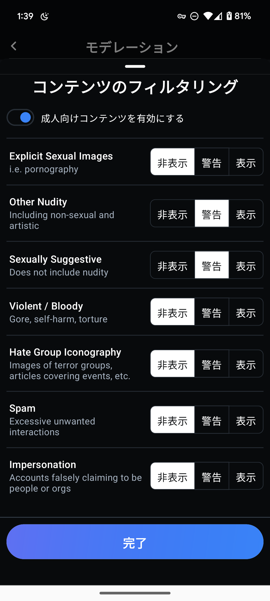

import ArticleCard from "@components/ArticleCard.astro";

Blueskyは、分散型SNSの新星として、2024年2月7日についに招待制を廃止し、誰でも自由にアクセスできるようになりました。Blueskyは既存のSNSと異なり、ATプロトコルを採用しており、ユーザーにより高いプライバシー保護と自由な発言の場を提供しています。

しかし、Blueskyでは、センシティブな内容を含む投稿には必ずフラグを付ける必要があります。これにより、環境を守りつつユーザー体験の質を維持しようとしています。

この記事では、**Blueskyでセンシティブなコンテンツを表示する方法**について解説します。

なお、センシティブなコンテンツとしてフラグを付ける方法は、こちらの記事で解説しています。

<ArticleCard link="/article/2024/02/07/how-to-flag-your-post-as-sensitive-on-bluesky/" />

## 基本設定

Blueskyでユーザーがセンシティブなコンテンツをどのように扱いたいかは、**個別に設定**できます。自分に合わせた設定にしましょう。

設定画面は次の手順で表示できます。

1. ［設定］を開く
2. ［モデレーション］に進む
3. ［コンテンツのフィルタリング］を選択する

ここで、［成人向けのコンテンツを有効にする］のトグルスイッチをオンにすると、センシティブなコンテンツの設定が有効化されます。

## 個別のコンテンツ設定

*コンテンツのフィルタリングの設定画面*

Blueskyでは、さまざまな種類のセンシティブなコンテンツに対して、**非表示**、**警告**、または**表示**の3つの選択肢から設定できます。

［非表示］に設定すると、該当するコンテンツは一切表示されません。［警告］を選択すると、コンテンツを表示する前に警告が表示され、ユーザーの同意がある場合のみ内容を表示できるようになります。［表示］にすると、特別な警告なしでコンテンツが表示されます。

### 現在サポートされているセンシティブなコンテンツの種類

- Explicit Sexual Images
- Other Nudity
- Sexually Suggestive
- Violent / Bloody
- Hate Group Iconography
- Spam
- Impersonation

これらのカテゴリーから、それぞれに対して設定を変更できるようになっています。

イラストを含むコンテンツを楽しみたい場合、**Other Nudity** や **Sexually Suggestive** を **警告**または**表示**に設定するのがオススメです。

**Explicit Sexual Images** は、非常に露骨な画像も含まれるため、**非表示**か**警告**の設定を選ぶのがオススメです。

設定を済ませたら、［完了］ボタンをクリックすると設定が保存されます。

## まとめ

センシティブなコンテンツの管理はデリケートな問題ですが、Blueskyではユーザー自身が好みに合わせたコントロールができるようになっています。

この記事を参考に、自分に合った設定に変更してみてください。
