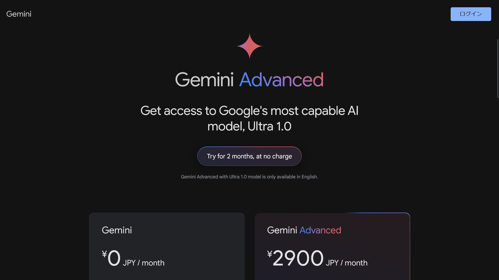
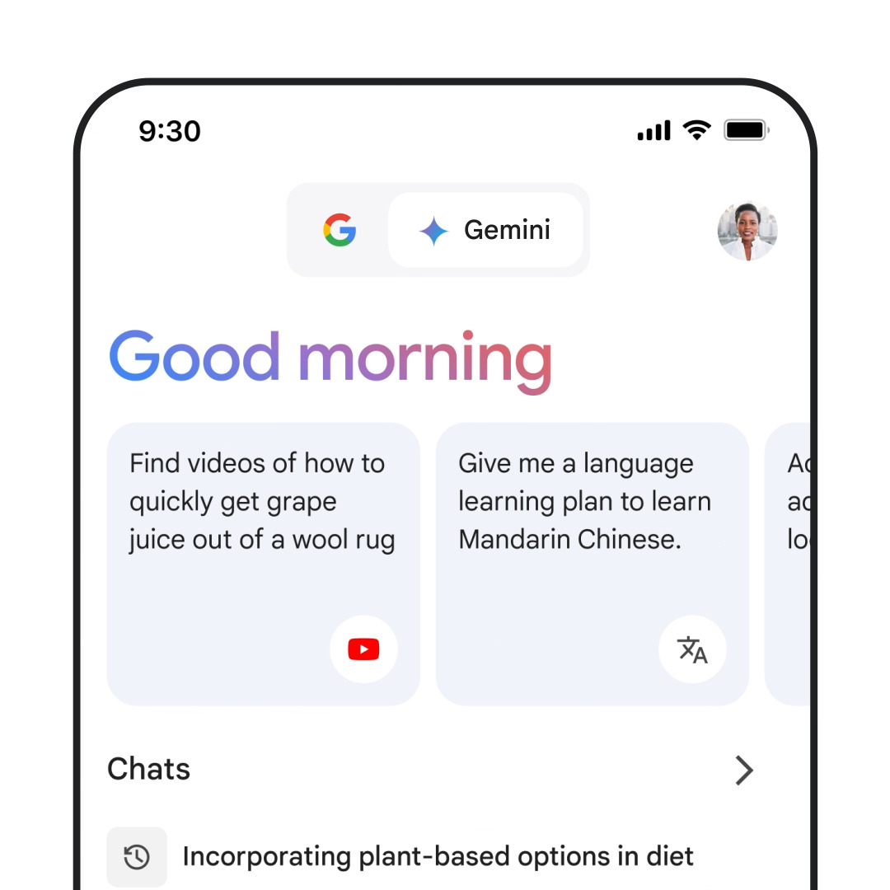

import { YouTube } from "@astro-community/astro-embed-youtube";
import ArticleCard from "@components/ArticleCard.astro";

2024年2月8日、Googleは大規模言語モデル（LLM）を活用したチャットサービス「**Bard**」の名称を「**Gemini**」に変更し、新たなモデル「**Ultra 1.0**」と**専用のモバイルアプリをリリース**しました。

この記事では、Geminiの新機能やアプリについて詳しく解説します。

<YouTube id="b5Fh7TaTkEU" />

## Geminiとは？

Geminiは、40以上の言語と230以上の国や地域で利用可能な、Googleの最新かつもっとも高度なコラボレーションツールです。

仕事の面接準備、コーディングのデバッグ、新規ビジネスアイデアのブレインストーミングなど、多彩な用途で利用されています。最近では、魅力的なイメージの生成など、クリエイティブな作業にも応用されてきました。

## Gemini Advancedとその能力

*Gemini Advancedの[公式サイト](https://gemini.google.com/advanced)のスクリーンショット*

今回、Geminiの新機能として、最大かつもっとも高度なAIモデル「Ultra 1.0」にアクセスできる「[Gemini Advanced](https://gemini.google.com/advanced)」が発表されました。他の最先端チャットボットとの比較評価で、Gemini Advancedがもっとも好まれるという結果になっています。

Gemini Advancedは、コーディング、論理的推論、細かな指示にもとづくタスク、さらにはクリエイティブなプロジェクトの共同作業など、より複雑なタスクに対応可能です。さらに、以前のプロンプトから文脈をより深く理解し、詳細で長い会話が可能になります。

<YouTube id="25A-jj61z7w" />

### Gemini Advancedの利用例

- 個人向けのチューターとして、ステップバイステップの指導やクイズ、ディスカッションを提供
- より高度なコーディングシナリオでのアイディア提供やコーディング手法の評価支援
- デジタルコンテンツクリエーターのアイディア生成、トレンド分析、オーディエンス拡大方法のブレインストーミング

Gemini Advancedは、150以上の国と地域で英語版が利用可能となっており、将来的にはさらに多くの言語に対応予定とのことです。

### Gemini Advancedの価格

Gemini Advancedは、[Google One AIプレミアムプラン](https://one.google.com/explore-plan/gemini-advanced)の一部として月額$19.99（日本では月額2,900円）で提供されます。このプランには、2TBのストレージや通常のGoogle Oneの特典も含まれています。

なお、最初の2か月は無料で利用できるとのことです。

## Geminiアプリの提供開始

Googleは、GeminiとGemini Advancedをスマートフォン向けにも提供開始しました。AndroidとiOSのGoogleアプリに新たなアプリとして導入され、移動中でもさまざまな支援を受けられます。

たとえば、パンクしたタイヤの写真を撮って指示を求めたり、ディナーパーティーの招待状用のカスタムイメージを生成したりといった使い方が可能です。

### Androidアプリ

*画像：[Google Bard is now Gemini: How to try Ultra 1.0 and new mobile app](https://blog.google/products/gemini/bard-gemini-advanced-app/)より*

Androidでは、Googleアシスタントを通じて、またはGeminiアプリをダウンロードして、アシスタントとして利用できます。「OK Google」と声をかけることで、写真のキャプションを生成したり、読んでいる記事について質問したりと、さまざまなコンテキストでの支援を受けることができます。

- [Androidアプリのダウンロードページ](https://play.google.com/store/apps/details?id=com.google.android.apps.bard)

### iOSアプリ

*画像：[Google Bard is now Gemini: How to try Ultra 1.0 and new mobile app](https://blog.google/products/gemini/bard-gemini-advanced-app/)より*

iOSでは、今後数週間のうちにGoogleアプリからGeminiを利用できるようになります。クリエイティビティを高めるチャット、カスタムイメージの生成、ソーシャルポストの作成支援などさまざまな機能が提供されます。

- [iOSのGoogleアプリのダウンロードページ](https://apps.apple.com/us/app/google/id284815942)

### アプリは日本で使える？

~~Geminiのアプリは、現時点ではアメリカの英語ユーザーのみが利用できます。来週からは、英語、日本語、韓国語を含むさらに多くの国と言語での展開が予定されているとのことです。~~

:::note[2024年2月16日追記]
現在、一部の環境でGeminiアプリを利用できるようになっています。詳細や使い方はこちらの記事で解説しています。

<ArticleCard link="/article/2024/02/11/google-assistant-gemini-app/" />
:::

## まとめ

GoogleのAIチャットサービス「Bard」が「Gemini」に進化し、新たなモデル「Ultra 1.0」と専用のモバイルアプリがリリースされました。Gemini Advancedは、より複雑なタスクに対応可能で、月額$19.99（日本では月額2,900円）で提供されます。また、Geminiアプリは、AndroidとiOSのGoogleアプリに新たなアプリとして導入され、移動中でもさまざまな支援を受けられます。

Geminiの新機能やアプリについて、今後の展開が楽しみです。

## 参考

- [Google Bard is now Gemini: How to try Ultra 1.0 and new mobile app](https://blog.google/products/gemini/bard-gemini-advanced-app/)
