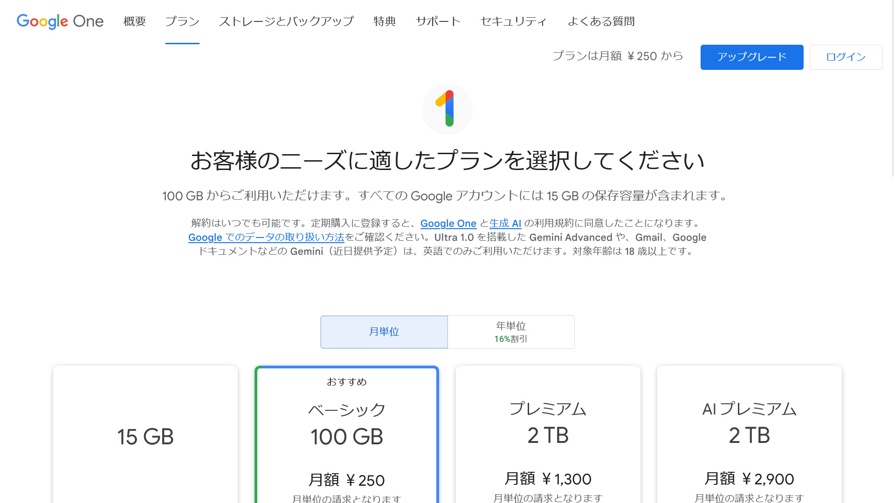

import ArticleCard from "@components/ArticleCard.astro";

2024年2月8日、Googleは新しいAI「Gemini」を発表するとともに、新しいGoogle Oneのプラン「**AIプレミアム**」を発表しました。AIプレミアムは、他のプランとどのように違うのでしょうか？

この記事では、AIプレミアムの**特徴や他のプランとの違い**について解説します。

## AIプレミアムの特徴

*[Google Oneの公式サイト](https://one.google.com/about/plans?hl=ja)のスクリーンショット*

AIプレミアムプランの最大の特徴は、Googleの新しいAI「**Gemini Ultra**」を利用できることです。

Googleはこれまで、Bardと呼ばれるAIを搭載したチャットサービスを提供していました。2月8日に、GoogleはBardを「Gemini」という名前に変更し、新しいモデル「Ultra 1.0」をリリースしました。

Ultra 1.0を搭載したGeminiは「Gemini Advanced」と呼ばれ、AIプレミアムプランに含まれています。

Geminiについて、詳しくはこちらの記事で解説しています。

<ArticleCard link="/article/2024/02/09/bard-becomes-gemini-and-mobile-app/" />

## 他のプランとの違い

Google Oneには現在、「**ベーシック**」「**スタンダード**」「**プレミアム**」「**AIプレミアム**」の4つのプランがあります。それぞれのプランの価格と特徴は次のとおりです。

ベーシックは月額250円で、次のような特徴があります。

- 100GBのストレージ
- Googleからの特別サポート
- 最大5人のユーザーとの共有
- Googleフォトのその他の編集機能
- 複数デバイス対応のVPN
- ダークWebのモニタリング
- メンバー向けのその他の特典

スタンダードは月額380円で、ベーシックプランのストレージ容量が2倍の200GBになります。

プレミアムは月額1,300円で保存容量が2TBになり、さらにGoogle Workspaceの高度な機能が使えるようになります。

AIプレミアムは月額2,900円で、プレミアムプランの特典に加えてGemini Advancedが利用できます。また、まもなくGmailやGoogleドキュメントなどでもGeminiを利用できるようになるとのことです。

:::note
この記事で解説している価格や機能はすべて記事執筆時点のものです。最新の情報は[公式サイト](https://one.google.com/about/plans?hl=ja)をご確認ください。
:::

## 無料トライアルはある？

記事執筆時点では、AIプレミアムプランは最初の2か月を無料で利用できるとのことです。気になっている場合は、ぜひ試してみてください。

## 他社との比較

Microsoftは、同社のCopilotのより高度な機能を使える「Copilot Pro」を月額3,200円で提供しています。Copilot Proの詳細については、次の記事で解説しています。

<ArticleCard link="/article/2024/01/20/copilot-pro-feature-comparison-pricing-usage/" />

また、ChatGPTの開発元のOpenAIは、ChatGPTで高性能な「GPT-4」というモデルを利用できるChatGPT Plusプランを月額20ドル（約2,990円）で提供しています。

Google One AIプレミアムは、その価格帯からChatGPT Plusを意識していると思われます。GoogleフォトやGoogleドライブをよく利用する場合は、Google One AIプレミアムを検討してみるとよいでしょう。

## まとめ

Google One AIプレミアムは、Googleの新しいAI「Gemini Ultra」を利用できるプランです。他のプランとの違いや、他社との比較を踏まえて、自分に合ったプランを選んでみてください。

## 参考

- [プランと料金設定 - Google One](https://one.google.com/about/plans?hl=ja)
