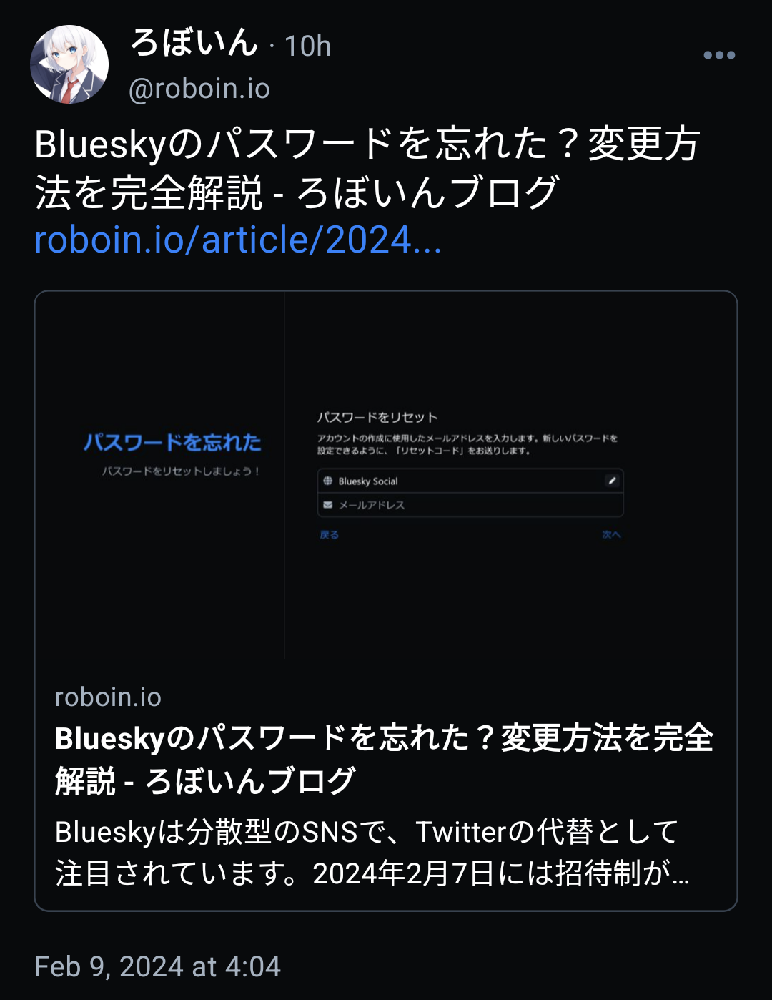
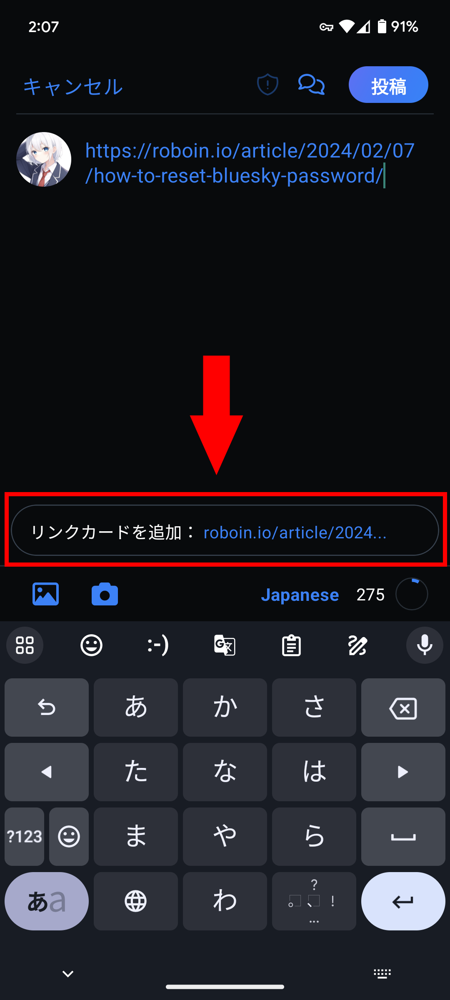
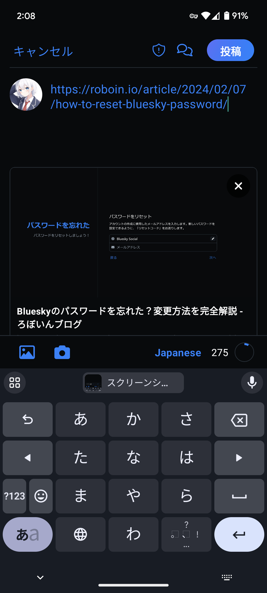

import ArticleCard from "@components/ArticleCard.astro";

BlueskyはTwitter（X）の代替として注目されている、分散型のSNSです。

しかし、リンクカードの表示方法が他のSNSと少し違うため、戸惑うかもしれません。この記事では、**Blueskyでリンクカードを表示させる方法**を詳しく解説します。

## Blueskyとは？

**Blueskyは分散型SNS**で、従来のSNSに見られるデータの集中管理とは異なるアプローチを取っています。ATプロトコルを採用しており、同プロトコルを採用した**他のSNSと相互にやり取りできる**ことが特徴です。

ThreadsやMisskey、Mastodonなど、ActivityPubを採用した他の分散型SNSとは異なり、Blueskyは独自の道を歩んでいます。

Blueskyは最近、招待制を廃止して誰でもアカウントを作れるようになったことで、急速にユーザー数を増やしています。

## リンクカードとは？

*Blueskyの投稿に表示されるリンクカードの例*

リンクカード機能は、投稿にリンクを添付する際に、**そのリンク先のサムネイルやタイトルなどの情報を自動的に取得し表示する機能**です。Twitterを含む多くのSNSで利用されており、リンク先の情報を簡単に共有するための便利な機能です。

この機能は、OGP（Open Graph Protocol）という仕組みを利用しています。

しかし、**Blueskyではデフォルトではリンクカードは表示されない**ため、この便利な機能を見落としているかもしれません。

## リンクカードを表示させる方法

Blueskyでリンクカードを表示させる方法は、次のとおりです。

### 投稿作成画面でURLを貼り付ける

まず、投稿したい内容の中にWebページのURLを貼り付けます。

### ［リンクカードを追加］ボタンをタップする

URLを貼り付けたあと、画面に表示される［リンクカードを追加］ボタンをタップします。

### リンクカードが表示されるのを待つ

ボタンをタップしてから数秒待つと、リンクカードが投稿に追加されます。これで、リンク先のサムネイルやタイトルなどが表示されるようになります。

## 埋め込みのメディアプレイヤーを表示する

リンクカードを表示させると、埋め込みのメディアプレイヤーを利用できるようになります。ただし、埋め込みのメディアプレイヤーはデフォルトでは無効化されているので、有効化する方法については、こちらの記事で解説しています。

<ArticleCard link="/article/2024/02/09/how-to-display-embedded-media-player-in-bluesky/" />

## エラーが発生した場合の対処法

リンクカードの追加時にいくつかのエラーが発生することがあります。主なエラーとその対処法は次のとおりです。

### Error: Unable to extract link meta

このエラーは、リンク先がOGPに対応していないか、URLが間違っているときに発生します。URLを確認し、正確なものかどうかを確認してください。

### AbortError: Aborted

このエラーは、何らかの理由でOGPのデータの取得が中断したときに発生します。このエラーが出た場合は、リンクカードのバツマークを押して削除し、もう一度リンクカードを追加してみてください。

## まとめ

分散型SNSの新星、Blueskyでリンクカードを活用する方法を紹介しました。

リンクカードの表示は、有用な情報を簡単に共有するための強力なツールです。Blueskyでは、この機能を最大限に活用することで、より豊かなコンテンツの共有が可能になります。
