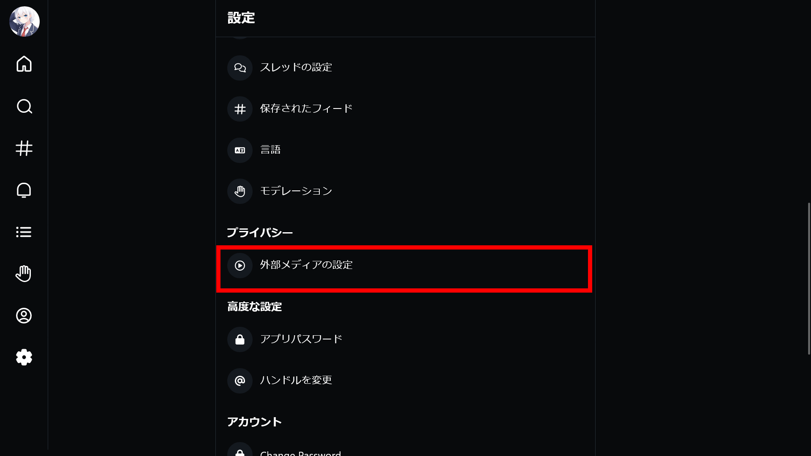

import ArticleCard from "@components/ArticleCard.astro";

BlueskyはATプロトコルに基づいた画期的な分散型SNSで、2024年2月7日に招待制が廃止され、ついに誰でも参加可能となったことで大注目されています。

この記事では、**BlueskyでYouTubeやVimeo、Twitchなどの外部メディアの埋め込みプレイヤーを表示する方法**を詳しく解説します。

## Blueskyとは？

Blueskyは、ATプロトコルを採用した分散型のSNSです。これは、異なるSNS間での相互連携を可能にするプロトコルで、Blueskyは他のATプロトコルを採用しているSNSユーザーと自由にやりとりが可能です。

しかし、ActivityPubを使用しているThreadsやMisskey、Mastodonなどとは互換性がないため、注意が必要です。

## Blueskyで外部メディアの埋め込みを表示する方法

Blueskyは、**デフォルトではYouTubeや他の外部メディアは表示されない**ようになっています。表示するように設定する方法は簡単なので、次の手順で設定してみてください。

### ステップ1：［設定］を開く

まず、Blueskyのメニューから「設定」を開きます。設定がどこにあるか分からない場合は、次の記事で設定画面の開き方を解説しています。

<ArticleCard link="/article/2024/02/13/how-to-open-bluesky-settings/" />

### ステップ2：［プライバシー］セクションへ

次に、［プライバシー］セクションを見つけ、［外部メディアの設定］を開きます。

### ステップ3：メディアプレイヤーを有効にする

［有効にするメディアプレイヤー］の中から、表示したいメディアのトグルスイッチをオンにします。デフォルトではすべてオフになっています。

プライバシーにとくにこだわりがないなら、すべてオンにしておくと便利です。

:::tip
投稿者がリンクカードを有効にしている投稿でしか、埋め込みプレイヤーは利用できません。投稿時にリンクカードを有効にする方法については、こちらの記事で解説しています。

<ArticleCard link="/article/2024/02/09/how-to-add-link-card-to-bluesky-post/" />
:::

## 対応している外部メディア一覧

現在、Blueskyでサポートされている外部メディアは次のとおりです。

- YouTube
- YouTube Shorts
- Vimeo
- Twitch
- GIPHY
- Tenor
- Spotify
- Apple Music
- SoundCloud

この豊富なラインナップにより、さまざまな形式のコンテンツをシームレスに共有でき、ユーザー同士の交流がより豊かになります。

## まとめ

Twitter（X）ではデフォルトで外部メディアの埋め込みプレイヤーが表示されますが、Blueskyではデフォルトでは表示されないため、設定を変更する必要があります。

この機能を有効にすると外部サイトに飛ばずに動画や音声を再生できるため、非常に便利です。ぜひ設定してみてください。
