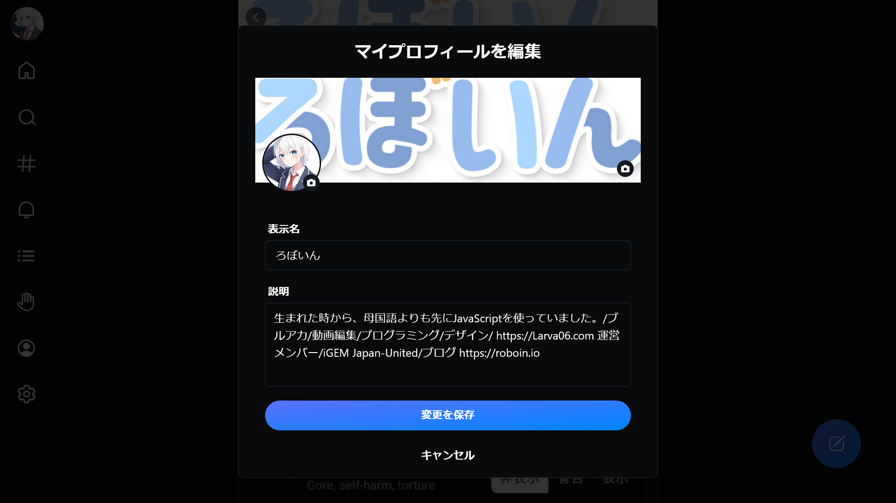

import ArticleCard from "@components/ArticleCard.astro";

Blueskyが2024年2月7日に招待制を廃止して以来、ますます多くのユーザーがこの新しいSNSに興味を持っています。

この記事では、**Blueskyのプロフィールにリンクを貼る方法**を分かりやすく解説します。

なお、自分のプロフィールページのURLを共有する方法については、こちらの記事で解説しています。

<ArticleCard link="/article/2024/02/09/how-to-share-your-bluesky-profile-link/" />

## Blueskyとは？

Blueskyは、ATプロトコルを採用した**分散型のSNS**です。このプロトコルを採用している他のSNSと相互にやり取りが可能という点が特徴的です。しかし、ActivityPubを採用しているThreads、Misskey、MastodonなどのSNSとは互換性がない点に注意が必要です。

:::note
ATプロトコルとActivityPubは、SNS間の相互運用性を提供するためのプロトコルですが、互換性はありません。それぞれ異なるSNS間で情報を共有する際の規格です。
:::

## プロフィールにリンクを貼る手順

Blueskyで自分のプロフィールにリンクを貼りたい場合、次の手順を実行します。

### ステップ1：自分のアカウントのプロフィールを表示

まず、Blueskyにログインした状態で自分のプロフィールページに移動します。

### ステップ2：［プロフィールを編集］をクリック

プロフィールページにある［プロフィールを編集］をクリックして、編集モードに入ります。

### ステップ3：説明欄にリンクを貼りつけ

*プロフィールの編集画面*

プロフィールの［説明］欄に自己紹介文とともに、リンクURLを貼り付けます。Blueskyでは、他のSNSのように専用のリンク欄は用意されていないため、説明欄を使用する必要があります。

また、プロフィールの文字数制限などの詳細は、こちらの記事で解説しています。

<ArticleCard link="/article/2024/02/11/complete-guide-bluesky-profile-text-image-size/" />

### ステップ4：変更を保存

すべての編集が完了したら、［変更を保存］をクリックして、プロフィールの更新を完了させます。

## リンクが正しく設定されない場合の対処法

リンクを貼り付けたはずなのに何らかの理由でうまく表示されない場合は、次の点をチェックしてみましょう。

- **URLが正しいか確認する**: 間違いやタイプミスがないか、もう一度確認します
- **URLの形式をチェックする**: URLが`http://`または`https://`から始まっているかを確認します。私が確認した範囲ではこれがなくてもリンクとして機能しましたが、これがないとリンクとして認識されないこともあるかもしれません
- **URLの前後に半角スペースを挿入する**: URLの直前や直後に半角スペースを入れないと、リンクとして認識されないことがあります

:::caution
セキュリティ上の理由から、不明なリンクは避けるべきです。信頼できるサイトのリンクのみをプロフィールに追加しましょう。
:::

## まとめ

Blueskyにおいて自分のプロフィールページは、自己表現のための大事なスペースです。この記事を参考に、リンクを正しく貼り付けてみてください。
