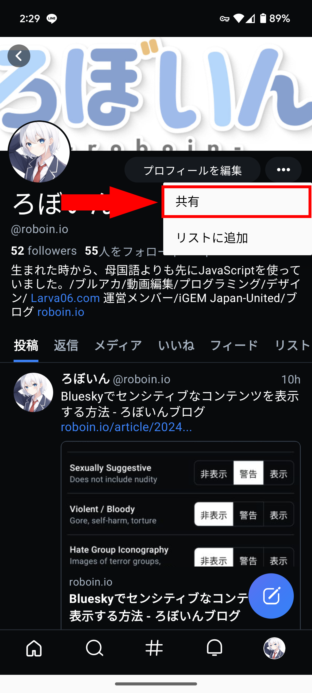

import ArticleCard from "@components/ArticleCard.astro";

Blueskyは分散型のSNSで、最近になって招待制が廃止され、誰でもアカウントを作れるようになりました。

この記事では、**Blueskyで自分や他のユーザーのプロフィールのリンクを共有する方法**を、スマホアプリとブラウザーの両方から解説します。

なお、プロフィールにリンクを貼る方法については、こちらの記事で解説しています。

<ArticleCard link="/article/2024/02/09/how-to-paste-links-to-your-bluesky-profile/" />

## Blueskyとは？

Blueskyは、従来の中央集権型SNSとは異なる、分散型のSNSです。ATプロトコルを採用している点が特徴で、さまざまなプラットフォームが相互運用可能になることを目指しています。

しかし、ActivityPubをベースにしたThreadsやMisskey、Mastodonなどとの直接的な互換性はありません。

また、Blueskyは2024年2月7日に招待制が廃止され、誰でもアカウントを作れるようになりました。これにより、Blueskyのユーザー数は急速に増加しています。

## スマホアプリでプロフィールリンクを共有する

Blueskyのアプリでプロフィールのリンクを共有する方法は非常にシンプルです。

1. 共有したいアカウントのプロフィールを開く
   - 自分のアカウントのURLを共有したい場合は、自分のアカウントのアイコンをタップしてプロフィール画面を開く
2. 3つのドットが横に並んだメニューボタンをタップする
3. メニューから［共有］を選択すると、プロフィールのリンクをコピーしたり、他のアプリに直接共有できるオプションが表示される


*プロフィールのメニューを開いたようす*

:::tip
プロフィールリンクをコピーして他のSNSで共有することもできます。
:::

## ブラウザー版でプロフィールリンクを共有する

もしPCからブラウザーで利用している場合は、もっと簡単にプロフィールリンクを共有できます。

1. 共有したいアカウントのプロフィールにアクセスする
2. ブラウザーのアドレスバーに表示されているURLをコピーする
3. コピーしたURLを他のSNSなどで共有する

:::note
ブラウザー版では、URLを直接コピペすることで、どんなプラットフォームにも簡単にリンクを共有できます。
:::

## プロフィールのURLの形式

プロフィールのURLは、次のような形式になっています。

```markdown frame="terminal"
https://bsky.app/profile/<ハンドル>
```

たとえば、私のBlueskyアカウントのハンドルは`@roboin.io`なので、URLは次のようになります。

```markdown frame="terminal"
https://bsky.app/profile/roboin.io
```

Blueskyのハンドルやユーザー名の変更方法はこちらの記事で解説しています。

<ArticleCard link="/article/2024/02/07/how-to-change-bluesky-handle-and-user-name/" />

## リンクを共有するときの注意点

Blueskyのプロフィールのリンクにはハンドルが含まれるため、**ハンドルを変更するとそれまでのURLはリンク切れしてしまいます**。また、ハンドルの変更後に古いハンドルを別のユーザーが取得した場合は、混乱を招く可能性があります。

このことに十分に注意してください。

ハンドルにドメインを使用しており、そのドメインを手放す予定がない場合はこのような心配は不要です。ハンドルにドメインを設定して本人確認する方法は、こちらの記事で解説しています。

<ArticleCard link="/article/2024/02/07/how-to-identify-yourself-in-bluesky/" />

## まとめ

Blueskyでのプロフィールリンクの共有は、スマホアプリでもブラウザー版でも非常に簡単です。

URLをコピーして他のSNSで共有することもできるので、ぜひ活用してみてください。
