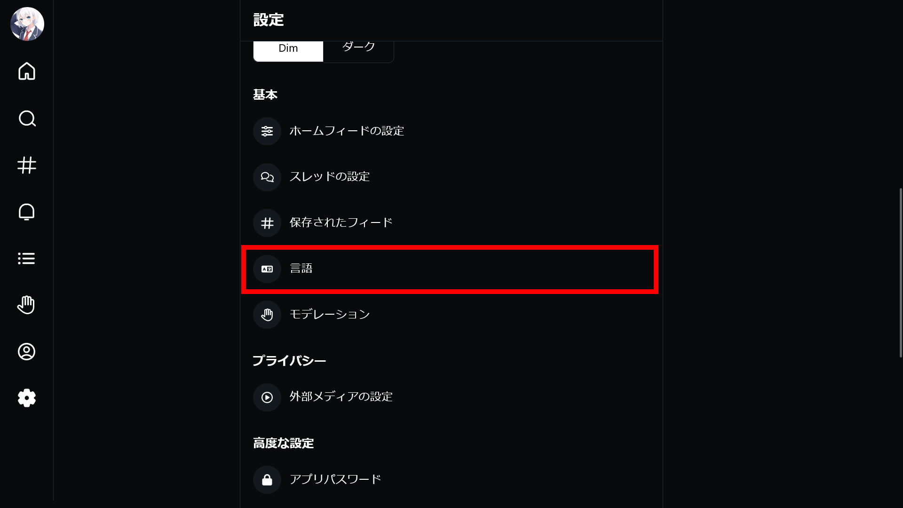
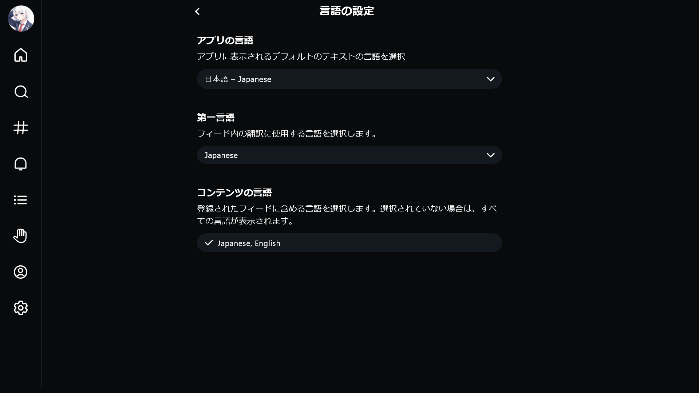

現在、SNSの世界において新しい波として注目されているのが、Blueskyです。Twitter（現在のX）の代替として見られているこの分散型SNSは、2024年2月7日に招待制を廃止し、より多くの人々が参加できるようになりました。

しかし、日本語ユーザーにとって最初の壁は「言語設定」かもしれません。この記事では、**Blueskyを日本語で快適に利用するための設定方法**を詳しく解説します。

## Blueskyとは？

Blueskyは、分散型SNSとして開発されており、ユーザーにより高い自由度を提供することを目指しています。ATプロトコルを採用しており、同プロトコルを採用した他のSNSと相互にやり取りできることが特徴です。

## Blueskyの日本語設定

Blueskyは**日本語設定**に対応しています。また、日本語以外にもさまざまな言語に対応しています。

Blueskyを**日本語化**するための設定方法は、次のとおりです。

### ステップ1: ［設定］へアクセスする

Blueskyを開き、メニューから［設定（Settings）］を選択します。

### ステップ2: ［言語］設定を開く

［設定（Settings）］メニューの［基本（Basics）］セクションから［言語（Languages）］を探し、選択してください。

### ステップ3: 言語設定を変更する

言語設定では次の3つを設定できます。

- **アプリの言語（App Language）**：アプリのUI（画面表示）に使用される言語を設定します
- **第一言語（Primary Language）**：他言語で書かれた投稿を翻訳する際の、翻訳先の言語を設定します
- **コンテンツの言語（Content Languages）**：フィードに表示したい投稿の言語を選択します。複数言語をそれぞれをトグルスイッチで有効/無効にできます

日本語設定をしたい場合は、これらの設定で［日本語］（または［Japanese］）を選択してください。

:::tip
言語設定はクライアント間で同期されません。したがって、複数のデバイスでBlueskyを使用する場合は、それぞれのデバイスで言語設定を行う必要があります。
:::

## 日本語化できない場合は？

設定を変更しても、すぐに日本語表示されない場合があります。その際は、次の対処法を試してください。

### Web版の場合

ページを再読み込みしてください。ブラウザーのリフレッシュボタンを押すか、キーボードで「`Ctrl` + `R`」（Windows）または「`Command` + `R`」（Mac）を押します。

### アプリやブラウザーのキャッシュを削除する

アプリや使っているブラウザーのキャッシュを削除してから、もう一度設定を試みてください。

### ［日本語］になっているか確認する

設定で正しく日本語を選択しているか確認してください。

とくに、「**日本語（Japanese）**」と「**ジャワ語（Javanese）**」は綴りが似ており選択肢も近くに配置されているので、間違えていないか確認してみてください。

:::note
言語設定の際には、似た名前の言語に注意して選択しましょう。
:::

## まとめ

Blueskyを日本語で快適に利用するための設定方法を解説しました。Blueskyの言語設定を適切に変更して、より快適に利用しましょう。
