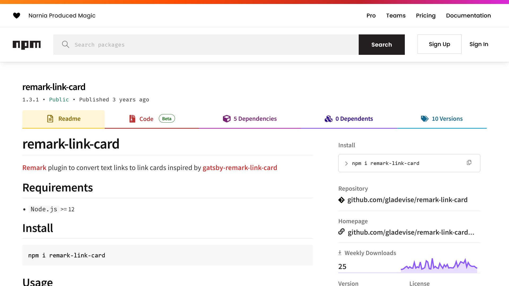

ブログなどでは、リンクを埋め込む際にリンクカードを表示することがあります。リンクカードは、リンク先のページのタイトルやサムネイル、概要などを一覧表示でき、リンク先の情報を簡単に把握できるため、ユーザーにとって便利な機能です。

この記事では、Markdownでリンクカードを表示するための **「remark-link-card」の使い方**について解説します。

## remark-link-cardとは？


*[remark-link-cardのnpmページ](https://www.npmjs.com/package/remark-link-card)*

[remark-link-card](https://github.com/gladevise/remark-link-card)は、[OGP](https://ogp.me/)のリンクカードを表示するための、Markdownパーサーの[remark](https://github.com/remarkjs/remark)用のプラグインです。

remark-link-cardを使うと、Markdownファイル内のベアリンクを自動でリンクカードに変換できます。リンクカードにはサムネイルやタイトル、概要、favicon、リンク先のURLが表示されます。

:::caution
remark-link-cardを使う際は、次の点に注意してください。

- remarkでのみ利用できます。他のMarkdownパーサーでは利用できません
- 設定でキャッシュを有効にしない限り、サムネイルなどのデータはリンク先のサイトから読み込まれます。そのため、リンク先のサイトに負荷をかけないように注意してください
- Webで公開されているリンク先のページのみに対応しています。ローカルのファイルや非公開のページには対応していません
:::

## remark-link-cardの使い方

remak-link-cardを使うには、まずプロジェクトにインストールします。

```powershell
npm install remark-link-card
```

インストールが完了したら、remarkにremark-link-cardを追加します。

```javascript
import remark from "remark";
import rlc from "remark-link-card";

(async () => {
    const result = await remark()
        .use(rlc)
        .process(exampleMarkdown)

    console.log(result.contents);
})();
```

[Astro](https://astro.build/)を使っている場合は、`astro.config.mjs`にremark-link-cardを追加します。

```javascript title="astro.config.mjs"
import { defineConfig } from "astro/config";
import rlc from "remark-link-card";

// https://astro.build/config
export default defineConfig({
    // ...
    markdown: {
        remarkPlugins: [rlc]
    }
});
```

:::note
remark-link-cardにはCSSが含まれていないため、自分でスタイルを設定する必要があります。
:::

### オプション

remark-link-cardには、次のオプションがあります。

- `cache`：`true`に設定すると、faviconやサムネイルなどのデータを`./public/remark-link-card/`にキャッシュします。デフォルトは`false`です
- `shortenUrl`：`true`に設定すると、リンクカードに表示するURLをホスト名のみにします。デフォルトは`false`で、完全なURLを表示します

オプションを利用する場合は、次のように設定します。

```javascript
import remark from "remark";
import rlc from "remark-link-card";

(async () => {
    const result = await remark()
        .use(rlc, {
            cache: true,
            shortenUrl: true
        })
        .process(exampleMarkdown)

    console.log(result.contents);
})();
```

```javascript title="astro.config.mjs"
import { defineConfig } from "astro/config";
import rlc from "remark-link-card";

// https://astro.build/config
export default defineConfig({
    // ...
    markdown: {
        remarkPlugins: [
            [
                rlc,
                {
                    cache: true,
                    shortenUrl: true
                }
            ]
        ]
    }
});
```

### リンクカードを表示する方法

リンクカードを表示するには、Markdownファイル内にベアリンク（むき出しのURL）を記述します。ベアリンクではないリンクは、カードに変換されません。また、1行に複数のリンクがある場合も変換されません。

次のコードは、リンクカードが表示される例です。

```markdown
## リンクカードが表示される

https://example.com

<https://example.com>
```

次のコードは、リンクカードが表示されない例です。

```markdown
## リンクカードが表示されない

[リンクカードが表示されない](https://example.com)

https://example.com https://example.com
```

Markdownではリンクを`< >`で囲っても囲わなくても動作します。MDXではエラーが出るため、リンクを`< >`で**囲わない**ことをオススメします。

## まとめ

この記事では、Markdownでリンクカードを表示するための「remark-link-card」の使い方について解説しました。

リンクカードを手軽に実装できるので、ぜひ使ってみてください。

## 参考

- [gladevise/remark-link-card](https://github.com/gladevise/remark-link-card)
