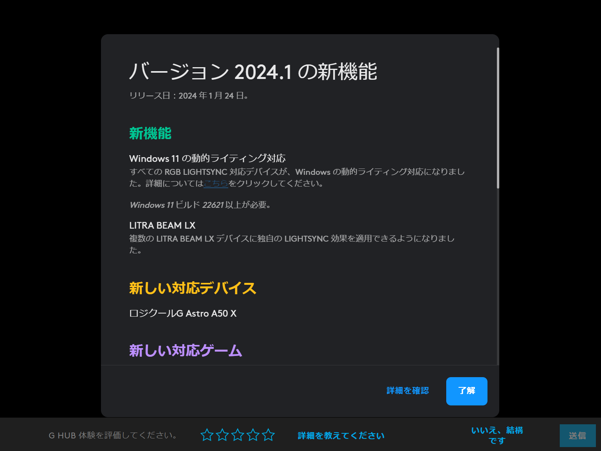
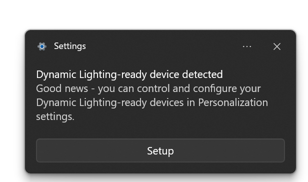
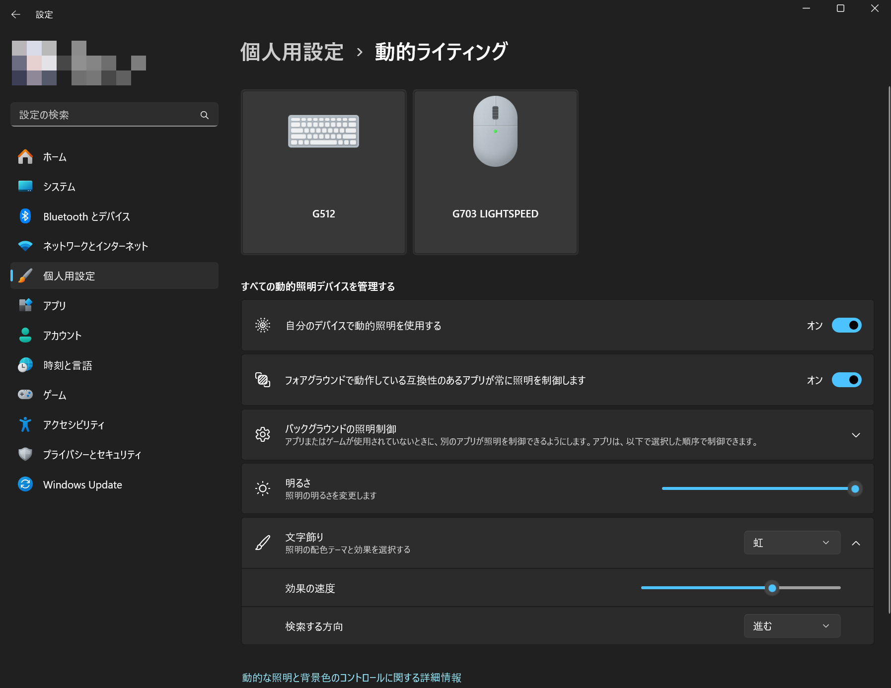

Logicool製デバイスがWindowsの新機能「**動的ライティング**」を完全サポートしました。この記事では、動的ライティングの対応デバイス、そして実際の使い方まで詳しく解説します。

## 動的ライティングとは？

いわゆる「ゲーミングデバイス」は、キーボードやマウスなどの入力デバイスにおいて、LEDライトを搭載していることが多いです。これらのライトは、ユーザーが好きな色に設定したり、特定のアクションに反応して点灯したりといった、さまざまな使い方ができます。

しかし、それらの機能を利用するには**メーカー独自のソフトウェアで設定を変更する必要**があり、異なるメーカーのデバイス間での設定方法が統一されていませんでした。

動的ライティングは、断片化したエコシステムを統一することを目的としたWindowsの新機能です。この機能を使うと、**動的ライティングに対応したデバイスのライティングをWindowsの設定画面から統一的に制御できるようになります**。

動的ライティングでは、**HID LampArray標準を実装した照明デバイスをWindowsの設定でネイティブに制御**できるようになります。

### 対応デバイスは？

動的ライティングは、**HID LampArray**に対応したデバイスで利用できます。

Windowsの動的ライティングでは、キーボード、マウス、ゲームコントローラー、周辺機器、シーン、通知、シャーシ、ウエアラブル、家具、アート、ヘッドセット、ベンダー定義の各種デバイスを制御できます。

## Logicoolデバイスが動的ライティングをサポート

*G HUB v2024.1のリリースノート*

2024年2月にリリースされた**Logicool G HUB**バージョン2024.1では、**Logicool製RGB LIGHTSYNC対応デバイス**が動的ライティングに完全対応しました。これまではG HUBを通じて照明のカスタマイズが可能でしたが、今回のアップデートでWindowsの設定画面からも照明を制御できるようになりました。

この機能は**Windows 11ビルド22621以上**で利用可能となっています。

## 動的ライティングの設定方法

動的ライティング対応デバイスをWindowsに接続すると、デバイスが動的ライティングに対応していることを示す通知が表示されます。

*動的ライティングに対応していることを示す通知*

動的ライティングを設定するには、この通知の［Setup］をクリックするか、Windowsの設定画面を開いて［個人用設定］>［動的ライティング］を選択します。

*動的ライティングの設定画面*

設定画面では、光の明るさ、効果、そして特定のアプリケーションの照明の優先度など、さまざまな設定が可能です。複数のデバイスの設定を一括で変更することもできますし、設定画面の上部に表示されているデバイス名をクリックすると、デバイスごとに個別に設定を変更することもできます。

## 注意点は？

動的ライティングを利用するためには、Windows 11ビルド22621以上が必要です。デバイスによってはカラーや明るさが若干異なる場合があるので注意が必要です。

また、すべてのゲーミングデバイスが動的ライティングに対応しているわけではありません。前述のように、Windowsの動的ライティングはHID LampArray標準を実装したデバイスにのみ対応しています。

## まとめ

Microsoftの動的ライティング機能とLogicoolのデバイスが完全に統合されることで、より自由で、より没入感のあるデスクトップ体験を享受できるようになりました。

とくに、複数のメーカーのゲーミングデバイスを利用している場合は、Windowsの設定画面から統一的に照明を制御できるのは大きなメリットです。対応デバイスを持っている場合は、ぜひ一度試してみてください。

## 参考

- [動的照明デバイス | Microsoft Learn](https://learn.microsoft.com/ja-jp/windows-hardware/design/component-guidelines/dynamic-lighting-devices)
- [Windows で動的照明デバイスを制御する - Microsoft サポート](https://support.microsoft.com/ja-jp/windows/windows-%E3%81%A7%E5%8B%95%E7%9A%84%E7%85%A7%E6%98%8E%E3%83%87%E3%83%90%E3%82%A4%E3%82%B9%E3%82%92%E5%88%B6%E5%BE%A1%E3%81%99%E3%82%8B-8e8f22e3-e820-476c-8f9d-9ffc7b6ffcd2)
