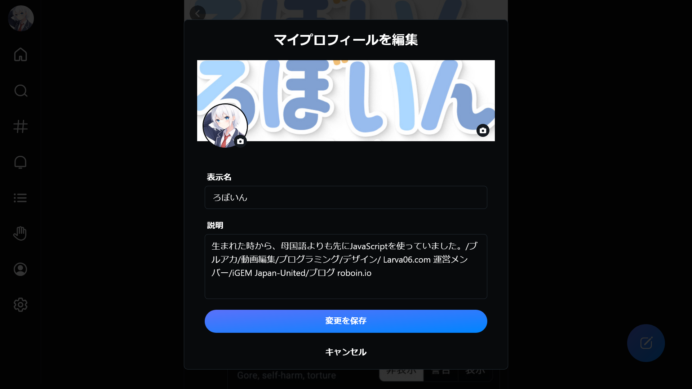

import ArticleCard from "@components/ArticleCard.astro";

Blueskyは、Twitterの共同創業者のジャック・ドーシーらが発案した画期的な分散型SNSプロジェクトです。2024年2月7日には、より多くの人が参加しやすいよう招待制を廃止しました。

この記事では、Blueskyのプロフィールの**文字数制限**や**画像サイズ**について、詳しく紹介します。

## プロフィールの文字数は？

Blueskyでは、プロフィールの自己紹介文の文字数が**256文字**に制限されています。文字数が限られているため、自分の興味や専門分野、趣味などを簡潔に、かつ魅力的に表現することが重要です。

**英語も日本語も1文字**としてカウントされます。また、リンクも他の文字と同様にカウントされます。文字数が足りない場合は、短縮リンクを使ったり、URLの``https://``を省略したりなどの工夫が必要です。

また、プロフィールにリンクを設定する方法や注意点などは、こちらの記事で解説しています。

<ArticleCard link="/article/2024/02/09/how-to-paste-links-to-your-bluesky-profile/" />

## アイコンの画像サイズは？

プロフィール画像、つまりアイコンは第一印象に大きく影響します。Blueskyで設定できるアイコンの画像サイズは**1:1の正方形**です。

あなたの顔がはっきりと認識できる写真や、個性を表現できるイラストなど、自分を表現するにふさわしい画像を選びましょう。他のSNSを使っている場合は、そのアイコンをそのまま使うのもよいでしょう。

## ヘッダーの画像サイズは？

Blueskyのヘッダー画像は、プロフィールページの印象を決定づける重要な要素です。

デバイスによって表示比率が異なるため、PCでは「**1196x300px**」、スマートフォンでは「**2340x900px**」程度やその倍数が目安となります。デバイスによって多少表示が異なる可能性があるので、重要な情報が切れないように余白をもたせた画像を作成するのがよいでしょう。

また、ヘッダー画像を作る際に参考になる枠線が付いたテンプレートを有志の方が配布されているので、これを使うと便利です。このテンプレートを活用すると、画像作成がより簡単になります。ただし、この場合でもデバイスによる表示の違いを考慮して余白を取ることをオススメします。

<blockquote class="twitter-tweet" data-dnt="true" data-theme="dark">
「Blueskyでヘッダー画像をバチっと表示させるテンプレート ver2.1」を公開しました。  これを定規のように使って598x598の画像を作成してヘッダーに設定すればバチっと表示されるはずです<a href="https://twitter.com/hashtag/bluesky?src=hash&amp;ref_src=twsrc%5Etfw">#bluesky</a> <a href="https://twitter.com/hashtag/%E3%83%96%E3%83%AB%E3%83%BC%E3%82%B9%E3%82%AB%E3%82%A4?src=hash&amp;ref_src=twsrc%5Etfw">#ブルースカイ</a> <a href="https://t.co/j1HrzhGPMp">pic.twitter.com/j1HrzhGPMp</a>
&mdash; 匠屋本舗 (@takumiya) <a href="https://twitter.com/takumiya/status/1755175823668375800?ref_src=twsrc%5Etfw">February 7, 2024</a></blockquote> 

## プロフィールの変更方法

プロフィールを変更するには、次の手順で設定を開きます。

### ステップ1：プロフィールページを開く

まずは、自分のアカウントのプロフィールページを開きます。メニューから［プロフィール］を選択するか、自分のアイコンをクリックするとプロフィールページに移動します。

### ステップ2：プロフィールを編集

［プロフィールを編集］というボタンがあるので、これをクリックするとプロフィールの編集画面が開きます。

*プロフィールの編集画面*

### ステップ3：プロフィールを変更

プロフィールの編集画面では、プロフィール画像やヘッダー画像、自己紹介文などを変更できます。変更したい項目を選択して、新しい情報を入力・選択してください。

［表示名］はアカウント名、［説明］は自己紹介文です。

アイコンやヘッダー画像を変更するには、それぞれの画像をクリックし、メニューから［ライブラリー］を選択します。画像のトリミング画面が開くので、スライダーを動かすと画像の大きさを変更でき、画像をドラッグすると表示範囲を変更できます。また、スライダーの隣に表示されているボタンでは、トリミングの縦横比率を変更できます。

### ステップ4：変更を保存

プロフィールの編集画面で変更が完了したら、［保存を保存］ボタンをクリックして変更を保存します。

## まとめ

Blueskyは新しい時代のSNSとして注目されています。プロフィールの文字数制限や画像サイズについて理解して、適切で見やすいプロフィールを作成しましょう。

## 参考

- [次世代SNS対応のための画像サイズまとめ (Bluesky・Threads) #Twitter - Qiita](https://qiita.com/moroi/items/4b3df510982f7062d156)
