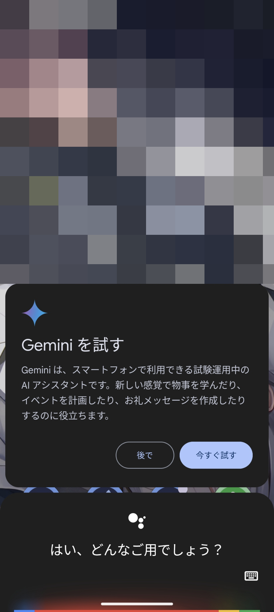
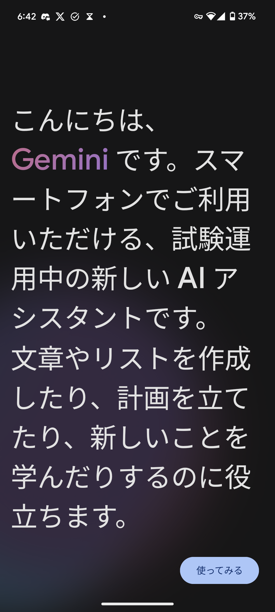
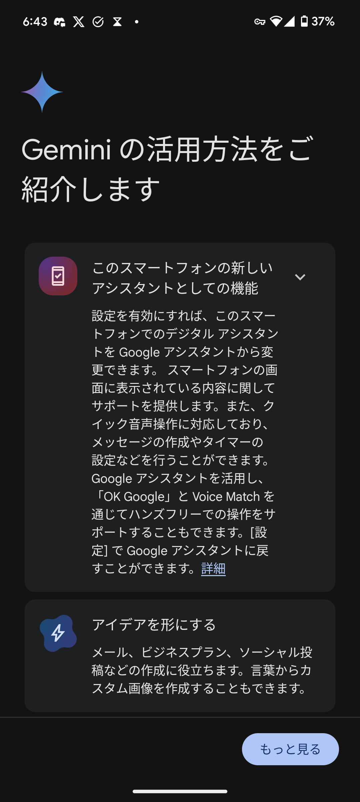
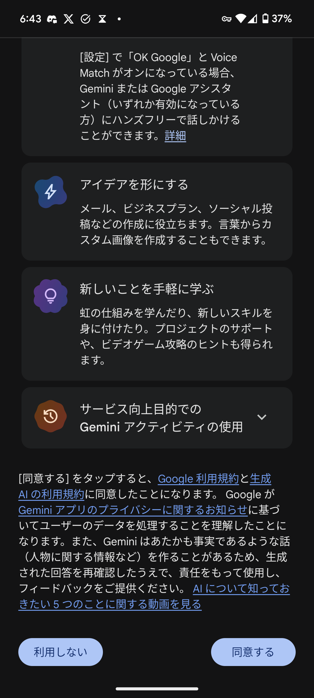
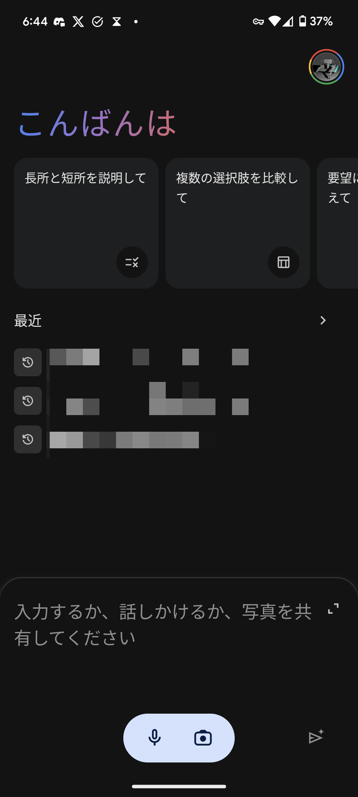
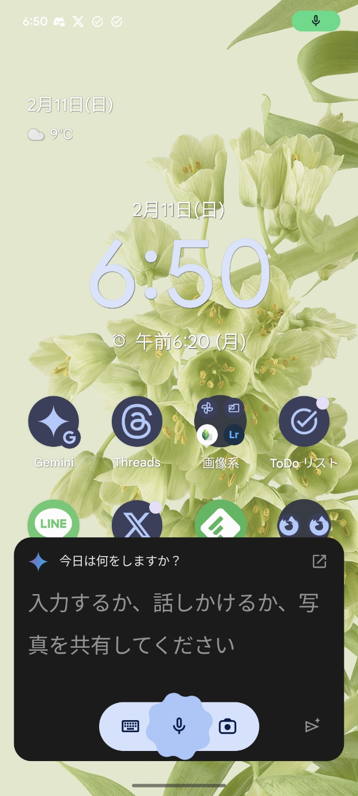
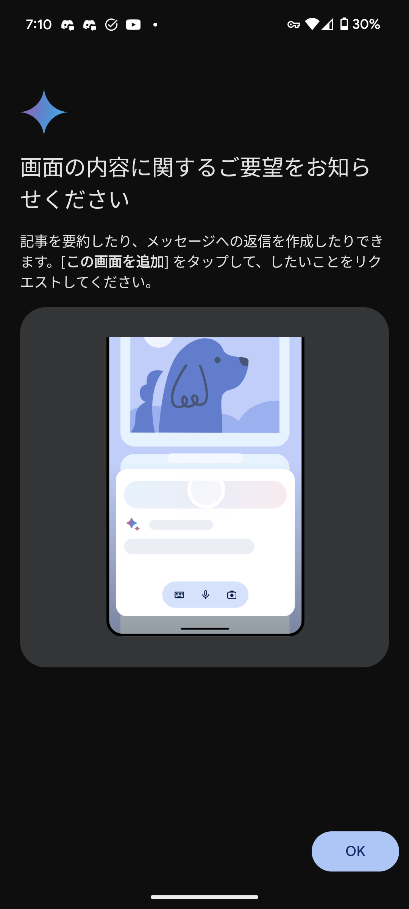
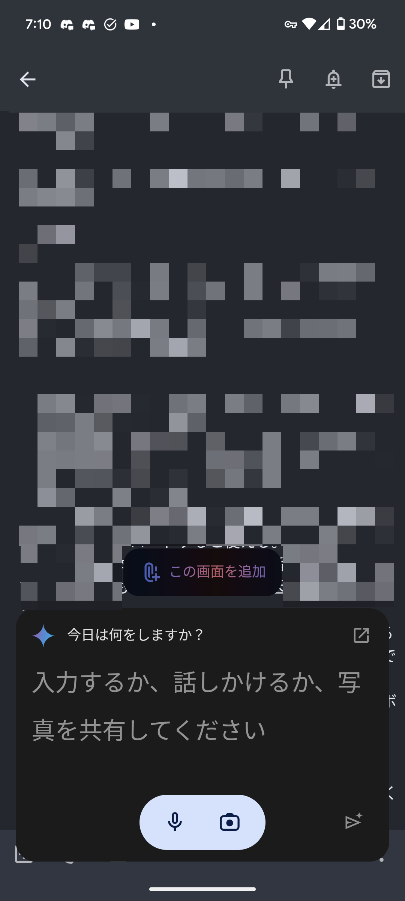
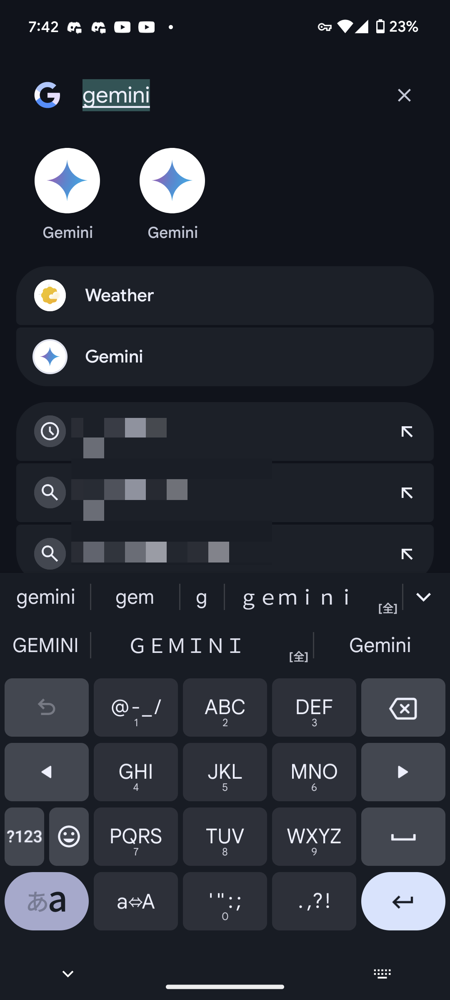

import ArticleCard from "@components/ArticleCard.astro";
import { YouTube } from "@astro-community/astro-embed-youtube";

Googleの大規模言語モデル（LLM）「Gemini」がGoogleアシスタントへ統合されました。これによって、文脈を踏まえたより高度な応答が可能になり、日常生活や仕事の効率化に大きな貢献をすることが期待されます。

この記事では、**Geminiが統合されたGoogleアシスタントの効率的な使い方**と、その際に留意すべき点をじっくりと解説します。

## BardからGeminiへのアップデート

<YouTube id="b5Fh7TaTkEU" />

2024年2月の発表により、GoogleのAIチャットサービス「**Bard**」は、「**Gemini**」へと進化を遂げました。この変更は単なる名称の変更ではなく、Googleアシスタントとの統合を含めさまざまな新機能が追加されています。

### 新機能と改善点

Bardが提供してきた幅広い機能に加え、Geminiは次のような新機能と改善点を備えています。

- **高度なAIモデル「Ultra 1.0」の導入**: Geminiは、これまでのモデルを上回る精度と応答能力をもつ「Ultra 1.0」を採用しています。この新モデルにより、より複雑な問いかけに対しても、詳細で文脈を踏まえた回答が可能になりました
- **専用モバイルアプリの提供**: これまではWebアプリしかありませんでしたが、移動中でも利用しやすいようにAndroidとiOS向けに専用アプリがリリースされました。これにより、外出先でもGeminiの機能をフルに活用できます。

Geminiについて、詳しくはこちらの記事で解説しています。

<ArticleCard link="/article/2024/02/09/bard-becomes-gemini-and-mobile-app/" />

## GeminiとGoogleアシスタントの連携

**Gemini**は、その革新的なAI機能をGoogleアシスタントに統合することで、さまざまなシチュエーションで応用可能な支援を提供します。**音声入力**や**テキスト入力**、さらには**カメラを使った写真の追加**など、多様なインタラクションが可能になります。

この機能はもともと、2023年のMade by Googleで「Assistant with Bard」として[発表](https://blog.google/products/assistant/google-assistant-bard-generative-ai/)されていました。

Geminiアプリは当初、**米国の英語ユーザー**にのみ提供されていました。しかし、2024年2月11日に、筆者の環境で日本から日本語で利用可能になったことを確認しました。

ただし、記事執筆時点で日本ではGoogle PlayからGeminiアプリをダウンロードできないため、APKファイルを**サイドロード**する必要があります。

これまではサイドロードしても日本語に対応していない旨が表示され、英語に変更しても現在のロケールが原因で利用できませんでした。それが今回、サイドロードすれば日本から日本語で使えるようになった形です。

ただし、環境によってはまだ利用できないかもしれません。まだ使えない場合でも、[Googleの公式ブログ](https://blog.google/products/gemini/bard-gemini-advanced-app/)によると近いうちに使えるようになるとのことなので、しばらく待ってみてください。

## Geminiを有効にする方法

Geminiがロールアウトされている環境では、次の手順で**Googleアシスタントと連携したGemini**を利用できます。

まずは、GoogleアシスタントとGeminiの統合を有効にする必要があります。筆者の環境では、Googleアシスタントを開いたときにGeminiを利用可能になったことを示すメッセージが表示されました。

*Geminiを利用可能になったことを示すメッセージ*

> Geminiを試す
>
> Geminiは、スマートフォンで利用できる試験運用中のAIアシスタントです。新しい感覚で物事を学んだり、イベントを計画したり、お礼メッセージを作成したりするのに役立ちます。

この画面で、［今すぐ試す］をタップすると、Geminiについての説明が表示されます。

*Geminiについての説明の画面*

> こんにちは、Geminiです。スマートフォンでご利用いただける、試験運用中の新しいAIアシスタントです。文章やリストを作成したり、計画を立てたり、新しいことを学んだりするのに役立ちます。

［使ってみる］をタップすると、Geminiの活用方法についての説明が表示されます。下までスクロールして［同意する］を選択すると、Geminiを利用できるようになります。

*Geminiの活用方法についての説明画面*

*スクロールすると同意ボタンを押せるようになる*

この画面ではGeminiに送信したデータがどのように扱われるかについての説明も含まれているので、よく読んでおきましょう。デフォルトではデータは3年間保存され、この機能をオフにした場合でも72時間保存されます。詳しくはこちらの記事で解説しているので、参考にしてください。

<ArticleCard link="/article/2024/02/10/how-to-delete-gemini-data-from-your-google-account/" />

## Geminiアプリの使い方

GeminiとGoogleアシスタントの統合を有効にすると、Geminiアプリのショートカットを直接開くか、「**OK Google**」のボイスコマンドを利用するとGeminiが開くようになります。

次の画像はそれぞれ、Geminiアプリを直接開いた場合と、ボイスコマンドで開いた場合の画面です。

*Geminiアプリを直接開いた場合の画面*

*「OK Google」でGeminiを開いた場合の画面*

どちらの画面でも、テキストの入力、音声入力、画像の送信に対応しています。

- **テキストの入力**：テキストボックスに質問を入力し、紙飛行機のアイコンをタップすると送信されます
- **音声入力**：マイクのアイコンをタップして音声入力を開始し、話し終わると自動で送信されます
- **画像の送信**：カメラのアイコンをタップして写真を撮影し、テキストや音声での質問に添付できます

音声入力を使った場合は、応答の生成が完了すると自動的に読み上げられます。ただし、応答の生成も読み上げの開始も、どちらもかなり時間がかかる印象です。

:::tip
Geminiは高い精度の応答を提供するものの、「**幻覚**」と呼ばれる誤情報を生成する可能性もあります。

重要な情報については、「**回答の再確認**」機能を使いつつ、他の情報源とも照らし合わせることをオススメします。回答の再確認機能の使い方については、こちらの記事で紹介しています。

<ArticleCard link="/article/2024/02/02/google-bard-gemini-pro-now-supports-japanese/#回答の再確認の使い方" />
:::

### Google Workspaceとの連携も可能

Gemini（旧：Google Bard）は、**拡張機能**という形で**Google Workspaceとの連携**も可能です。Gmail内のメールを検索やYouTubeの要約など、Geminiがサポートする機能は多岐にわたります。

たとえば、「〇〇についてのメールを探して」とリクエストすると、Gmail内の該当するメールを探して内容を要約してくれます。この場合、応答の最後にそのメールを開くボタンが追加されるので、簡単に確認できます。

拡張機能の使い方についてはこちらの記事で解説しています。

<ArticleCard link="/article/2023/12/20/how-to-use-google-bard-extensions/" />

### 現在開いている画面を踏まえた応答も

他のアプリを開いている状態でGeminiを開くと、画面の内容を踏まえた応答が可能です。画面の内容を踏まえて応答してほしい場合は、［**この画面を追加**］というボタンをクリックします。

*［この画面を追加］機能についての説明*

> 画面の内容に関するご要望をお知らせください
>
> 記事を要約したり、メッセージへの返信を作成したりできます。［この画面を追加］をタップして、したいことをリクエストしてください。

*他のアプリを開いている状態でGeminiを開いたようす*

### 一部のクエリは従来のGoogleアシスタントと同じ挙動

Geminiが統合されたGoogleアシスタントは、基本的にはOpenAIの**ChatGPT**やMicrosoftの**Copilot**などのように、文脈を踏まえた文章を生成できます。

しかし、タイマーの設定などの一部のクエリでは文章を生成せずに、従来のGoogleアシスタントと同じ挙動をします。たとえば、「5分のタイマーをセットして」と言うと、Geminiを使った応答ではなく、従来のGoogleアシスタントと同じ挙動になります。

## Geminiアプリが2つある？

実は、GeminiアプリをインストールしたスマホでGoogleアシスタントとGeminiの統合を有効にすると、Geminiアプリが2つ表示されます。

*Geminiアプリが2つ表示されているようす*

これらのアプリは名前もアイコンもまったく同じです。しかし、アイコンを長押しして［アプリ情報］を開くと、片方は「Gemini」、もう片方は「アシスタント」と表示されるので区別できます。

## まとめ

Geminiの登場とGoogleアシスタントとの統合は、私たちの生活をより豊かで便利にしてくれることが期待されます。ただし、Geminiはまだ試験運用中のAIアシスタントであり、幻覚と呼ばれる誤情報を生成する可能性もあります。

技術を正しく理解し、適切に活用しましょう。
