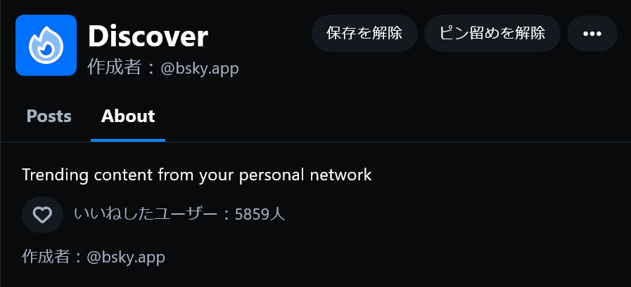
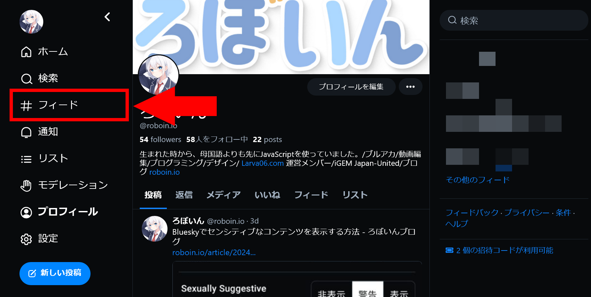
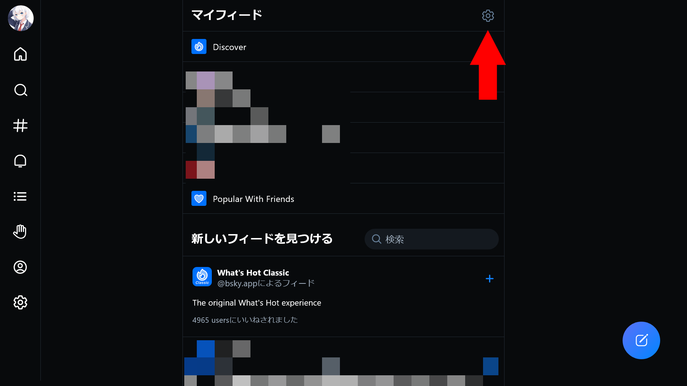
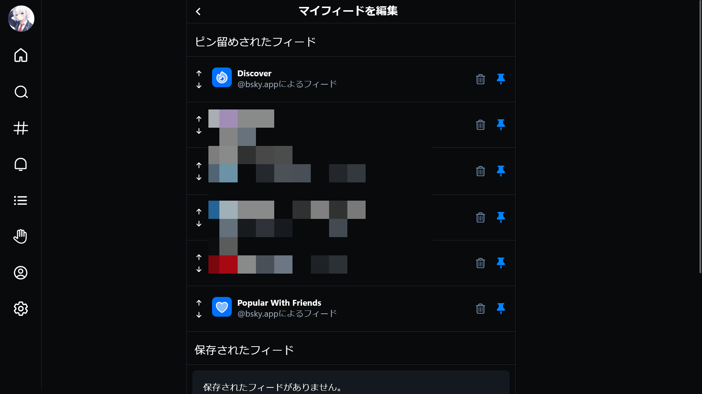

import ArticleCard from "@components/ArticleCard.astro";

BlueskyはTwitter（X）の代替として注目されている分散型のSNSです。この記事では、BlueskyのDiscoverフィードとは何か、そして**Discoverフィードを非表示にする方法**について解説します。

## Blueskyとは？

**Blueskyは分散型SNS**で、従来のSNSに見られるデータの集中管理とは異なるアプローチを取っています。[ATプロトコル](https://atproto.com/)を採用しており、同プロトコルを採用した**他のSNSと相互にやり取りできる**ことが特徴です。Elon Muskに買収されたTwitter（X）の代替としても注目されています。

ThreadsやMisskey、Mastodonなど、ActivityPubを採用した他の分散型SNSとは異なり、Blueskyは独自の道を歩んでいます。

また、カスタムフィード機能では技術的な知識があれば自分でタイムラインのアルゴリズムを開発できるなど、自由度の高さも特徴的です。

Blueskyは長らくベータ版で参加には招待コードが必要でしたが、最近になって招待制が廃止されたことで新規参加のハードルが下がり、急速にユーザー数を増やしています。

## Discoverとは？

*画像：[Discoverフィードの説明画面](https://bsky.app/profile/did:plc:z72i7hdynmk6r22z27h6tvur/feed/whats-hot)より*

Blueskyには、他のSNSのタイムライン表示に該当する「フィード」機能が存在しています。その中でも、**Discoverフィード**はデフォルトでホームに表示されています。

[フィードの説明](https://bsky.app/profile/did:plc:z72i7hdynmk6r22z27h6tvur/feed/whats-hot)には「Trending content from your personal network」と書かれています。つまり、Discoverフィードは自分のフォロー・フォロワーのユーザーからトレンドを抽出して表示する機能です。

URLを見ると、どうやらこのフィードは旧名が「What's Hot」のようです。このことからも人気のある投稿を表示する機能であることが分かります。

また、Discoverに似たフィードとして、フォローしているユーザーの人気な投稿を表示する「[Best of Follows](https://bsky.app/profile/did:plc:z72i7hdynmk6r22z27h6tvur/feed/best-of-follows)」、フォローしているアカウントの人気コンテンツとフォローしているアカウントがいいねしたコンテンツを組み合わせた「[Popular With Friends](https://bsky.app/profile/did:plc:z72i7hdynmk6r22z27h6tvur/feed/with-friends)」などがあります。

## Discoverを消す方法

Discoverは自分のアカウントに合わせて人気な投稿を表示してくれる便利な機能ですが、自分の興味に合わない投稿が表示されることもあります。「おすすめ表示は不要なので、フォローしている人の投稿だけを見たい」という場合は、Discoverを非表示にできます。

もし、「Discoverフィードのコンテンツが英語ばかりなので非表示にしたい」という場合は、フィードのコンテンツを日本語にする方法もあるので、そちらも参考にしてください。

<ArticleCard link="/article/2024/02/09/how-to-use-bluesky-in-japanese/" />

Discoverを非表示にするには、まずは、メニューから［フィード］を選択します。

フィードの設定画面が表示されるので、右上の歯車アイコンをクリックします。

［マイフィードを編集］という画面が表示されます。この画面で、フィードの順番を変更したり、ホームに表示するフィードを変えたりできます。自分で追加したフィードもこの画面に表示されます。

Discoverを消すには、［Discover］の右側にある青いピンのアイコンをクリックします。そうすると、ピンのアイコンが灰色になって固定が解除されます。この状態でホームに戻ると、Discoverフィードが非表示になっていることが確認できます。

## まとめ

BlueskyのDiscoverフィードは、自分のフォロー・フォロワーのユーザーからトレンドを抽出して表示する機能です。Discoverフィードが邪魔だと感じる場合は非表示にできるので、自分の興味に合わせたタイムラインを作りましょう。
