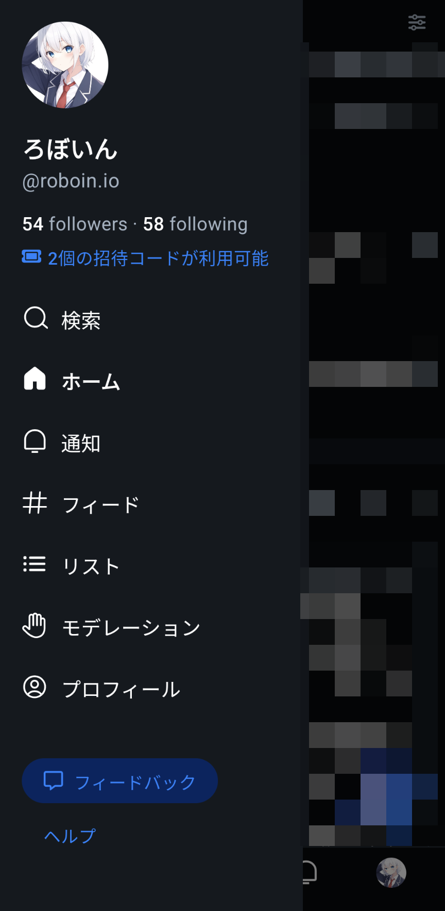
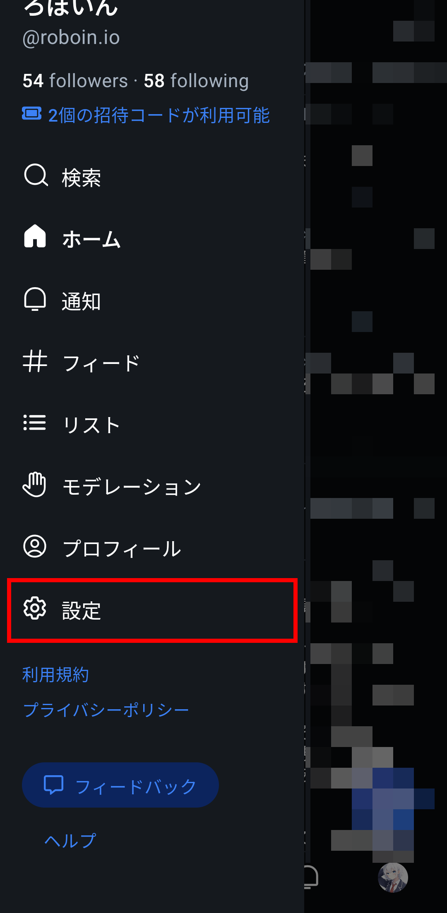

import ArticleCard from "@components/ArticleCard.astro";

BlueskyはTwitter（X）の代替として注目されている、分散型のSNSです。この記事では、**Blueskyの設定画面の開き方**について解説します。

## Blueskyとは？

**Blueskyは分散型SNS**で、従来のSNSに見られるデータの集中管理とは異なるアプローチを取っています。ATプロトコルを採用しており、同プロトコルを採用した**他のSNSと相互にやり取りできる**ことが特徴です。

ThreadsやMisskey、Mastodonなど、ActivityPubを採用した他の分散型SNSとは異なり、Blueskyは独自の道を歩んでいます。

Blueskyは最近、招待制を廃止して誰でもアカウントを作れるようになったことで、急速にユーザー数を増やしています。

## 設定画面が見つからない！？

Blueskyには当然ながら、他の一般的なSNSと同様に設定画面が存在しています。しかし、**スマホアプリやWeb版のスマホ表示で設定を初見で見つけるのは困難です**。

画面の左上の3本線のメニューボタンをタップすると、メニューが開きます。しかし、この中に設定らしき項目は見つかりません。

では、設定はどこにあるのでしょうか？実は、このメニューはスクロールでき、スクロールすると設定が現れます。

この［設定］をタップすると、設定画面が開きます。設定画面では**メールアドレスの確認**や**ハンドルの変更**、**日本語設定**などができます。

日本語化する方法やハンドルの変更方法などは、これらの記事で解説しています。

<ArticleCard link="/article/2024/02/09/how-to-use-bluesky-in-japanese/" />

<ArticleCard link="/article/2024/02/07/how-to-change-bluesky-handle-and-user-name/" />

## まとめ

Blueskyの設定画面は、スマホアプリやWeb版のスマホ表示では見つけにくい場所にあります。メニューをスクロールすることで設定画面にアクセスできるので、設定を変更したいときはこの方法を覚えておきましょう。
