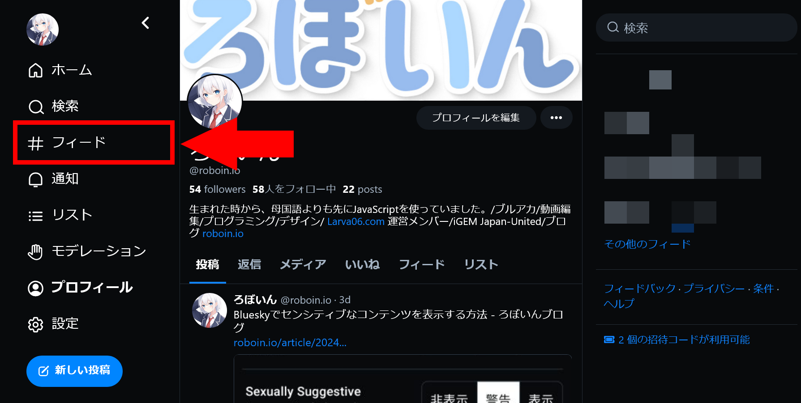
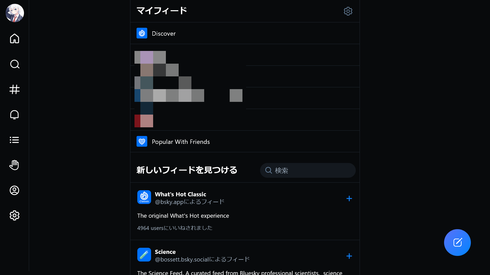

import ArticleCard from "@components/ArticleCard.astro";

BlueskyはTwitter（X）の代替として注目されている分散型のSNSです。この記事では、Blueskyの「フィード（feed）」とは何か、そしてフィードを検索する方法について解説します。

## Blueskyとは？

**Blueskyは分散型SNS**で、従来のSNSに見られるデータの集中管理とは異なるアプローチを取っています。[ATプロトコル](https://atproto.com/)を採用しており、同プロトコルを採用した**他のSNSと相互にやり取りできる**ことが特徴です。Elon Muskに買収されたTwitter（X）の代替としても注目されています。

ThreadsやMisskey、Mastodonなど、ActivityPubを採用した他の分散型SNSとは異なり、Blueskyは独自の道を歩んでいます。

カスタムフィード機能では技術的な知識があれば自分でタイムラインのアルゴリズムを開発できます。さらに、ハンドルにカスタムドメインを設定して本人確認できる仕組みが導入されている点も特徴的です。

<ArticleCard link="/article/2024/02/07/how-to-identify-yourself-in-bluesky/" />

Blueskyは長らくベータ版で参加には招待コードが必要でしたが、最近になって招待制が廃止されたことで新規参加のハードルが下がり、急速にユーザー数を増やしています。

## フィードとは？

フィードは、他のSNSのタイムラインに該当する機能です。Blueskyではホームに表示されるフィードを自分でカスタマイズできるため、自分の興味に合わせた情報を表示できます。

通常のSNSのフィード（タイムライン）は、フォローしているユーザーの投稿が表示されるタイムラインと、オススメの投稿が表示されるタイムラインの2つがあります。

おすすめタイムラインは、フォローしているユーザーの投稿とは別に人気のある投稿が表示されるタイムラインで、Blueskyでは「Discover」と呼ばれています。Discoverフィードについての詳細や非表示にする方法は、こちらの記事を参照してください。

<ArticleCard link="/article/2024/02/13/how-to-hide-bluesky-discover-feed/" />

Blueskyではこれらに加えて、自分で追加したフィードを表示できます。たとえば、特定のトピックやキーワード、カテゴリーに関するフィードを購読すると、そのトピックに関する投稿（ポスト）が表示されるようになります。

知識があれば誰でもフィードを開発できる仕組みになっており、公式・非公式を問わずさまざまなフィードがあります。

また、フィードにはデフォルトでは日本語だけでなく英語のコンテンツも表示されます。英語のコンテンツを表示したくない場合は、こちらの記事を参照してください。

<ArticleCard link="/article/2024/02/09/how-to-use-bluesky-in-japanese/" />

## フィードを検索する方法

Blueskyにはさまざまなフィードがありますが、その中から自分の興味に合ったフィードを見つけるためには、フィードを検索する方法を知っておくと便利です。

フィードを検索するにはまず、メニューから［フィード］を選択します。

この画面では、［マイフィード］にすでに登録されているフィードが表示されます。その下に［新しいフィードを見つける］というセクションがあり、ここでフィードを検索できます。

フィードを検索するには、［新しいフィードを見つける］というテキストの隣にある検索ボックスを利用します。探しているフィードのキーワードを検索ボックスに入力すると、該当するフィードが表示されます。

フィードを登録したい場合は、該当するフィードのプラスボタンをクリックします。すると、そのフィードが［マイフィード］に追加され、ホームに表示されるようになります。マイフィードには表示したいもののホームには表示したくないという場合は、こちらの記事と同じ方法で設定できます。

<ArticleCard link="/article/2024/02/13/how-to-hide-bluesky-discover-feed/" />

:::note
記事執筆時点では、Blueskyのフィードの検索機能はかなり初歩的なものです。とくに検索機能として一般的な、スペースで区切ってAND検索をする機能はありません。

たとえば、「bluesky　日本語」で検索すると「bluesky」と「日本語」が含まれるフィードが表示されるのではなく、「bluesky　日本語」という文字列にスペースも含めてマッチするフィードが表示されます。
:::

## 公式のフィードを探す方法

Blueskyには公式のフィードと非公式のフィードがあります。前述の検索方法では、公式・非公式の両方のフィードが表示されます。

公式のフィードを探している場合は、[Blueskyの公式アカウント](https://bsky.app/profile/bsky.app)を開いて［フィード］タブを選択すると、公式のフィードが表示されます。記事執筆時点での公式の主要なフィードは次のとおりです。

- **Popular With Friends**：フォローしているアカウントの人気コンテンツと、フォローしているアカウントがいいねしたコンテンツの組み合わせ
- **Discover（旧：What's Hot）**：フォロー・フォロワーのネットワーク内で人気のあるコンテンツ
- **Mutuals**：相互フォローの人のコンテンツ
- **What's Hot Classic**：Discoverの前身で、現在は停止中
- **Bluesky Team**：Blueskyチームのコンテンツ
- **Best of Follows**：フォローしているアカウントの人気コンテンツ

## まとめ

Blueskyのフィードを検索する方法について解説しました。Blueskyは分散型SNSで、自分でフィードを追加して表示できるため、興味に合った情報を表示できます。検索機能を活用して、自分の興味に合ったフィードを見つけてみてください。
