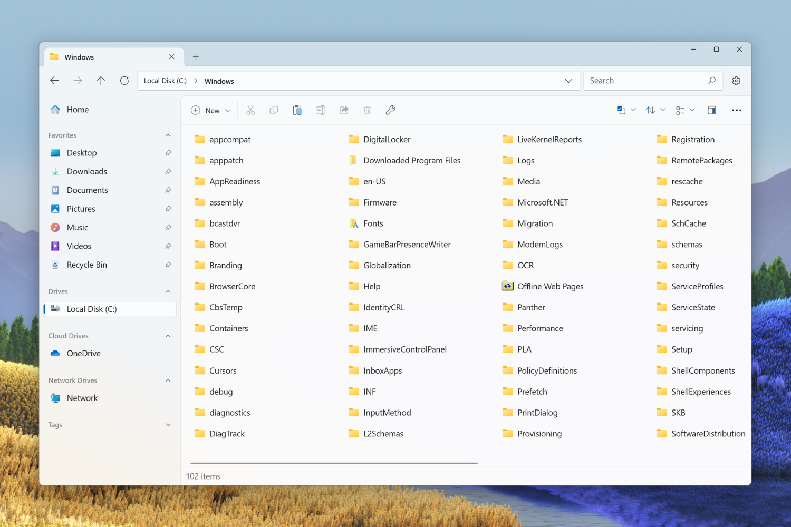

Windowsの人気ファイル管理アプリ「Files」の**v3.2**がリリースされました。多くの新機能と改善が含まれています。一体どんな機能が追加されたのか、そしてどのように使い勝手が向上したのか、詳しく見ていきましょう。

## Files 3.2の注目の新機能！

### 大容量フォルダーの安定性が向上

Filesでは、大容量のフォルダを扱う際にアプリがクラッシュしたり、フリーズしたりすることがありました。

v3.2では、**大容量フォルダーのブラウズの安定性が大幅に向上**しました。アイテムの追加や削除時のクラッシュを減少させ、よりスムーズな操作感を実現しているとのことです。

### リストビューでより多くのアイテムを表示

*画像：[リリースノート](https://files.community/blog/posts/v3-2)より*

新しく追加された**リストビュー**は、アイコンとファイル名だけを表示し、より多くのアイテムを効率よく表示できるレイアウトです。大量のファイルやフォルダを素早く確認したい時に便利です。

:::tip
リストビューを使用するには、ツールバーのレイアウトアイコンをクリックし、フライアウトメニューからリストビューを選択します。
:::

### アルバムカバーのカスタマイズ

**メディアファイルのアルバムカバーを直接変更**できるようになりました。これにより、お気に入りのアルバムを見つけやすくしたり、音楽コレクションをパーソナライズしたりするのが簡単になります。

アルバムカバーは右クリックして［プロパティ］から変更できます。

### サムネイルの高画質化

サムネイルの解像度とコントラストが向上し、**より美しく、識別しやすいサムネイル**を実現したとのことです。OneDrive内のサムネイルの読み込みに失敗するバグも修正されています。

## その他の改善点と注意点

他にも多くの改善が施されています。主要な改善点は次のとおりです。詳細な変更点は[公式のリリースノート](https://files.community/blog/posts/v3-2)から確認できます。

- 右クリックメニューから組み込みアイテムを隠すオプションが追加
- ファイルツリーを上に移動する際の自動スクロールを無効にするオプションが追加
- 検索クエリがデフォルトで未インデックスアイテムを含むように更新
- 新しく作成したファイルが最近使用したファイルに追加されるように

また、v3.1からアップデートする際にはデフォルトのレイアウトの設定がリセットされる場合があるとのことなので注意が必要です。

## まとめ

Files 3.2では多くのフィードバックを反映し、新機能と改善が施されました。全体的に安定性と利便性が向上しています。

FilesはWindows用のオープンソースのファイル管理ツールです。 タブやデュアルペインなどの便利な機能を備えており、美しくモダンなデザインが特徴です。

Filesは[公式ダウンロードページ](https://files.community/download)からダウンロードできます。

## 参考

- [Files • Announcing Files v3.2](https://files.community/blog/posts/v3-2)
- [Release-Notes/3.2.0.md at main · files-community/Release-Notes](https://github.com/files-community/Release-Notes/blob/main/3.2.0.md)
