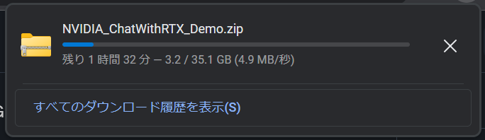
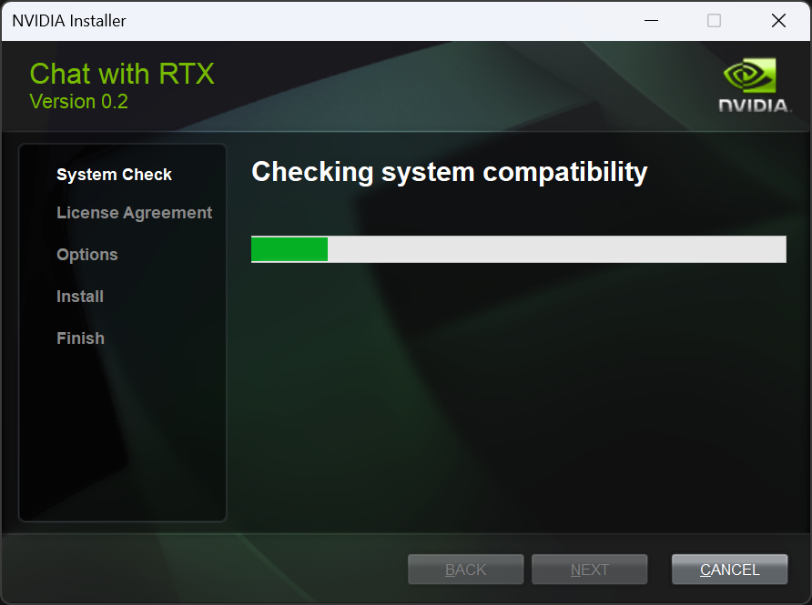
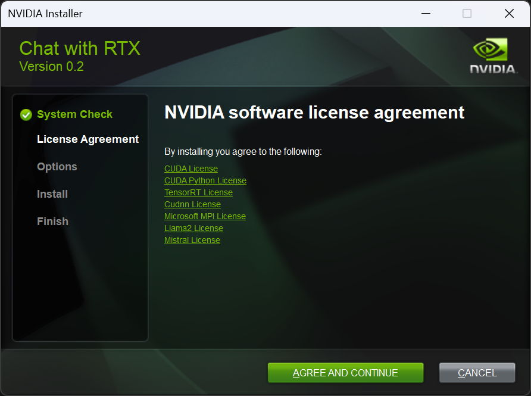
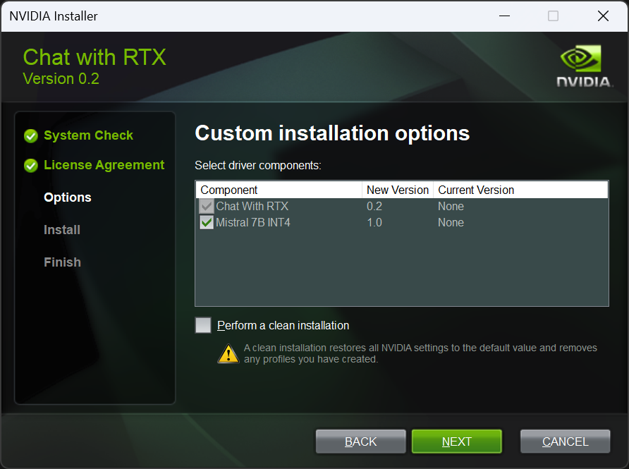
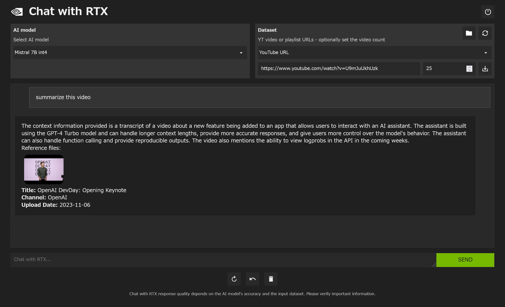
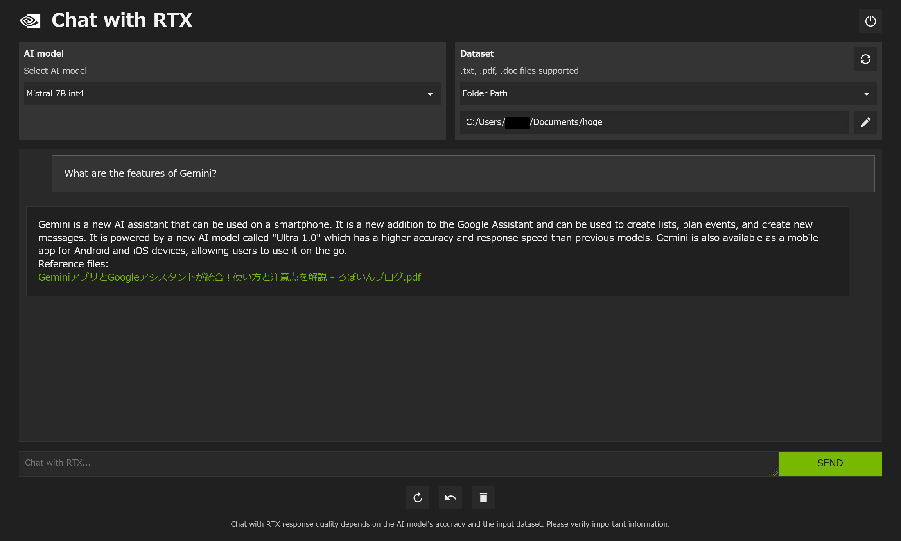

import { YouTube } from "@astro-community/astro-embed-youtube";
import ArticleCard from "@components/ArticleCard.astro";

NVIDIAは2024年2月14日（日本時間）、ローカルで動作するRAG対応のチャットソフト「**Chat with RTX**」を発表しました。Chat with RTXは、個人や開発者に新しい方法で資料やデータにアクセスする手段を提供します。

この記事では、NVIDIAがリリースした「Chat with RTX」概要から使い方までを解説します。

## Chat with RTXとは？

*画像：[Chat with RTXの公式サイト](https://www.nvidia.com/en-us/ai-on-rtx/chat-with-rtx-generative-ai/)*

Chat with RTXは、NVIDIAがCES 2024で発表した**大規模言語モデル（LLM）の技術デモ**です。LLMは、OpenAIのChatGPTやMicrosoftのCopilot、GoogleのGemini（旧：Google Bard）などで使われている技術です。

Chat with RTXでは**検索拡張生成（RAG）** と呼ばれる技術を用いて、ローカルのファイルを検索し、それらを活用した回答ができます。それが今回、実際にデモとしてダウンロード可能になりました。

次の動画は、NVIDIAが公開したChat with RTXのデモ動画です。

<YouTube id="gdsRJZT3IJw" />

このデモアプリを使用すると、LLMを自分のドキュメント、ノート、ビデオなどに接続し、パーソナライズできるようになります。**RTX acceleration**、**TensorRT-LLM**、および**検索強化生成（RAG）** を活用してチャットボットにクエリを送り、文脈に合った適切な回答を素早く得られます。

さらに、Chat with RTXはPC上で**ローカルに実行**されるため、速くて安全な結果を得られます。

Chat with RTXは、テキスト、PDF、DOC/DOCX、XMLなどのさまざまなファイル形式をサポートしています。フォルダーを指定するだけで数秒以内にロードします。また、YouTubeのプレイリストのURLを入力すると、動画の字幕をを読み込み、コンテンツに関するクエリを実行できるようになります。

技術デモであるChat with RTXは、GitHubから入手可能なTensorRT-LLM RAG開発者リファレンスプロジェクトから構築されています。開発者はこのリファレンスを使用してRTXのための独自のRAGベースアプリケーションを開発し、展開できるとのことです。

:::note[Chat with RTXのシステム要件]
Chat with RTXのシステム要件は次のとおりです。

- OS：Windows 11
- GPU：8GB以上のVRAMを搭載したNVIDIA GeForce RTX 30または40シリーズ、NVIDIA RTX AmpereまたはAda世代のGPU
- メモリー：16GB以上
- ドライバー：v535.11以上
:::

### Chat with RTXが役立つ場面

Chat with RTXのような技術は、さまざまなシーンで役立つことが期待されます。

**研究者や学生**は、論文や研究メモに素早くアクセスし、特定の情報を検索する際に時間を節約できます。**ビジネス**では、重要なドキュメントやプレゼンテーション資料から迅速に情報を抽出し、意思決定を加速できます。

また、**開発者**はソースコードや技術文書内で特定の機能やAPIの使用方法を簡単に発見でき、**コンテンツクリエイター**は、ビデオの文字起こしから特定のトピックやセクションを素早く探し出せます。

## Chat with RTXの使い方

### インストール

Chat with RTXは、NVIDIAの公式サイトからダウンロードできます。公式サイトにアクセスし、［Download Now］をクリックするとダウンロードが始まります。

https://www.nvidia.com/en-us/ai-on-rtx/chat-with-rtx-generative-ai/

ファイルはZIP形式で約35GBあるので、ダウンロードには時間がかかります。

ダウンロードが完了したらZIPファイルを解凍します。ファイルサイズが大きいので解凍にも時間がかかります。私の環境では解凍に15分ほどかかりました。

<small>CPU性能よりもストレージ速度が足を引っ張っていました。</small>

解凍後のフォルダーのサイズは約38GBでした。

Chat with RTXをインストールするには、管理者権限で``setup.exe``を実行します。

記事執筆時点でのバージョンはv0.2のようです。システムの互換性の確認が始まるので、しばらく待ちます。

Chat with RTXで利用されているソフトウェアのライセンスの同意画面が表示されるので、内容をよく読んで同意する場合は［AGREE AND CONTINUE］をクリックします。

インストールのオプションの画面が表示されます。どうやら、Chat with RTXはMistral 7Bを使っているようです。また、ファイルを見てみると、LLaMA 13Bのモデルも対応しているようです。ここでは元々の設定のまま［NEXT］で進みました。

インストール場所の確認が表示されるので、とくに問題がなければそのままインストールします。

### 使い方

インストールが終わって起動すると、Webブラウザーが立ち上がってUIが表示されます。

［Dataset］で［YouTube URL］を選択し、OpenAIのDevDayの動画のURLを入力してみました。

<YouTube id="U9mJuUkhUzk" />

ダウンロードアイコンをクリックして字幕データをダウンロードしてから「summarize this video」と入力したところ、動画の要約が表示されました。内容は概ね合っていそうです。RTX 3070 Tiで試したところ、生成速度は非常に高速でした。

> summarize this video
>
> The context information provided is a transcript of a video about a new feature being added to an app that allows users to interact with an AI assistant. The assistant is built using the GPT-4 Turbo model and can handle longer context lengths, provide more accurate responses, and give users more control over the model's behavior. The assistant can also handle function calling and provide reproducible outputs. The video also mentions the ability to view logprobs in the API in the coming weeks. 
> Reference files:  
> Title: OpenAI DevDay: Opening Keynote 
> Channel: OpenAI 
> Uploaded Date: 2023-11-06

［Dataset］で［Folder Path］を選択してみます。フォルダーを指定すると、その中のファイルを読み込みます。どうやらパスに日本語が含まれているとエラーが出るようです。今回は、GoogleのGeminiについての記事をPDFにしてフォルダーに入れてみました。

<ArticleCard link="/article/2024/02/11/google-assistant-gemini-app/" />

「What are the features of Gemini?」と尋ねたところ、適切な応答が返ってきました。日本語の記事だったのですが、問題なく回答できるようです。回答に使用したファイルへのリンクを示してくれるので、参照しやすいようになっています。

> What are the features of Gemini?
>
> Gemini is a new AI assistant that can be used on a smartphone. It is a new addition to the Google Assistant and can be used to create lists, plan events, and create new messages. It is powered by a new AI model called "Ultra 1.0" which has a higher accuracy and response speed than previous models. Gemini is also available as a mobile app for Android and iOS devices, allowing users to use it on the go. 
> Reference files:  
> GeminiアプリとGoogleアシスタントが統合！使い方と注意点を解説 - ろぼいんブログ.pdf

追加で日本語でも質問してみたところ、英語で応答が返ってきたものの内容は正確でした。

> Geminiのアプリが2つある場合はどのようにして見分けられますか？
>
> In the case where there are two Gemini applications installed on a smartphone, they can be distinguished by tapping on the icon. The icon for the Gemini application will be labeled "Gemini," while the icon for the Google Assistant application will be labeled "アシスタント."  
> Reference files:  
> GeminiアプリとGoogleアシスタントが統合！使い方と注意点を解説 - ろぼいんブログ.pdf

## まとめ

「Chat with RTX」は、txtファイルに対応している一方でMarkdownファイルには対応していないようです。Markdownファイルに対応していると、ドキュメントの検索などに利用しやすくなるように思いました。

今後のアップデートや開発者コミュニティからのフィードバックによる改善に期待が高まります。

## 参考

- [Build a Custom LLM with Chat With RTX | NVIDIA](https://www.nvidia.com/en-us/ai-on-rtx/chat-with-rtx-generative-ai/)
- [NVIDIA Brings Generative AI to Millions, With Tensor Core GPUs, LLMs, Tools for RTX PCs and Workstations | NVIDIA Newsroom](https://nvidianews.nvidia.com/news/generative-ai-rtx-pcs-and-workstations)
