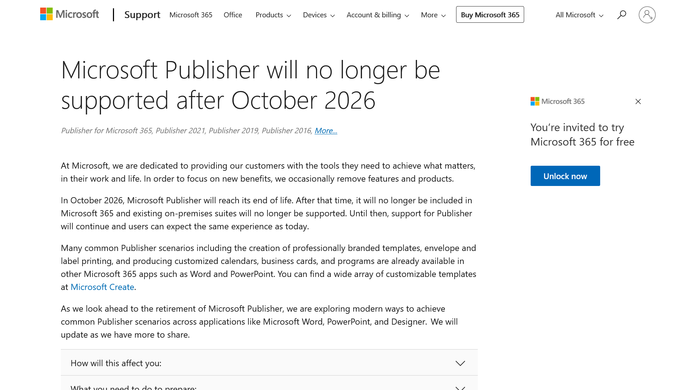

Microsoftは2026年10月をもって、**Microsoft Publisher**のサポートを終了することを発表しました。

この記事では、この変更が意味すること、ユーザーがどのような対応を取るべきか、そして**Microsoft Publisherの代替となるツール**について詳しく説明します。

## なぜサポートが終了するのか？

*画像：[Microsoft Publisherのサポート終了を知らせるページ](https://support.microsoft.com/en-us/office/microsoft-publisher-will-no-longer-be-supported-after-october-2026-ee6302a2-4bc7-4841-babf-8e9be3acbfd7)*

Microsoftは、顧客にとってよりよい価値を提供するため、時には特定の機能や製品の提供を終了することがあります。**Microsoft 365**のアップデートや改良に注力する中で、2026年10月にPublisherがそのライフサイクルの終わりを迎えることになりました。これにより、Microsoft 365や既存のオンプレミススイートからPublisherが除外され、サポートが提供されなくなります。

## サポート終了が意味すること

Microsoft Publisherのサポート終了に伴い、次のような変更が発生します。

- **2026年10月まで**、現在の機能をそのまま利用できます
- サポート終了後、**Microsoft 365のユーザー**はPublisherにアクセスできなくなります
- 同時に、**永続版Publisher**のサポートも終了します

:::note
Microsoftは、今後新しい情報や更新があれば共有するとしています。買い切り版のPublisherについてはサポート終了後も使用できますが、バグやセキュリティの問題に対して修正されなくなるので、注意が必要です。
:::

## サポート終了に向けてユーザーが取るべき対応

Microsoftは現段階で特定のアクションを取る必要はないとしています。しかし、Publisherを日常的に使用しているユーザー、とくにビジネスで活用しているユーザーは代替ツールへの移行を考え始めるべき時期かもしれません。

## Microsoft Publisherの代替ツールは？

サポート終了の発表に伴い、Publisherの代替ツールを探す必要が出てきました。

**Microsoft 365**内には多くの**Publisherシナリオ**（プロフェッショナルなテンプレートの作成、封筒やラベルの印刷、カスタマイズされたカレンダーやビジネスカード、プログラムの制作など）を実現できるアプリケーションがすでに存在します。

**Microsoft Word**や**PowerPoint**は、Publisherの代替として有効な選択肢になりえます。[Microsoft Create](https://create.microsoft.com/)で利用可能な豊富なカスタマイズ可能なテンプレートと共に、Publisherユーザーにとって新たな標準になる可能性が高いといえます。

:::note
Microsoftは**Designer**を含む他のアプリケーションにおいて、Publisherシナリオを実現する現代的な方法を模索中としています。そのため、今後発表される新機能やアップデートに注目しておきましょう。
:::

## まとめ

Microsoft Publisherのサポート終了は、多くのユーザーにとって新たなツールへの移行を余儀なくされる可能性があります。しかし、Microsoft 365内にはすでに強力で多機能な代替ツールがあり、今後さらにパワフルで使いやすい機能が追加されることが期待されます。

## 参考

- [Microsoft Publisher will no longer be supported after October 2026 - Microsoft Support](https://support.microsoft.com/en-us/office/microsoft-publisher-will-no-longer-be-supported-after-october-2026-ee6302a2-4bc7-4841-babf-8e9be3acbfd7)