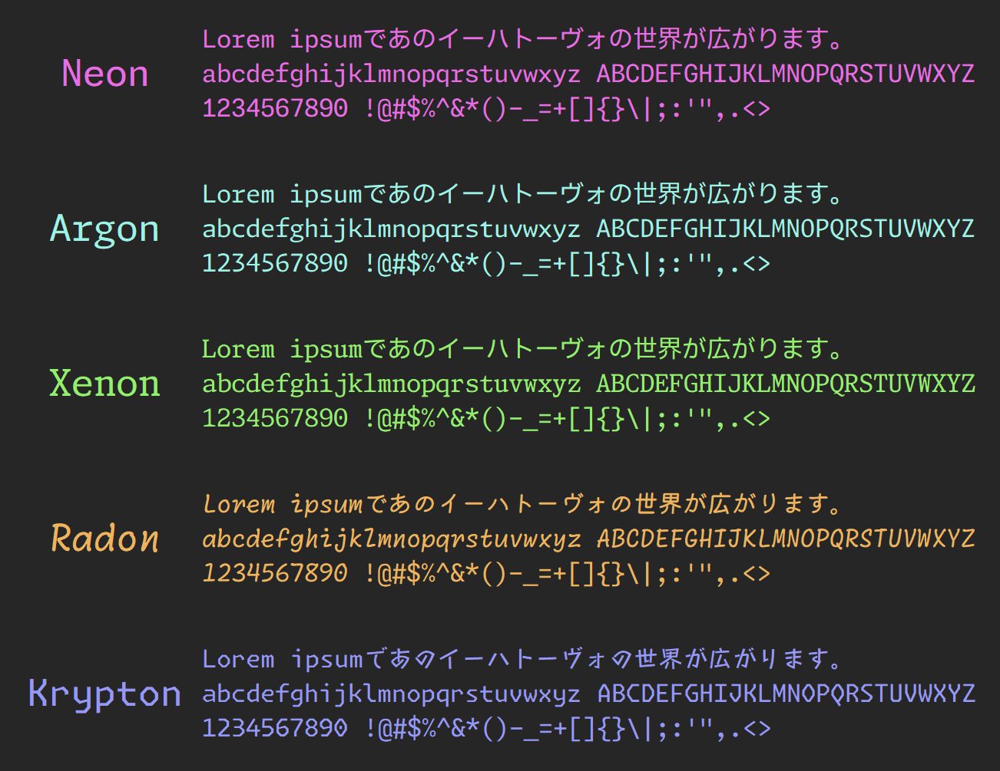

import ArticleCard from "@components/ArticleCard.astro";

プログラミングにおいて、読みやすいコードは美しいだけでなく、バグの少ない効率的な開発につながります。そのためには、適切なフォントの選定も欠かせません。

今回は、最近公開されたばかりのプログラマー向けフォント「**Moralerspace**」について、その特徴や魅力を深堀りします。

## Moralerspaceフォントとは？


*画像：[GitHubリポジトリー](https://github.com/yuru7/moralerspace)より*

**Moralerspace**は、モダンな欧文フォント「[Monaspace](https://github.com/githubnext/monaspace)」と、日本語フォント「[IBM Plex Sans JP](https://github.com/IBM/plex)」を組み合わせた、プログラミング向けのフォントです。この組み合わせにより英数字と日本語の文字が美しく調和し、読みやすさと使いやすさを両立しています。

Moralerspaceは、同じくプログラミング用フォントの「**HackGen**」と同じ方が開発しています。

MonaspaceはGitHubが開発したフォントで、さまざまな技術によって読みやすさを実現しています。詳しくは、こちらの記事で解説しています。

<ArticleCard link="/article/2023/11/11/github-monaspace-font/" />

## Moralerspaceの特徴

Moralerspaceフォントは、Monaspace由来の英数字を使っているため、クリアでモダンなデザインで非常に読みやすくなっています。また、日本語文字はIBM Plex Sans JPをベースにしており、文字の懐が広く、長時間のコーディング作業でも目の疲れを軽減します。

文字幅比率は半角3：全角5で、ゆとりのある幅の半角英数字を実現しています。半角1：全角2のバージョンも配布されています。さらに、**全角スペースが可視化**されるため、バグの減少にも寄与します。

### ライセンス

Moralerspaceフォントは**SIL Open Font License v1.1**に基づいて配布されています。これにより、個人使用から商用利用まで、自由に使用することが可能です。

## 使い方

Moralerspaceは[GitHubリポジトリーのReleasesページ](https://github.com/yuru7/moralerspace/releases)からダウンロードできます。［Assets］から好みのバージョンのZIPファイルをダウンロードし、解凍してフォントをインストールするだけです。

VS Codeで使うには、GUIから設定するか、`settings.json`を編集します。たとえば、通常版のMoralerspaceのNeonを利用する場合は、GUIでフォント設定の先頭に`'Moralerspace Neon',`を追加するか、`settings.json`を次のように編集します。

```jsonc title="settings.json" add={3} "'Moralerspace Neon',"
{
    // ...
    "editor.fontFamily": "'Moralerspace Neon', monospace"
}
```

`Moralerspace Neon`の部分は、ダウンロードしたフォントのファミリー名に置き換えてください。たとえば、Moralerspaceの半角1：全角2バージョンのArgonを使う場合は、`Moralerspace Argon HW`とします。

## まとめ

Moralerspaceは、MonaspaceとIBM Plex Sans JPの良いところを組み合わせた非常に読みやすいフォントです。筆者もさっそくVS CodeのフォントをMoralerspaceに設定しました。ぜひ、試してみてください。

## 参考

- [yuru7/moralerspace: Moralerspace は、欧文フォント Monaspace と日本語フォント IBM Plex Sans JP を合成したプログラミング向けフォントです。](https://github.com/yuru7/moralerspace)
