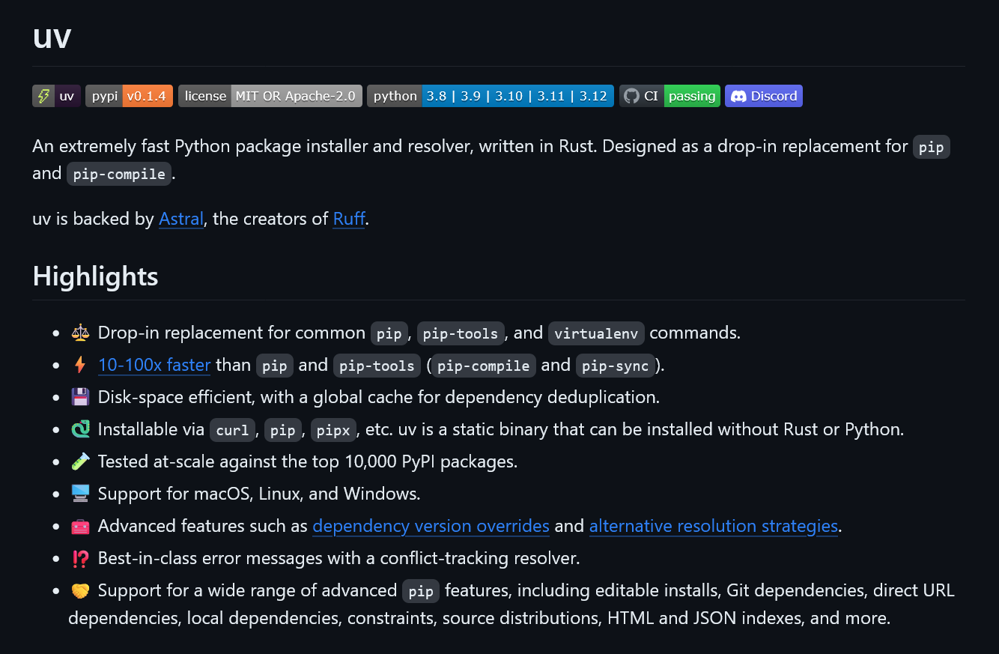
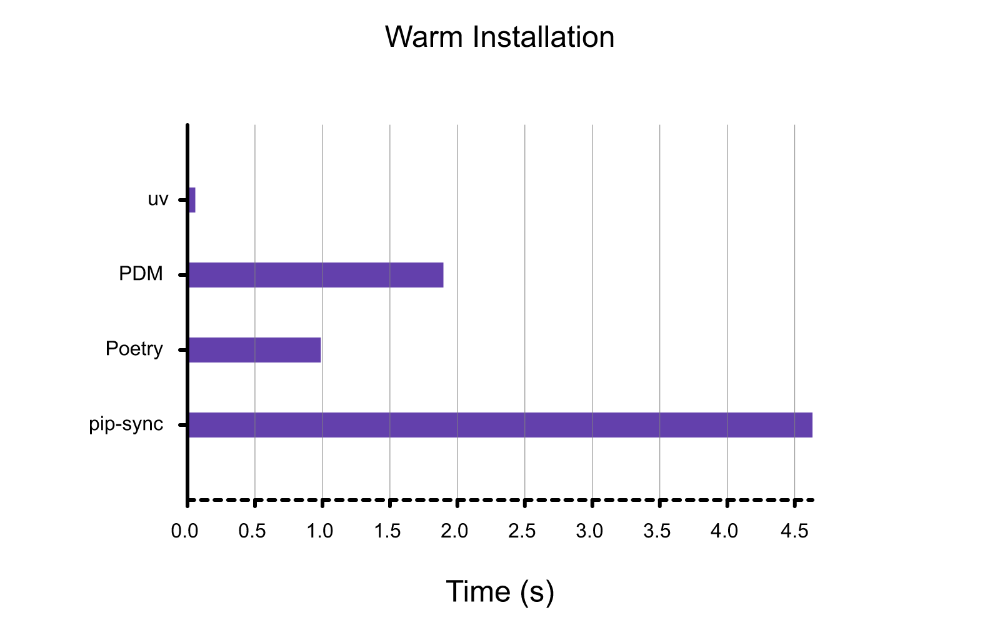
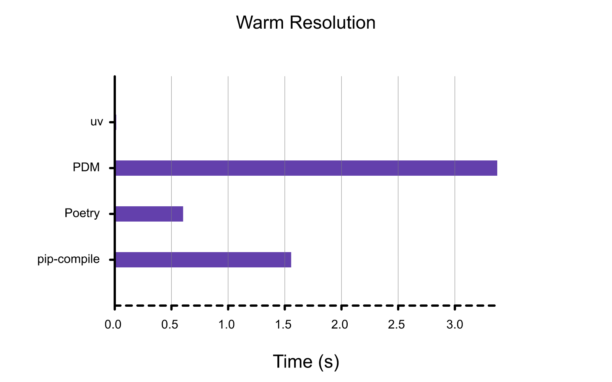

Rust言語で開発された超高速なPythonパッケージインストーラー・リゾルバー「**uv**」が発表されました。uvは従来のパッケージ管理ツールのpipやpip-toolsを置き換えることを目指しています。

この記事では、uvの特徴や機能について詳しく紹介します。

## uvとは？


*画像：[uvのGitHubリポジトリー](https://github.com/astral-sh/uv)のスクリーンショット*

uvは、2024年2月15日に発表された、**Pythonのパッケージインストーラー・リゾルバー**です。その最大の特徴は**Rust言語で開発**されており、**従来のツールの100倍の速度で動作**する点です。

Rustは高速で安全、並行処理にも強いとされるプログラミング言語で、近年、多くの新しいソフトウェアプロジェクトで採用されています。Rustは[Windowsカーネルの一部で使用されている](https://www.microsoft.com/en-us/security/blog/2023/09/26/new-security-features-in-windows-11-protect-users-and-empower-it/)ほか、[Android OSの一部でも採用](https://security.googleblog.com/2021/04/rust-in-android-platform.html)されています。

uvはRustの強みを生かし、従来のpipやpip-toolsに代わる、**高速かつ信頼性の高いパッケージ管理ツール**を目指しています。

:::note
**pip**とは、Pythonでもっとも一般的に使われるパッケージ管理システムで、Pythonのパッケージをインストール、管理するためのツールです。

**pip-tools**はpipの機能を補助し、パッケージ依存関係の解決などをさらに簡単にするツール群です。
:::

## 主な特徴とメリット

uvの特徴としては、次のような点が挙げられます。

### 超高速なパッケージ管理

uvは従来のツールと比較して、**8〜10倍**の速度でパッケージのインストールや依存関係の解決ができます。キャッシュを使用した場合には、さらに速度が向上し、**80〜115倍**高速に処理を完了できます。


*キャッシュありのインストール速度の比較。画像は[GitHubリポジトリー](https://github.com/astral-sh/uv/blob/main/BENCHMARKS.md)より*


*キャッシュありの依存関係の解決速度の比較。画像は[GitHubリポジトリー](https://github.com/astral-sh/uv/blob/main/BENCHMARKS.md)より*

### 簡単な導入と互換性

既存のpipやpip-toolsワークフローで構築されたプロジェクトに対して、**設定なし**で使用できるように設計されています。これにより、既存のプロジェクトへの導入の障壁が低くなります。

さらに、モジュール化されているため必要な機能だけを利用できます。

### 簡素化されたツールチェーン

uvは**単一の静的バイナリー**として提供され、pip、pip-tools、virtualenvの代わりを一手に担います。Python自体とは独立しているため、複数のバージョンのPythonが存在する環境でも簡単に管理できます。

## インストール方法

uvのインストールは非常に簡単です。次のコマンドを実行するだけで、すぐに利用できます。

```bash
curl -LsSf https://astral.sh/uv/install.sh | sh
```

または、pipを使用したインストールも可能です。

```bash
pip install uv
```

## uvによる操作の例

uvは、既存のpipやpip-toolsとの互換性を保ちながら、より簡単な操作でパッケージ管理ができます。

- `pip install`の代わりに`uv pip install`を使用してパッケージをインストール
- `pip-compile`の代わりに`uv pip compile`を使用して依存関係をロック
- `python -m venv`の代わりに`uv venv`で仮想環境を作成
- `pip-sync`の代わりに`uv pip sync`で仮想環境を同期

## uvの今後

uvとRye（実験的なパッケージ管理ツール）の連携により、uvは将来的には**Python版Cargo**へと進化することを目指しています。CargoはRustのパッケージマネージャーで、非常に高速かつ信頼性の高いツールです。uvがこのビジョンを実現すれば、Pythonの開発体験はさらに向上することでしょう。

## まとめ

uvは、Rustの強力な性能を背景に、Pythonのパッケージ管理を高速で便利にする可能性を秘めています。とくに、大規模なプロジェクトではパッケージのインストールや依存関係にかかる時間を大きく削減できるため、開発効率の向上が期待できます。uvの今後の発展に注目です。

## 参考

- [uv: Python packaging in Rust](https://astral.sh/blog/uv)
- [astral-sh/uv: An extremely fast Python package installer and resolver, written in Rust.](https://github.com/astral-sh/uv)
