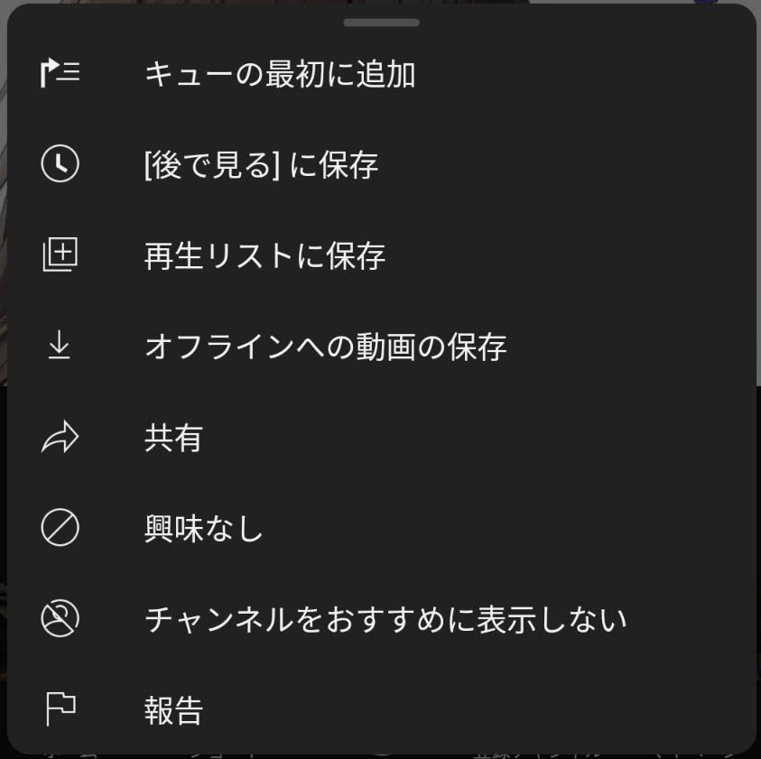

YouTubeを利用していると、「次に何を見るか」が問題になってくることがありますよね。そんな時に非常に便利なのが、「**キューの最初に追加**」機能です。この機能を使用することで、見たい動画のリストを簡単に作成し、次々と動画を楽しむことが可能になります。

## YouTubeのキュー機能とは？

YouTubeの**キュー機能**は、複数の動画をリストアップし、そのリストに沿って自動で次の動画が再生される機能です。**保存されない一時的な再生リスト**と考えると分かりやすいです。

これにより、オススメに流れてきた気になる動画をを途切れることなく次々と視聴できます。

### キューに動画を追加する方法

キューに動画を追加するには、まず視聴したい動画のメニューボタンをクリックします。スマートフォンの場合は［**キューの最初に追加**］、PCの場合は［**キューに追加**］を選択します。すると、その動画がキューに追加されます。

*スマホアプリの場合に表示されるメニュー画面*

スマホで2本目以降をキューに追加する場合は、［**キューの最初に追加**］と［**キューの最後に追加**］を選べます。前者を選択するとキューの先頭に追加され、現在再生している動画の次に再生されます。後者を選択するとキューの末尾に追加され、現在のキューの最後に再生されます。

これにより、現在の視聴セッションを中断することなく次に視聴する動画を設定できます。

:::note
Web版YouTubeではキューを無料で利用できます。スマホやタブレットのアプリでキューを使うには、**YouTube Premium**に加入する必要があります。
:::

YouTube Premiumに加入するとスマホでキューを使えるほか、広告が表示されなくなり、オフライン再生が可能になります。また、YouTube Music Premiumも利用できるようになります。

YouTube Premiumに加入すると、スマホで動画を視聴中にオススメに表示された気になった動画をキューに追加して次々と再生するという使い方ができるのでオススメです。ぜひ試してみてください。

## 参考

- [YouTube で動画をキューに追加する - YouTube ヘルプ](https://support.google.com/youtube/answer/9546304?hl=ja)
