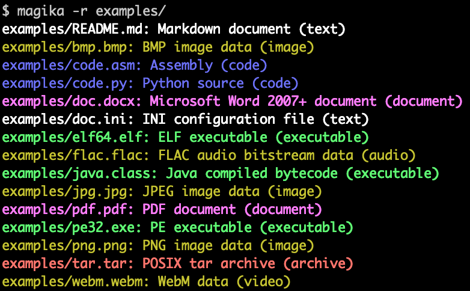

Googleが2024年2月15日に発表した「**Magika**」は、AI技術を活用したファイルタイプの識別システムです。Googleのディープラーニングモデルを駆使し、バイナリやテキストファイルの種類を高速かつ高精度に判定します。

この記事では、Magikaの概要から使い方まで、詳しく解説します。

## Magikaの特徴とは？


*Magikaの出力の例。画像は[GitHubリポジトリー](https://github.com/google/magika)より*

### AIによる高精度なファイルタイプ識別

元々、Linuxに代表される[libmagicやfileユーティリティ](https://github.com/file/file)がファイルタイプの判定に広く用いられてきました。

しかし、手作業によるヒューリスティックな方法では、テキストファイルやプログラミング言語ファイルなどの識別が難しい問題がありました。

Magikaは、この問題をAIの力で解決します。**わずか1MBのカスタム深層学習モデル**を使用し、その処理はCPU上でもミリ秒単位で行えるほど高速です。

:::note
ちなみに、人気なコードエディターのVS Codeでは[Guesslang](https://github.com/yoeo/guesslang)というモデルと[TensorFlow.js](https://www.tensorflow.org/js)を使用した[言語検出機能](https://code.visualstudio.com/updates/v1_60#_automatic-language-detection)が実装されています。
:::

### 高性能で広範なファイルタイプ対応

Magikaは、100を超えるファイルタイプを対象とした100万ファイルのベンチマークによる評価で、既存のツールに比べて約20%の性能向上を達成しています。

とくに、テキストファイルやコードファイル、設定ファイルなどで大きな改善が見られます。

### 多様な利用環境での活用

Google内では、GmailやDrive、Safe Browsingなどにおけるユーザーの安全を高めるためにMagikaが広範に使用されています。

正確なファイルタイプの識別により、悪意のあるドキュメントをスキャンするシステムでスキャンできるファイル数を11%増やすなど、大きな効果を挙げています。

### オープンソースでの提供

Magikaは、[GitHub](https://github.com/google/magika/)上で[Apache-2.0ライセンス](https://github.com/google/magika/blob/main/LICENSE)にもとづきオープンソースとして公開されています。

Pythonライブラリやコマンドラインツールとして利用でき、GPUは不要です。研究者や他のソフトウェア開発者にとってもアクセスしやすいツールとなっています。

## Magikaの使い方

### Webデモの利用

Magikaは[Webデモ](https://google.github.io/magika/)を通じて、ブラウザー上で簡単にファイルタイプの識別を試せます。インストール不要で利用可能なため、気軽にMagikaの性能を体験できます。

また、速度は低下するものの、TensorFlow.jsを用いた[npmパッケージ](https://www.npmjs.com/package/magika)も提供されています。

### インストール

MagikaはPythonパッケージとして提供されており、次のコマンドで簡単にインストールできます。

```shell
pip install magika
```

### コマンドラインツールとしての使用

Magikaをコマンドラインツールとして使用する場合、ファイルやディレクトリーを指定して実行します。

```shell
$ magika -r ファイルやディレクトリのパス
tests_data/README.md: Markdown document (text)
tests_data/basic/code.asm: Assembly (code)
tests_data/basic/code.c: C source (code)
...
```

:::tip
`-r`オプションを付けると、ディレクトリー内のファイルを再帰的にスキャンします。
:::

JSON形式での出力や、MIMEタイプのみを取得するオプションも用意されており、多彩なニーズに対応可能です。

### Python APIとしての使用

MagikaはPythonライブラリーとしても提供されています。次の例のように、直接Pythonコード内からファイルタイプを識別できます。

```python
from magika import Magika

m = Magika()
res = m.identify_bytes(b"ファイルの内容")
print(res.output.ct_label)
```

## まとめ

Googleによって開発されたMagikaは、ファイルタイプ識別の精度とスピードを大きく向上させ、多くの分野での利用が期待されます。この画期的なツールを活用し、さまざまなアプリケーションや研究に役立ててみてはいかがでしょうか。

## 参考

- [Magika: AI powered fast and efficient file type identification | Google Open Source Blog](https://opensource.googleblog.com/2024/02/magika-ai-powered-fast-and-efficient-file-type-identification.html)
- [Magika](https://google.github.io/magika/)
- [google/magika: Detect file content types with deep learning](https://github.com/google/magika/)
