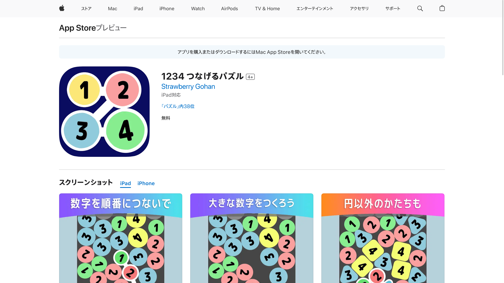
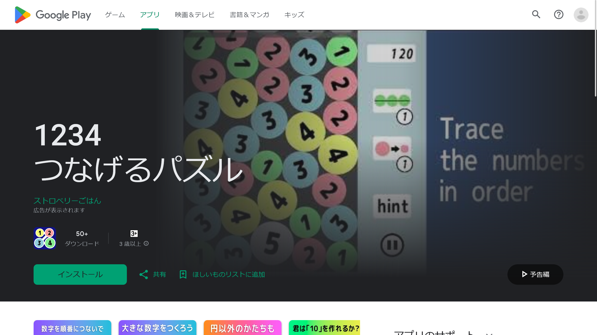

import { YouTube } from "@astro-community/astro-embed-youtube";

2月20日にリリースされたパズルゲーム『**1234 つなげるパズル**』が、そのシンプルなルールと中毒性で注目を集めています。

この記事では、iOSやAndroidのスマートフォンに『1234 つなげるパズル』をインストールする方法と、その遊び方について紹介します。

## 『1234 つなげるパズル』とは？

<YouTube id="Sm-fPFdY3pI" />

『1234 つなげるパズル』は2月20日に正式リリースされたばかりのゲームで、名前のとおり数字をつなげるパズルゲームです。

2月2日からテスト公開されており、そのシンプルなルールと中毒性で一部のユーザーから注目を集めていました。

開発者は「スイカゲーム真似したら全く違うゲームになりました」と[コメント](https://twitter.com/ShadowloveP/status/1753357603927703904)しています。

## インストール方法

### iOS版のインストール

*画像：[アプリページ](https://apps.apple.com/jp/app/id6475421133)より*

1. iPhoneまたはiPadのApp Storeを開きます
2. 検索ボックスに『1234 つなげるパズル』と入力し検索するか、[こちらのリンク](https://apps.apple.com/jp/app/id6475421133)からアプリページにアクセスします
3. アプリページから［取得］をタップし、必要に応じてApple IDのパスワードやTouch ID、Face IDで認証します
4. インストールが完了したら、［開く］をタップしてゲームを開始します

### Android版のインストール

*画像：[アプリページ](https://play.google.com/store/apps/details?id=com.strawberry.connect1234)より*

1. AndroidスマートフォンまたはタブレットのGoogle Playストアを開きます
2. 検索バーに『1234 つなげるパズル』と入力し検索するか、[こちらのリンク](https://play.google.com/store/apps/details?id=com.strawberry.connect1234)からアプリページにアクセスします
3. アプリページから［インストール］をタップします。
4. インストールが完了したら、［開く］をタップしてゲームを開始します

## 遊び方と攻略法

### 基本ルール

『1234 つなげるパズル』の基本ルールはシンプルです。ゲームが始まると、1から4までの数字が書かれたカラフルなボールが画面上から降ってきます。プレイヤーはこれらのボールを順番になぞってつなげていきます。

### ポイント

- **3つ以上の連続した数字**のボールのみをつなげられます
- つなげられるボールは、物理的に**近くにあるものに限定**されます
- 数字は**大きい順**でも**小さい順**でも大丈夫です
  - 例）`1→2→3`や`4→3→2`など
- `1→2`や`3→4→2`のように、3つ未満しかつなげられない場合や連続していない数字の組み合わせは**不可**です
- つなげたボールは、その中で**最も大きい数字に1を足した数字**のボールに変化します
  - 例）`1→2→3`をつなげると、`4`に変化します

### ゲームオーバーとチャンス

つなげられるボールがなくなると終了しますが、終了直前には任意のボールを**小さくしたり**、**同じ数字のボールをつなげて消したりするチャンス**が与えられます。

これらの機能を活用して、高得点を目指しましょう。

### ヒント機能

迷ったときには、ペナルティーなしで利用できる**ヒント機能**があります。この機能を活用して、次の一手の参考にできます。

## まとめ

『1234 つなげるパズル』は、シンプルながらも戦略性のある遊びが楽しめるパズルゲームです。BGMや効果音も一役買っており、プレイの楽しさを一層引き立ててくれます。

休憩時間や通勤・通学時間の暇つぶしに最適です。ぜひインストールしてみてください！
