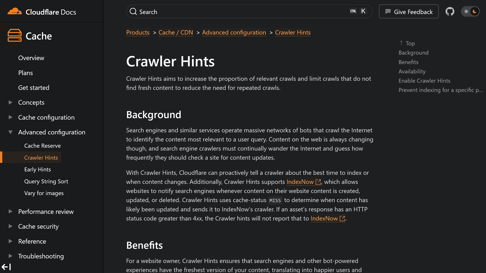

Webサイトに新しいコンテンツを投稿しても、検索エンジンにいち早くインデックスされなければ、その価値を最大限に活かし切ることができません。そこで注目したいのが、Cloudflareの提供する「**Crawler Hints**」です。

この記事では、Crawler Hintsの仕組みやメリット、具体的な使い方について解説します。

## Crawler Hintsとは？


*画像：[Crawler Hintsについてのヘルプページ](https://developers.cloudflare.com/cache/advanced-configuration/crawler-hints/)*

CloudflareのCrawler Hintsは、Webサイトに対する検索エンジンのクローリングをより効果的にし、同時にサーバーへの負荷を軽減するための機能です。

具体的には、コンテンツが更新された際に検索エンジンにその情報を通知することで、クローラーが必要なタイミングでサイトを訪れ、最新のコンテンツをインデックスできるよう促します。

Crawler Hintsは、**IndexNow**と呼ばれる仕組みを活用しています。IndexNowはBingやYandexに対応していますが、Googleは対応していないようです。

Web上のコンテンツは常に変化しており、検索エンジンのクローラーは、いつサイトを訪れてコンテンツをチェックすればよいのかを推測しています。

Crawler Hintsを使うと、Cloudflareがクローラーに対し、インデックスに最適なタイミングやコンテンツの変更をプロアクティブに通知できるようになります。

Crawler Hintsは、**Free**、**Pro**、**Business**、**Enterprise**プランのすべてで利用可能です。

### Crawler Hintsのメリット

Crawler Hintsを利用することで、次のようなメリットが得られます。

- **最新コンテンツの迅速なインデックス化**：Crawler Hintsを活用することで、コンテンツの変更が検索エンジンにいち早く通知され、ユーザーに対して常に最新の情報を提供できるようになります。また、検索ランキングにも好影響を与える可能性があります
- **サーバーへのトラフィック軽減**：不要なクローリングが減ることでWebサイトへのトラフィックが軽減され、環境への影響も軽減されます

### IndexNowとは？

Crawler HintsはIndexNowを利用していると説明しましたが、ではIndexNowとは具体的に何でしょうか？

IndexNowの仕組みに興味がない場合は、[Crawler Hintsを有効化する方法](#crawler-hintsを有効化する方法)までスキップして構いません。

IndexNowとは、Webサイトのコンテンツの変更を検索エンジンに即時通知するためのシンプルな方法です。コンテンツが追加、更新、削除された際にその情報を検索エンジンにpingすることで、検索エンジンは迅速にその変更を検索結果に反映させられます。

#### IndexNowにURLを送信する方法

前述のとおり、IndexNowは技術的には単純なpingに過ぎません。特定の形式でHTTPリクエストを発行することで、URLを検索エンジンに送信します。

基本的なフォーマットは次のとおりです。

```text wrap showLineNumbers=false
https://<searchengine>/indexnow?url=url-changed&key=your-key
```

- `<searchengine>`：検索エンジンのURL
- `url-changed`：追加、更新、削除されたページのURL。URLはエスケープされ、エンコードされている必要がある
- `your-key`：8文字以上128文字以下の16進数。このキーによってWebサイトの所有権を証明する。キーには小文字・大文字の英字（a-zA-Z）、数字（0-9）、ダッシュ（-）のみを使用できる

より詳細な仕様や複数のURLを送信する方法などは、[公式ドキュメント](https://www.indexnow.org/documentation)を参照してください。

このように、IndexNowは検索エンジンに対して、コンテンツの変更を通知するための非常にシンプルな方法です。

しかし、実際に利用するには、検索エンジンに対してこのようなリクエストを送信するための仕組みが必要です。Webサイトの所有権を証明するキーを設定しなければなりませんし、そのキーを使ってリクエストを送信するためのプログラムを書くか手動でリクエストを送信する必要があります。

CloudflareのCrawler Hintsは、設定をオンにするだけでIndexNowを気軽に利用できるようにしたものです。

## Crawler Hintsを有効化する方法

1. Cloudflareのダッシュボードにログインします
2. 対象のドメインを選択します
3. メニューの［Caching］から［構成］を選択します
4. ［Crawler Hints］のスイッチをオンにします

この手順により、Crawler Hintsが有効化され、Cloudflareは検索エンジンに対してコンテンツをクロールするのに最適なタイミングを伝え始めます。

## 特定のページのインデックスを防ぐ方法

Crawler Hintsは、Webサイト全体に対してグローバルに設定されます。特定のページをインデックスから除外したい場合は次のような方法があります。

- オリジンサーバーが`X-Robots-Tag: noindex`ヘッダーを送信する
- ページのHTMLに`<meta name="robots" content="noindex, nofollow" />`を含める
- Cloudflareの「Response header Transform Rule」を作成し、Cloudflare側で`X-Robots-Tag: noindex`ヘッダーを追加する

これにより、特定のページが検索エンジンにインデックスされるのを防ぐことができます。

## 注意点

Crawler Hintsを使うと、[検索エンジンにアクセス情報が漏れているように見える現象](https://zenn.dev/xpadev/scraps/37cc1670cc0e05)が発生します。しかし、**通常は問題になることはありません**。

また、これはアクセス情報が漏れているというよりは、

1. アクセスによってCloudflareがそのページを認識する
2. 前回のアクセス時から内容が更新されている場合は、Crawler Hints機能によって検索エンジンにpingが送信される
3. 検索エンジンがクロールに来る

という状態です。アクセスしたページに即座にクローラーが訪問することから、アクセス情報が漏れているように見えてしまいますが、実際にはこのようになっています。

noindexが設定されているページは対象から除外されますし、検索エンジンにはどのページが変更されたか通知されるだけなので「誰がアクセスしたか」という情報は送信されません。

そのため、**noindexを適切に設定しているサイトでこの挙動が問題になることはないでしょう**。

## まとめ

SEOは、多角的なアプローチが必要です。Crawler Hintsは、その一環として非常に価値の高いツールです。Webサイトのコンテンツ更新が検索エンジンによって迅速に認識され、適切にインデックスされることは重要です。

Crawler Hints（が使っているIndexNow）がGoogleに対応していないのは残念ですが、インデックスのリクエストについて気にする必要のある検索エンジンが減るだけでも大きなメリットです。

## 参考

- [Home | IndexNow.org](https://www.indexnow.org/index)
- [Crawler Hints · Cloudflare Cache (CDN) docs](https://developers.cloudflare.com/cache/advanced-configuration/crawler-hints/)
