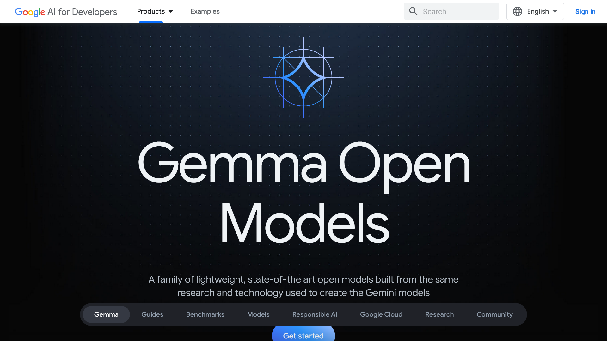
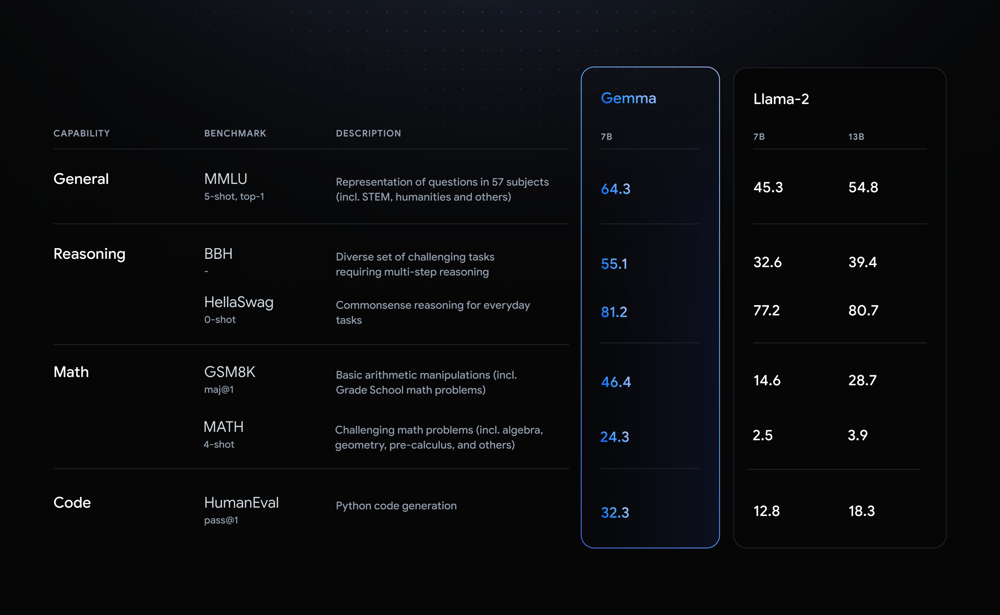

import ArticleCard from "@components/ArticleCard.astro";

2024年2月21日、Googleはオープンな大規模言語モデル（LLM）「**Gemma**」をリリースしました。Gemmaは、AI開発の責任ある進化のために制作され、Googleが以前に発表したGeminiモデルと同じ研究と技術を基にしています。

このモデルは、開発者と研究者がAIをより責任を持って構築するためのオープンモデルとして位置づけられています。

この記事では、**Gemmaについて詳しく解説したあと、実際にGemmaを使ってみます**。

## Gemmaとは？


*画像：[Gemmaの公式サイト](https://ai.google.dev/gemma)*

Gemmaは、軽量かつ最先端のオープンモデルのファミリーで、Google DeepMindをはじめとするGoogleのさまざまなチームによって開発されました。これはGeminiからインスピレーションを受けているとのことです。

Geminiについては、こちらの記事で解説しています。

<ArticleCard link="/article/2024/02/09/bard-becomes-gemini-and-mobile-app/" />

「gemma」という名前はラテン語で「宝石」を意味し、その価値と重要性を象徴しています。GoogleはGemmaのリリースに伴い、開発者のイノベーションを支援し、協力を促進し、Gemmaモデルの責任ある使用をガイドするためのツール「[Responsible Generative AI Toolkit](https://ai.google.dev/responsible)」も同時にリリースしています。

Google DeepMindはTwitter（X）への[投稿](https://twitter.com/GoogleDeepMind/status/1760289319154069606)で、「他のモデルと比較して、そのサイズでクラス最高のパフォーマンスを実現し、開発者のラップトップまたはコンピューターで実行できます。また、安全で責任ある出力に関する当社の基準を満たしながら、主要なベンチマークではるかに大きなモデルを上回っています」と説明しています。

Googleが公表したベンチマーク結果では、Gemma 7Bはすべての指標でLlama-2 13Bを上回っています。Gemmaの70億パラメーターに対して、Llama-2は130億パラメーターであることから、Gemmaがコンパクトで高性能なモデルであることが分かります。


*画像：[Google DeepMindの投稿](https://twitter.com/GoogleDeepMind/status/1760289319154069606)より*

### 主要な特徴と利点

Gemmaは、開発者と研究者がAIをより責任を持って構築できるようにするために設計されています。その主要な特徴と利点には、次のようなものがあります。

- **モデルのサイズ**：GemmaはGemma 2BとGemma 7Bの2つのモデルサイズでリリースされ、それぞれ事前訓練済みモデルとinstructionモデルを提供
- **責任ある生成AIツールキット**：安全なAIアプリケーションの作成に必要なガイダンスと重要なツール「Responsible Generative AI Toolkit」を提供
- **多様なフレームワークとツールのサポート**：JAX、PyTorch、TensorFlowなどを通じたネイティブKeras 3.0など、すべての主要フレームワークでの推論と教師ありファインチューニング（SFT：Supervised Fine-Tuning）のためのツールチェーンのサポート
- **ハードウェアの最適化**：NVIDIA GPUやGoogle Cloud TPUなど、業界をリードする複数のAIハードウェアプラットフォームのための最適化
- **オープンなライセンス**：規模に関係なく、すべての組織に対して責任のある商業利用と配布を許可する[ライセンス](https://www.kaggle.com/models/google/gemma/license/consent)

他のオープンなLLMと比較すると、「Responsible Generative AI Toolkit」の提供やオープンなライセンスなどが特徴的です。

とくに、オープンなモデルとして有名なMetaのLlama 2の[ライセンス](https://github.com/facebookresearch/llama/blob/main/LICENSE#L65-L71)では、月間アクティブユーザー数（MAU）が7億人以上の場合はMetaに申請する必要があるとされています。一方で、Gemmaは規模に関係なく、すべての組織に対して責任のある商業利用と配布を許可しています。

また、NVIDIAとの提携により、間もなくChat with RTXでも利用可能になるとのことです。これにより、Gemmaと検索拡張生成（RAG）を組み合わせて、ローカルのファイルを検索したり、ローカルのファイルの情報をもとにして質問に答えたりできるようになります。

Chat with RTXの概要と使い方については、こちらの記事で解説しています。

<ArticleCard link="/article/2024/02/14/nvidia-chat-with-rtx/" />

:::note
Gemmaはオープンなモデルですが、オープンソースではないことに注意してください。Gemmaの使用条件については、[こちら](https://www.kaggle.com/models/google/gemma/license/consent)から確認できます。
:::

### 責任あるデザイン

Gemmaは、GoogleのAI原則を最前線に置いて設計されています。データセットから特定の個人情報やその他のセンシティブなデータを自動的にフィルタリングする技術や、Gemmaの事前訓練モデルを安全かつ信頼できるものにするための広範なファインチューニングと人間のフィードバックによる強化学習（RLHF：Reinforcement Learning from Human Feedback）などを利用しています。

Gemmaモデルのリスクプロファイルを理解し削減するため、手動のレッドチーム化、自動的な敵対的テスト、危険な活動に対するモデル能力などを評価したとのことです。

## なぜGemmaは重要なのか？

Gemmaが他のオープンモデルと異なる点は、その設計における責任あるAIの重視にあります。これにより、開発者や研究者は、安全で倫理的なAIアプリケーションの作成に必要なツールとサポートを手に入れられます。

また、Gemmaは単にオープンなモデルであるだけでなく、あらゆる規模の組織が責任を持って商用利用と配布ができるようにしています。これは、小規模なスタートアップから大企業まで、幅広い組織が最先端のAI技術を活用できる機会を提供します。<small>（とはいっても、Llama 2のライセンスで制限の対象になるのはビッグテックだけなので実質的にLlamaとあまり変わらない感じもします）</small>

## 実際にGemmaを使ってみる

Gemmaは、次のプラットフォームで利用できます。また、[MaxText](https://github.com/google/maxtext)や[NVIDIA NeMo](https://github.com/NVIDIA/GenerativeAIExamples/tree/main/models/Gemma)、[TensorRT-LLM](https://github.com/NVIDIA/TensorRT-LLM)などと組み合わせた利用もできます。

- [Google Colab](https://colab.research.google.com/github/google/generative-ai-docs/blob/main/site/en/gemma/docs/get_started.ipynb)
- [Kaggle](https://www.kaggle.com/models/google/gemma/code)
- [Hugging Face](https://huggingface.co/collections/google/gemma-release-65d5efbccdbb8c4202ec078b)

今回はHugging Faceから[Gemma 7Bのinstructモデル](https://huggingface.co/google/gemma-7b-it)をダウンロードし、ローカルで実行してみます。

Hugging Faceからモデルをダウンロードするにはログインし、ライセンスの同意ボタンをクリックする必要があります。メールアドレスとユーザー名がGoogleと共有されるとのことです。

同意ボタンをクリックすると、ライセンスが表示されます。氏名を入力して同意すると、モデルを使えるようになります。

ライセンスに同意したら、まずは必要なライブラリーをインストールします。パソコンにPythonとpipがインストールされていることを前提にしています。

```shell
pip install -U accelerate transformers huggingface_hub
```

次に、``huggingface-cli login``でHugging Faceにログインします。アクセストークンの入力を求められるので、Hugging Faceの[設定ページ](https://huggingface.co/settings/tokens)から取得して入力します。

右クリックでペーストできますが、**入力した内容は表示されません**。そのため、右クリックでトークンを貼り付けたら他のキーを押さずにEnterキーを押してください。また、「Add token as git credential? (Y/n)」と聞かれますが、今回は``n``を入力しました。

```shellsession
$ huggingface-cli login

    _|    _|  _|    _|    _|_|_|    _|_|_|  _|_|_|  _|      _|    _|_|_|      _|_|_|_|    _|_|      _|_|_|  _|_|_|_|
    _|    _|  _|    _|  _|        _|          _|    _|_|    _|  _|            _|        _|    _|  _|        _|
    _|_|_|_|  _|    _|  _|  _|_|  _|  _|_|    _|    _|  _|  _|  _|  _|_|      _|_|_|    _|_|_|_|  _|        _|_|_|
    _|    _|  _|    _|  _|    _|  _|    _|    _|    _|    _|_|  _|    _|      _|        _|    _|  _|        _|
    _|    _|    _|_|      _|_|_|    _|_|_|  _|_|_|  _|      _|    _|_|_|      _|        _|    _|    _|_|_|  _|_|_|_|

    To login, `huggingface_hub` requires a token generated from https://huggingface.co/settings/tokens .
Token can be pasted using 'Right-Click'.
Token:
```

ここまでできたら、次のコードを実行してGemmaを使ってみます。今回はfloat16の量子化モデルをGPUで実行してみます。ただし、ここでは公式のサンプルコードに``import torch``と``, max_new_tokens=128``を追加しています。

他のサンプルコードは[Hugging Faceのページ](https://huggingface.co/google/gemma-7b-it#usage)から確認できます。

```python title="gemma.py" ins={2,10} ins=", max_new_tokens=128"
from transformers import AutoTokenizer, AutoModelForCausalLM
import torch

tokenizer = AutoTokenizer.from_pretrained("google/gemma-7b-it")
model = AutoModelForCausalLM.from_pretrained("google/gemma-7b-it", device_map="auto", torch_dtype=torch.float16)

input_text = "Write me a poem about Machine Learning."
input_ids = tokenizer(input_text, return_tensors="pt").to("cuda")

outputs = model.generate(**input_ids, max_new_tokens=128)
print(tokenizer.decode(outputs[0]))
```

:::tip
``ValueError: Tokenizer class GemmaTokenizer does not exist or is not currently imported.``というエラーが発生する場合は、次のコマンドでtransformersをアップデートしてみてください。

```shell
pip install -U transformers
```

また、``RuntimeError: shape '[1, 9, 3072]' is invalid for input of size 36864``というエラーが発生する場合は、torchをv2.2.0以降にアップデートしてみてください。アップデートのコマンドは環境によって異なるので、[公式サイト](https://pytorch.org/get-started/locally/)から確認してください。

参考：

- [google/gemma-7b-it · ValueError: Tokenizer class GemmaTokenizer does not exist or is not currently imported.](https://huggingface.co/google/gemma-7b-it/discussions/9)
- [google/gemma-7b · Error "shape '[1, 9, 3072]' is invalid for input of size 36864" while running Gemma 7b using torch.float16](https://huggingface.co/google/gemma-7b/discussions/17)
:::

```shellsession
$ python gemma.py
<bos>Write me a poem about Machine Learning.

In the realm of data, a tale unfolds,
Where algorithms dance, stories untold.
With neural networks, they learn and grow,
Unveiling patterns, hidden below.

Data whispers secrets, a treasure trove,
Machine learning listens, its appetite grows.
From images to text, it takes a bite,
Uncovers insights, shining light.

With every iteration, it takes a leap,
Predicting future, breaking free.
From medical diagnosis to financial gain,
It transforms, brings a new reign.

But with power comes responsibility,
To safeguard fairness, transparency.
For bias lur
```

Gemmaを使って詩を生成できました。詩の内容は、機械学習に関するもので、データの重要性や機械学習の責任についても言及されています。

次は``input_text``を変更して、チャット用のフォーマットを使いながら日本語で試してみます。

```python title="gemma.py" mark={7-11}
from transformers import AutoTokenizer, AutoModelForCausalLM
import torch

tokenizer = AutoTokenizer.from_pretrained("google/gemma-7b-it")
model = AutoModelForCausalLM.from_pretrained("google/gemma-7b-it", device_map="auto", torch_dtype=torch.float16)

input_text = """<start_of_turn>user
日本で一番高い山は？<end_of_turn>
<start_of_turn>model

"""
input_ids = tokenizer(input_text, return_tensors="pt").to("cuda")

outputs = model.generate(**input_ids, max_new_tokens=128)
print(tokenizer.decode(outputs[0]))
```

```shellsession
$ python gemma.py
<bos><start_of_turn>user
日本で一番高い山は？<end_of_turn>
<start_of_turn>model

日本で一番高い山は富士山です。富士山は標高3,776メートルです。<eos>
```

日本語での質問にも答えられました。富士山の標高も正しく答えられています。

日本語でも詩を生成してみます。

```python title="gemma.py" mark={8}
from transformers import AutoTokenizer, AutoModelForCausalLM
import torch

tokenizer = AutoTokenizer.from_pretrained("google/gemma-7b-it")
model = AutoModelForCausalLM.from_pretrained("google/gemma-7b-it", device_map="auto", torch_dtype=torch.float16)

input_text = """<start_of_turn>user
詩を生成して<end_of_turn>
<start_of_turn>model

"""
input_ids = tokenizer(input_text, return_tensors="pt").to("cuda")

outputs = model.generate(**input_ids, max_new_tokens=128)
print(tokenizer.decode(outputs[0]))
```

```shellsession
$ python gemma.py
<bos><start_of_turn>user
詩を生成して<end_of_turn>
<start_of_turn>model

夕暮ろしが差し込む晩、
夕暮ろしが差し込む晩、
星が瞬く夜空を照らし、
雲が踊る夜空を照らし、

風は吹く夜風、
風は吹く夜風、
花が咲く夜花、
花が咲く夜花。

あなたを想う私の心、
あなたを想う私の心、
遠く離れたあなたを、
遠く離れたあなたを。<eos>
```

少し日本語が怪しいですが、一応詩を生成できました。

## まとめ

Googleの「Gemma」は、開発者と研究者がAIをより責任を持って構築できるよう支援するための工夫が施されています。その設計は安全で倫理的なAIアプリケーションの作成を重視しています。

また、Gemmaはオープンなモデルでありながら、責任ある商用利用と配布が可能なライセンスを持っています。これにより、幅広い組織が最先端のAI技術を活用できる機会を提供しています。

Gemmaは、Google Colab、Kaggle、Hugging Faceなどのプラットフォームで利用できます。また、MaxText、NVIDIA NeMo、TensorRT-LLMなどと組み合わせた利用も可能です。

今回はHugging FaceからGemma 7Bのinstructモデルをダウンロードし、ローカルで実行してみました。Gemmaのリリースにより、AI開発の責任ある進化が促進されることが期待されます。

## 参考

- [Gemma: Google introduces new state-of-the-art open models](https://blog.google/technology/developers/gemma-open-models/)
- [Gemma - a family of lightweight, state-of-the art open models from Google.  |  Google AI for Developers](https://ai.google.dev/gemma)
- [Google's Gemma Optimized Across All NVIDIA AI Platforms | NVIDIA Blog](https://blogs.nvidia.com/blog/google-gemma-llm-rtx-ai-pc/)
