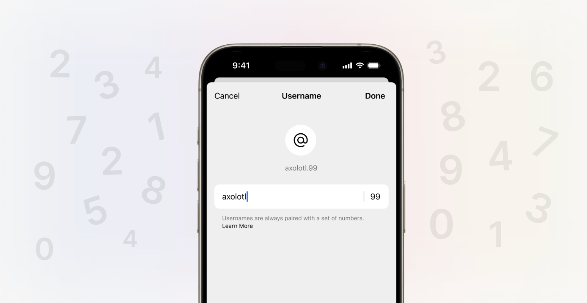

プライベートな通信を重視しているSignalが、ユーザーのプライバシー保護機能をさらに強化します。これまでSignalを使用する際、避けて通れなかったのが、電話番号の公開でした。

しかし、Signalはユーザーの声に耳を傾け、**電話番号を隠しながら通信できる新機能**を発表しました。

この記事では、**Signalの電話番号を隠す方法**と、新しく導入された**ユーザー名機能**について詳しく解説します。

## Signalの電話番号プライバシー保護機能

Signalは、プライベートな通信を守るためのさまざまな機能を提供していますが、2024年2月20日の発表により、電話番号のプライバシー保護をさらに強化しました。

これにより、Signalを利用するユーザーは、次のような方法で電話番号を隠すことが可能になります。

### 電話番号をデフォルトで非表示に

新しいデフォルト設定では、Signalを使用している間、**チャット相手に電話番号が表示されなくなります**。

ただし、電話番号を連絡先に保存している人は引き続き電話番号を見ることができます。

電話番号の公開設定を変更したい場合は、［設定］>［プライバシー］>［電話番号］から変更できます。

### ユーザー名による接続

*画像：[Signalの公式ブログ](https://signal.org/blog/phone-number-privacy-usernames/)より*

電話番号を教えずにSignalで誰かとチャットしたい場合、**一意のユーザー名**を作成して使用できます。

Signalにサインアップするためには依然として電話番号が必要ですが、ユーザー名を使用すれば**電話番号を共有せずに連絡を取ることが可能です**。

### 電話番号での検索制御

電話番号を使用してSignal上で見つけられることを望まない場合、必要に応じて新しいプライバシー設定を有効にできます。これにより、ユーザー名を知らない限り、他の人がアカウントを見つけたり、Signalアカウントがあることを知ったりできなくなります。

この設定はデフォルトでオフになっており、今までどおり電話番号で検索できます。

電話番号で検索できないようにするには、［設定］>［プライバシー］>［電話番号］から設定を変更します。

### 注意点

これらの機能を使用するためには、**Signalでやり取りする両者がアプリの最新バージョンを使用している必要があります**。これは、電話番号のプライバシー設定を含め、新しい機能を活用するためにも重要です。

これらのオプションは現在ベータ版で提供されており、数週間以内にすべてのユーザーに展開される予定です。

Signalのアプリは少なくとも90日ごとにアップデートする必要があるため、この機能は正式に提供が開始されてから90日後に完全に機能するようになります。

## ユーザー名の実装

これまでSignalで誰かに到達するには、その人の電話番号を知る必要がありました。

しかし、新しいユーザー名機能を利用することで、電話番号を共有せずにSignalで接続することが可能になります。**ユーザー名を共有することで、簡単に新しいチャットを開始できます**。

ユーザー名を共有するか、［プロフィール］>［QRコードとリンク］で取得できるQRコードまたはURLを共有することで、電話番号を共有せずに他のユーザーとやり取りできます。

### ユーザー名の作成と共有

ユーザー名は、［設定］>［プロフィール］から作成できます。ユーザー名は何度でも変更でき、不要な場合は削除できます。また、ユーザー名の平等性の維持となりすましの抑制のため、ユーザー名の末尾には2つ以上の数字が必要です。

Signalにおけるユーザー名は、他のSNSのようにログインやハンドルとして機能するわけではありません。単純に、電話番号を共有せずに接続するための簡単な方法としてのみ機能します。

プロフィール名として設定した名前は変わらず、メッセージを交換している人がユーザー名を見たり、見つけたりすることはありません。

### ユーザー名の保護

Signalはユーザー名でユーザーを検索する機能を提供しません。そのため、ユーザー名を使ってやり取りするには、正確なユーザー名を知っている必要があります。

また、Signalはユーザー名をプレーンテキストで保存しないため、特定のアカウントのユーザー名を簡単に確認または公開できないようになっています。

ユーザー名は、Ristretto 25519ハッシュアルゴリズムとゼロ知識証明を使用して保護されており、Signalは電話番号を与えられた場合でも、簡単にユーザー名を見ることはできません。

## まとめ

Signalの電話番号プライバシー保護機能とユーザー名により、ユーザーはより安心してプライベートな通信を楽しめます。電話番号を隠したい場合でも、新しい接続を簡単に作成できるようになりました。

Signalの新しい機能は、数週間以内にすべてのユーザーに展開される予定です。新しい機能を利用するためには、Signalの最新バージョンを使用していることを確認してください。

Signalの新しい機能については、公式ブログや公式Twitterアカウントで最新情報をチェックしてください。

## 参考

- [Signal >> Blog >> Keep your phone number private with Signal usernames](https://signal.org/blog/phone-number-privacy-usernames/)
