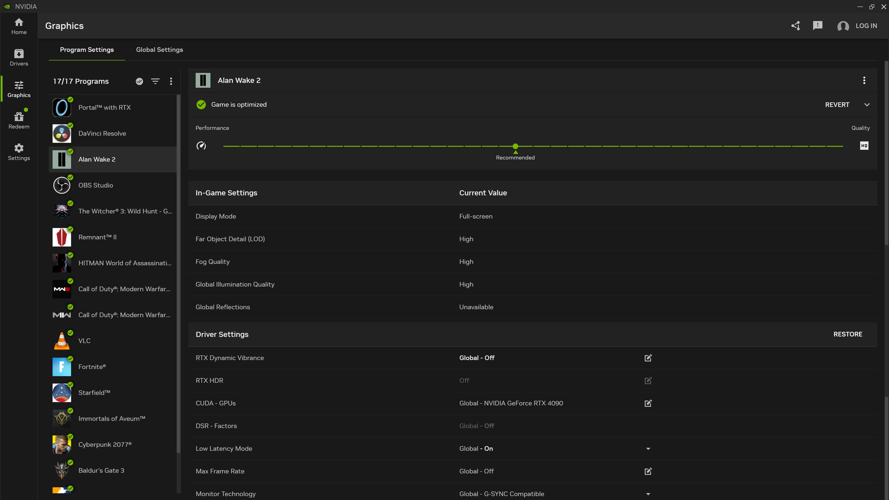
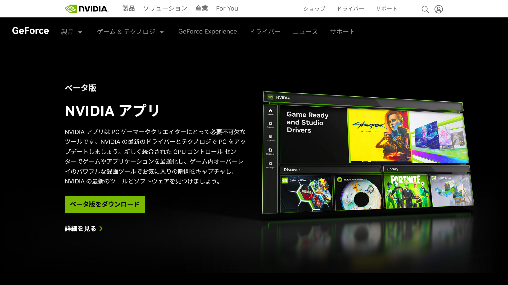
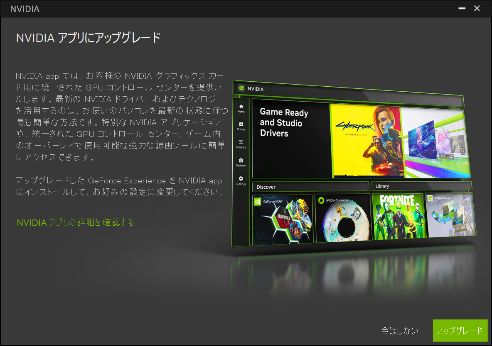
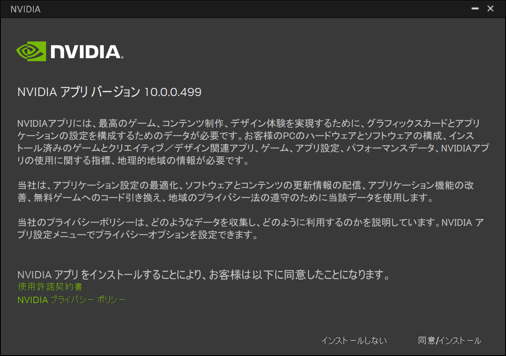
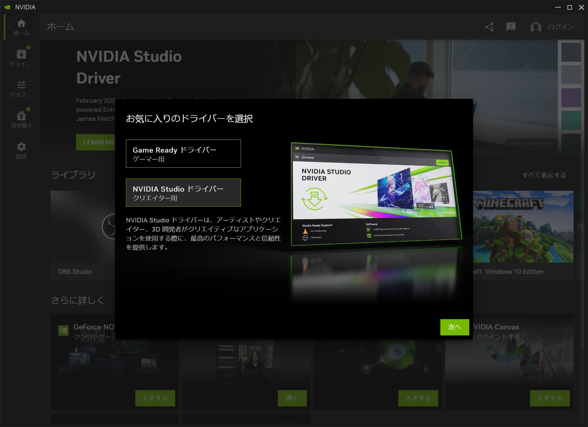
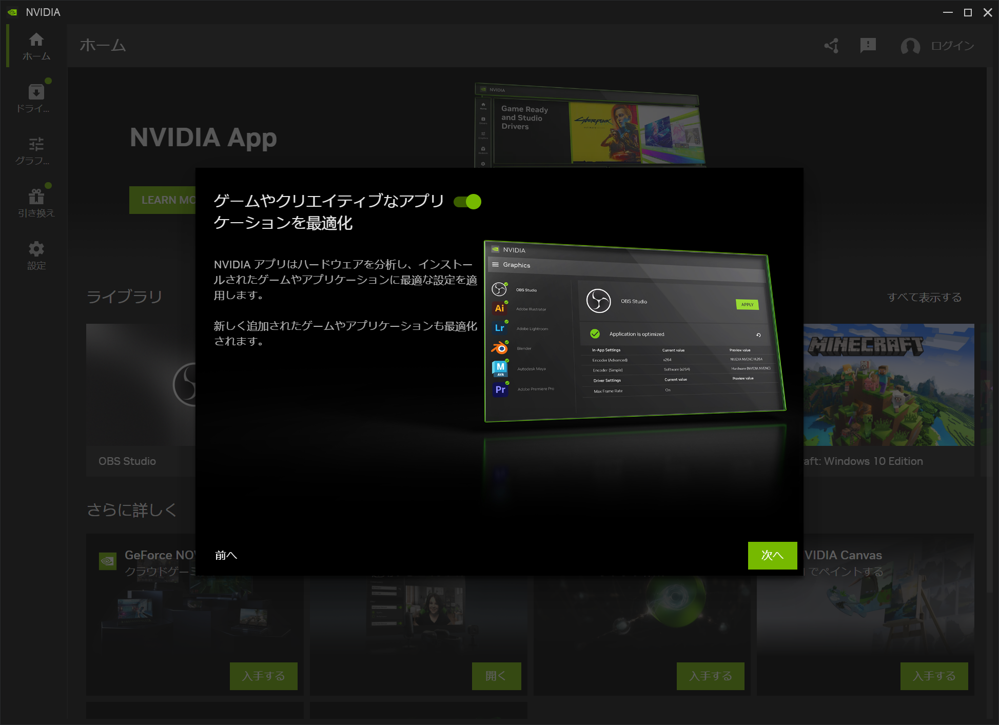
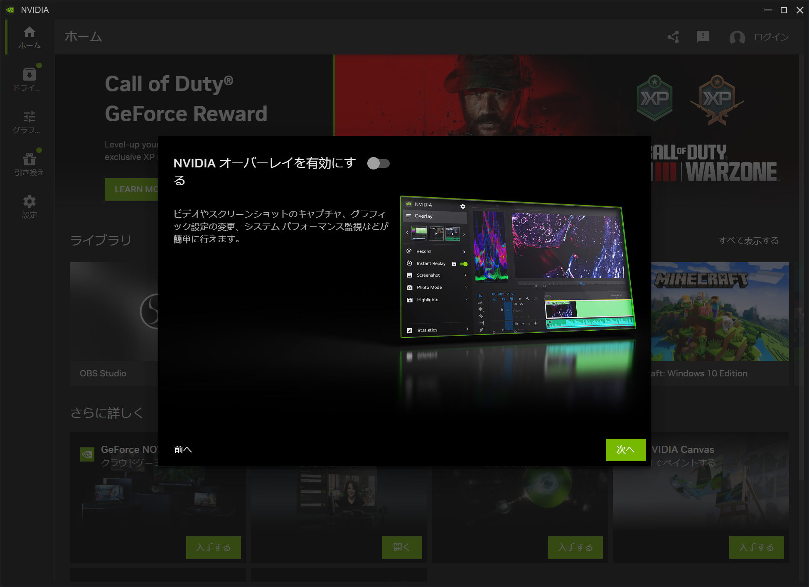
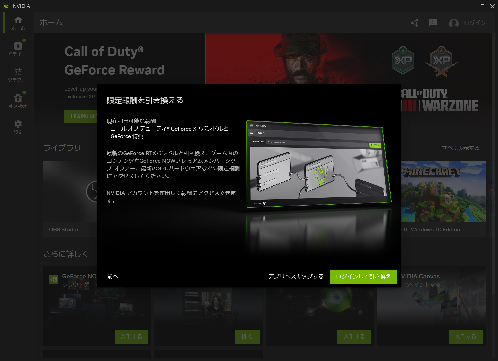

2024年2月22日（現地時間）、NVIDIAはPCゲーマーやクリエイター向けの新しいソフトウェア「**NVIDIAアプリ**」のパブリックベータ版をリリースしました。これは、NVIDIAが提供するNVIDIA Control Panel、GeForce Experience、RTX Experienceアプリを現代化し、統合する取り組みの第一歩です。

この記事では、NVIDIAアプリについて詳しく解説し、そのダウンロード方法や使い方についても紹介します。

## NVIDIAアプリとは？

*画像：「[新しい NVIDIA アプリのベータ版が登場: PC ゲーマーとクリエイターにとって不可欠なツール | GeForce News | NVIDIA](https://www.nvidia.com/ja-jp/geforce/news/nvidia-app-beta-download/)」より*

**NVIDIAアプリ**は、NVIDIAのGPUを搭載したPCやラップトップを使用するゲーマーやクリエイターのための新しいアプリケーションです。

既存の[NVIDIA Control Panel](https://www.nvidia.com/ja-jp/drivers/nv-control-panel/)、[GeForce Experience](https://www.nvidia.com/ja-jp/geforce/geforce-experience/)、および[RTX Experienceアプリ](https://www.nvidia.com/ja-jp/design-visualization/software/rtx-experience/)の機能を組み合わせ、最新のNVIDIAドライバーの更新やNVIDIAアプリケーション（[GeForce NOW](https://www.nvidia.com/ja-jp/geforce-now/)、[NVIDIA Broadcast](https://www.nvidia.com/ja-jp/geforce/broadcasting/broadcast-app/)、[NVIDIA Omniverse](https://www.nvidia.com/ja-jp/omniverse/)など）の発見とインストールを簡素化します。

### 統合されたGPUコントロールセンター

*画像：「[新しい NVIDIA アプリのベータ版が登場: PC ゲーマーとクリエイターにとって不可欠なツール | GeForce News | NVIDIA](https://www.nvidia.com/ja-jp/geforce/news/nvidia-app-beta-download/)」より*

このアプリは、GeForce Experienceのゲーム最適化設定とNVIDIA Control Panelの3D設定を一元化したインターフェースを特徴としています。

これにより、**最適化の確認やドライバー設定の調整が1か所で可能**となり、アプリケーションごとのカスタマイズや、すべてのゲームおよびアプリケーションに対するグローバルプロファイルの使用が可能です。

### ドライバー情報の改善

最新のドライバー更新に何が含まれているかをより迅速かつ直接的に理解できるように、新しい「**ドライバーページ**」が導入されました。

「新機能」と「修正された内容」に関する簡単な箇条書きや、ゲームサポートに関する簡単な説明が提供されます。

### 再設計されたゲーム内オーバーレイ

*画像：「[新しい NVIDIA アプリのベータ版が登場: PC ゲーマーとクリエイターにとって不可欠なツール | GeForce News | NVIDIA](https://www.nvidia.com/ja-jp/geforce/news/nvidia-app-beta-download/)」より*

NVIDIAアプリでは、ゲーム内オーバーレイが全面的に再設計されました。

便利なAlt+Zホットキーを使用して、Shadowplay録画ツール、Freestyleゲームフィルター、NVIDIAハイライト、フォトモード、およびパフォーマンス監視ツールに迅速にアクセスできます。

また、**新しい統計オーバーレイ**により、パフォーマンスモニタリングが強化され、ゲーマーはHUDのフットプリントを最小限に抑えた状態で表示方法をカスタマイズできます。

### 新しいAI Freestyleフィルター

*画像：「[新しい NVIDIA アプリのベータ版が登場: PC ゲーマーとクリエイターにとって不可欠なツール | GeForce News | NVIDIA](https://www.nvidia.com/ja-jp/geforce/news/nvidia-app-beta-download/)」より*

**NVIDIA Freestyle**は、お気に入りのゲームの視覚的な美しさをリアルタイムのポストプロセッシングフィルターを通じてパーソナライズする機能です。現在では、1,200以上のゲームと互換性があり、新しいAI搭載フィルターによりさらなる魅力が加わりました。

**RTX Dynamic Vibrance**は、NVIDIA Control Panelで人気のDigital Vibrance機能を改良したAI搭載のFreestyleフィルターです。 アプリごとに色の潰れを最小限に抑え、画質と没入感を維持しながら、画面上で色がより鮮やかに表示します。

また、**RTX HDR**は元々HDRサポートが装備されていなかったゲームをHDRで描画できるようにします。DX12、DX11、DX9、およびVulkanプラットフォームで実行されるゲームでHDRモニターを活用できるようになります。

### GeForceバンドルと特典の引き換え

NVIDIAアプリユーザーは、ゲーム内コンテンツやGeForce NOWなどの特典へのアクセスが可能となります。

また、パブリックベータの期間限定で、「GeForce Call of Duty: Modern Warfare III」と「Call of Duty: Warzone」を引き換えることができます。

## インストール方法

*画像：[NVIDIAアプリの配布ページ](https://www.nvidia.com/ja-jp/software/nvidia-app/)*

まずは、[NVIDIA公式サイト](https://www.nvidia.com/ja-jp/software/nvidia-app/)からNVIDIAアプリのベータ版をダウンロードします。

インストーラーを起動すると既存のNVIDIAのソフトからNVIDIAアプリにアップデートするか尋ねられるので、［アップグレード］をクリックします。

利用規約やプライバシーポリシーが表示されるので、同意する場合は［同意/インストール］を選択します。

しばらく待つとインストールが完了し、［Game Readyドライバー］か［Studioドライバー］を選択する画面が表示されるので、どちらかを選択して［次へ］をクリックします。

ゲームやアプリの最適化についての画面が表示されます。有効にすることをオススメしますが、不要な場合はトグルスイッチをオフにして［次へ］をクリックします。

NVIDIAオーバーレイについての画面が表示されるので、必要に応じて設定を変更します。

最後に、限定特典についての画面が表示されます。特典を受け取る場合は［ログインして引き換え］、不要な場合は［アプリへスキップする］をクリックします。

これで、NVIDIAアプリのインストールが完了しました。

:::tip
パフォーマンスモニターリングやAIフリースタイルフィルターなどの新機能を活用するには、ゲーム中に特定のホットキーを利用します。

Alt+ZでShadowplay録画ツール、Alt+Rでパフォーマンスオーバーレイを起動できます。
:::

## まとめ

NVIDIAアプリは、NVIDIAのGPUを搭載したPCやラップトップを使用するゲーマーやクリエイター向けの新しいアプリケーションです。NVIDIA Control Panel、GeForce Experience、RTX Experienceアプリの機能を組み合わせ、最新のNVIDIAドライバーの更新やNVIDIAアプリケーションの発見とインストールを簡素化します。

NVIDIAアプリのベータ版は、[NVIDIA公式サイト](https://www.nvidia.com/ja-jp/software/nvidia-app/)からダウンロードできます。

NVIDIAアプリを使って、より快適なゲーム体験やクリエイティブな活動を楽しみましょう。

## 参考

- [新しい NVIDIA アプリのベータ版が登場: PC ゲーマーとクリエイターにとって不可欠なツール | GeForce News | NVIDIA](https://www.nvidia.com/ja-jp/geforce/news/nvidia-app-beta-download/)
- [ゲーマーとクリエイターのための NVIDIA アプリをダウンロードする | NVIDIA](https://www.nvidia.com/ja-jp/software/nvidia-app/)
- [What's new in NVIDIA app 10.0.0](https://www.nvidia.com/ja-jp/geforce/release-notes/NVAPP/10_0_0/Web/nvapp-v10_0_0-web-release-highlights/)
