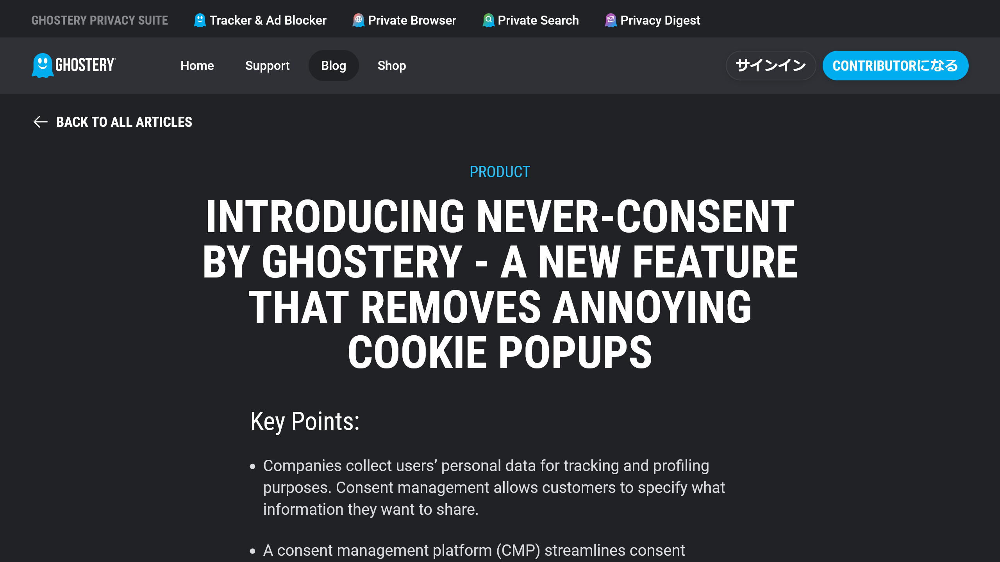
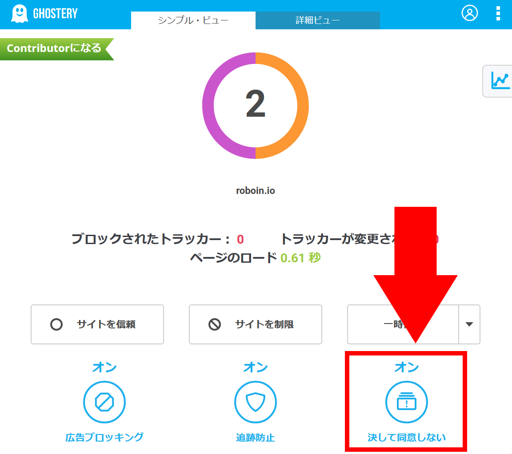

Webを閲覧していると、Webサイトを訪れる度に表示される「クッキーの同意」ポップアップにうんざりした経験はありませんか？これらのポップアップは、ユーザーからの明示的な同意を得て、トラッキングやプロファイリングの目的で個人データを収集しようとする企業によって設けられています。

しかし、このような同意管理（Consent Management）プロセスは、閲覧体験を阻害し、多くの場合、ユーザーにストレスを与えるものです。

そこで注目されるのが、プライバシー保護ツールである[Ghostery](https://www.ghostery.com/)の「**決して同意しない（Never-Consent）**」機能です。この機能は、煩わしいクッキー同意ポップアップを自動的に排除し、トラッキングされたくないというメッセージをWebサイトに伝えます。

## なぜ「決して同意しない」が必要なのか？

*画像：[Ghosteryの「決して同意しない」機能についての公式ブログ](https://www.ghostery.com/blog/never-consent-by-ghostery)*

GDPRやその他のプライバシーに関する法律により、企業はユーザーの同意を得てから個人データを収集する必要があります。

しかしながら、多くのWebサイトはユーザーがクッキー同意ポップアップを極力早く閉じ、コンテンツへアクセスできるようにするため、便宜的な同意オプションを用意しています。その結果、**ユーザーは無意識のうちにオンライン追跡へ同意してしまう場合があります**。

Ghosteryの「決して同意しない」機能は、この問題に対する解決策を提供します。**Webサイトを訪れた際に表示されるクッキー同意ポップアップを自動で最適なプライバシー設定に設定し、迷惑なポップアップを排除**することで、ユーザーのオンラインプライバシーを守ります。

## 「決して同意しない」のメリット

「決して同意しない」機能の導入により得られる最大のメリットは、がオンラインプライバシーを維持しながら、ストレスなくWebサイトを閲覧できるようになることです。煩わしいポップアップに邪魔されることなく、コンテンツへのアクセスがスムーズになります。

また、自動的にプライバシーを尊重する設定を選んでくれるため、ユーザーは追跡を拒否するための設定について考える必要がありません。

GhosteryがGDPRダイアログをブロックせず、クッキーとポップアップをブロックする方向にシフトしたことで、Webサイトの表示が崩れることなく追跡拒否の意志を明確に伝えられるようになりました。これにより、Webサイトの管理者とユーザーの間で、より透明性の高いプライバシー関連のコミュニケーションが可能になります。

## 「決して同意しない」の使い方

「決して同意しない」機能を有効にする方法は非常にシンプルです。Ghosteryのバージョン9.6.0以降にアップデートしておけば、「決して同意しない」についてのポップアップが表示された際に、そのポップアップ内のボタンから直接有効にできます。

また、Ghosteryの設定画面にある3つのボタンのうち、一番右側のボタンをオンに切り替えることでも機能を有効化できます。

*Ghosteryの設定画面*

:::note
「決して同意しない」機能を有効にすると、自動的にクッキー同意ダイアログがスキップされ、ブラウザーはすべてのトラッキングから自動的にオプトアウトされます。

これにより、Webサイトの表示が崩れることなく、プライバシーを守りながら快適にWebを閲覧できます。
:::

## 「決して同意しない」の代替手段

Ghostery以外にも、Firefoxブラウザーには「クッキーバナーブロッカー」が搭載されています。この機能を有効にすると、Firefoxが自動的にクッキー同意ポップアップを削減し、Webサイトの閲覧をスムーズにします。

Firefoxのクッキーバナーブロッカーは、オプトアウトCookieを設定し、それができない場合はバナーの［拒否］ボタンをクリックすることで、クッキー同意ポップアップを削減します。

## まとめ

Ghosteryの「決して同意しない」機能は、オンライン上でのプライバシー保護と快適な閲覧体験を求めるすべてのユーザーにとって便利なツールです。

この機能を活用することで、煩わしいクッキー同意ポップアップから解放され、プライバシーを尊重されたオンラインライフを楽しめます。

## 参考

- [Introducing Never-Consent by Ghostery - a new feature that removes annoying Cookie popups | Ghostery](https://www.ghostery.com/blog/never-consent-by-ghostery)
- [Block cookie banners on Firefox | Firefox ヘルプ](https://support.mozilla.org/ja/kb/cookie-banner-reduction?as=u&utm_source=inproduct)
