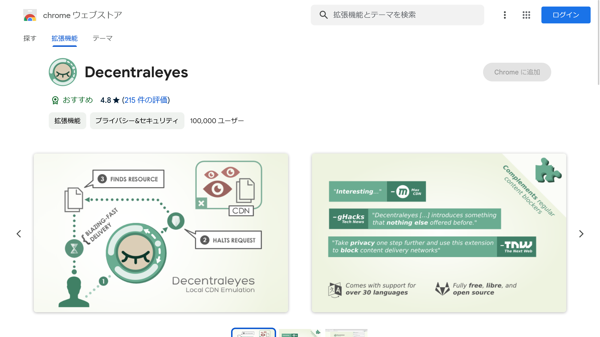

今回は、オンラインプライバシーを改善しながらWebサイトの読み込み速度を改善するブラウザー拡張機能「**Decentraleyes**」を紹介します。

## Decentraleyesとは？

*画像：[Decentraleyesのストアページ](https://chromewebstore.google.com/detail/decentraleyes/ldpochfccmkkmhdbclfhpagapcfdljkj)*

「[Decentraleyes](https://decentraleyes.org/)」とは、**オンラインでのプライバシーを向上させることを目的としたブラウザー拡張機能**です。

Decentraleyesは、Content Delivery Networks（CDN）をエミュレートすることで動作します。ブラウザーのトラフィックを傍受し、サポートされるリソースをローカルで見つけて差し替えます。

すべての処理が自動的に行われるため、事前の設定は必要ありません。[テストユーティリティー](https://decentraleyes.org/test/)を使用して、適切に保護されているかどうかを確認できます。

Decentraleyesは万能ではありませんが、多くのWebサイトがCDNを介してリクエストを送るのを防げます。さらに、Decentraleyesは不足しているCDNリソースに対するリクエストもブロックできます。

## なぜDecentraleyesが必要なのか？

Web上でのプライバシー保護とトラッキングの回避は、現代における課題のひとつです。**多くのWebサイトやオンラインサービスがユーザーデータを収集し、パーソナライズされた広告やコンテンツの提供に利用しています**。

ユーザーが制御できない形でデータが収集されることが多く、これによる**プライバシーの侵害**が問題となっています。

Decentraleyesを使うと通信量を節約し、プライバシーを保護できます。

多くのWebサイトが大手サードパーティーサービスを介して重要なファイルを読み込むように設定されています。これにはメンテナンスコストの削減や、Webの高速化が理由として挙げられます。

しかし、これらのサービスがWebの構造に深く組み込まれ、これらを遮断すると多くのWebサイトが機能しなくなる状況が生まれています。また、CDNを介してファイルを提供することで、ユーザーのプライバシーが侵害される可能性もあります。

Decentraleyesは一般的に使用されるファイルを多数同梱しており、**サイトが配信ネットワークからそれらを取得しようとするたびに、ローカルでそれらを提供します**。

Decentraleyesは、uBlock OriginやAdblock Plusなどの通常のコンテンツブロッカーを補完します。これにより、より広範なプライバシー保護と高速なWeb閲覧が可能になります。

## 使い方

Decentraleyesは、Chrome、Edge、Firefox、そしてOperaのための拡張機能として提供されています。それぞれのブラウザーの拡張機能ストアから簡単にインストールできます。

- [Chrome版](https://chrome.google.com/webstore/detail/decentraleyes/ldpochfccmkkmhdbclfhpagapcfdljkj)
- [Edge版](https://microsoftedge.microsoft.com/addons/detail/lmijmgnfconjockjeepmlmkkibfgjmla)
- [Firefox版](https://addons.mozilla.org/firefox/addon/decentraleyes/)
- [Opera版](https://addons.opera.com/extensions/details/decentraleyes/)

インストール後、特別な設定は必要ありません。Decentraleyesがバックグラウンドで動作し、プライバシーを保護してくれます。

## 類似の拡張機能

Decentraleyesと同様の目的をもつ拡張機能には、次のようなものがあります。

- **Privacy Badger**：トラッカーを自動的に学習しブロックすることで、ユーザーの追跡を防ぎます
- **Ghostery**：トラッカー、広告、その他のWeb上の追跡要素をブロックし、プライバシーを保護します

これらの拡張機能も、よりプライベートで快適なWeb閲覧のために有用です。

## まとめ

「Decentraleyes」はプライバシーを保護するツールのひとつとして、Webブラウザーで簡単に利用できるプライバシー保護の手段を提供します。

Decentraleyesを使うことで、Webサイトの読み込み速度を改善しながら、オンラインプライバシーを改善できます。

## 参考

- [Decentraleyes | Local CDN Emulation](https://decentraleyes.org/)
- [Thomas Rientjes / decentraleyes · GitLab](https://git.synz.io/Synzvato/decentraleyes)
