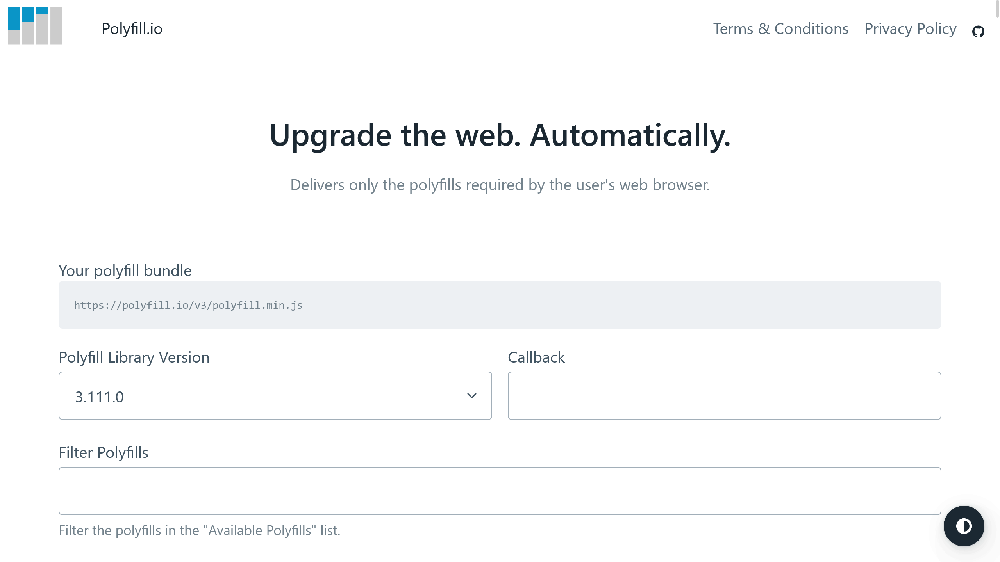
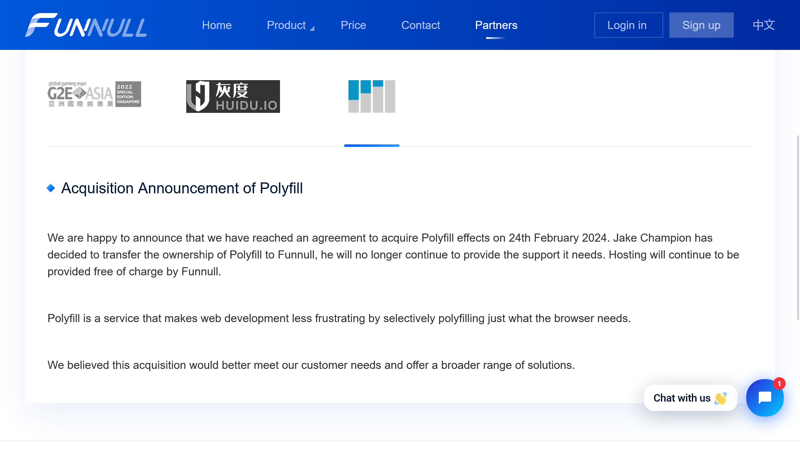

Web開発者たちにとって、ブラウザー間の互換性問題は長年にわたり頭痛の種となっています。そんな中、**Polyfill.io**は多くの開発者にとって救世主のような存在でした。

しかし、この度Polyfill.ioは**中国企業のFunnull**に売却されたことが明らかになり、開発者コミュニティーに波紋を広げています。

この記事では、Polyfill.ioの売却について、またWeb開発者が取るべき対策について詳しく解説します。

## Polyfill.ioとは？


*画像：[Polyfill.ioの公式サイト](https://polyfill.io/)*

[Polyfill.io](https://polyfill.io/)は、ブラウザー間の互換性問題を解決するためのサービスです。

具体的には、各リクエストの**User-Agent**ヘッダーを読み取り、リクエストを送信しているブラウザーに適したポリフィルを提供します。

ポリフィルとは、古いブラウザーで新しいブラウザーの機能をエミュレートするためのコードのことです。Web開発者がブラウザー間の差異を気にすることなく、新しいAPIや機能を使用できるようにする非常に便利なツールです。

[2023年12月にDataSignが実施した調査](https://oshiete-url.jp/report/docodoco/2023_12/#top)では、Polyfill.ioはWebサイトで使用されているサービスのトップ100にランクインしています。採用率は0.5%となっていますが、世界中には無数のWebサイトが存在することを考えると、決して少なくない数字です。

## 売却の背景

Polyfill.ioのメンテナーのJake Champion氏は、オープンソースプロジェクトの維持管理とそれに伴うインフラ運用が初めは楽しかったものの、プロジェクトが大きくなりすぎて手に負えなくなったことを告白しています。

<blockquote class="twitter-tweet" data-dnt="true" data-theme="dark"><p lang="en" dir="ltr">Being the maintainer of an open source project, and running the associated infrastructure, is great when it&#39;s fun and new. When I started, I never imagined this would reach 10k+ requests per second, and be depended upon by so many.</p>&mdash; Jake (@JakeDChampion) <a href="https://twitter.com/JakeDChampion/status/1761315223888068792?ref_src=twsrc%5Etfw">February 24, 2024</a></blockquote> <script async src="https://platform.twitter.com/widgets.js" charset="utf-8"></script>

このサービスは、毎秒10,000以上のリクエストを処理するレベルにまで成長し、世界中の多くの開発者に支持されるようになりました。そのため、新たな所有者に手渡す時が来たと判断し、**Funnull**という中国の企業と売却について数か月に渡って議論してきたとのことです。

そして、GitHubリポジトリの新たなメンテナーおよびオペレーターとして、Funnullが選ばれました。FunnullはCDNサービスを提供する中国企業です。

Funnullは[声明](https://funnull.com/Partner/)の中で、次のように述べています。


*Funnullが公開した声明。画像：[Funnullの公式サイト](https://funnull.com/Partner/)*

> We are happy to announce that we have reached an agreement to acquire Polyfill effects on 24th February 2024. Jake Champion has decided to transfer the ownership of Polyfill to Funnull, he will no longer continue to provide the support it needs. Hosting will continue to be provided free of charge by Funnull.
>
> Polyfill is a service that makes web development less frustrating by selectively polyfilling just what the browser needs.
>
> We believed this acquisition would better meet our customer needs and offer a broader range of solutions.
>
> 私たちは、2024年2月24日にPolyfill effectを買収することで合意に達したことを発表できることをうれしく思います。Jake ChampionはPolyfillの所有権をFunnullに譲渡することを決定し、彼は必要なサポートの提供を継続しません。ホスティングは引き続きFunnullによって無料で提供されます。
>
> Polyfillは、ブラウザーが必要とするものだけを選択的にポリフィルすることで、Web開発のストレスを軽減するサービスです。
>
> 今回の買収により、お客様のニーズをより適切に満たし、より幅広いソリューションを提供できると考えています。

## 問題点と開発者からの反応

### 安全性の懸念

Polyfill.ioのコントリビューターでFastlyのDevRelでもあるAndrew Betts氏は、Polyfill.ioのドメインの所有権を持っていなかったこと、そしてその売却に何の影響力も持てなかったことを明かしています。

そして、彼はWebサイトがPolyfill.ioを使用している場合、**直ちに削除すること**を強く推奨しています。

<blockquote class="twitter-tweet" data-dnt="true" data-theme="dark"><p lang="en" dir="ltr">If your website uses <a href="https://t.co/3xHecLPXkB">https://t.co/3xHecLPXkB</a>, remove it IMMEDIATELY.<br><br>I created the polyfill service project but I have never owned the domain name and I have had no influence over its sale. <a href="https://t.co/GYt3dhr5fI">https://t.co/GYt3dhr5fI</a></p>&mdash; Andrew Betts (@triblondon) <a href="https://twitter.com/triblondon/status/1761852117579427975?ref_src=twsrc%5Etfw">February 25, 2024</a></blockquote>

彼の懸念は、第三者のスクリプトが提供するドメインに大きなセキュリティリスクが伴うことにあります。たとえば、google-analytics.comのような人気のあるサードパーティスクリプトを提供するドメインのチームは、理論上は世界中のほぼすべてのWebサイトを読み取ったり、変更したりできます。

### ポリフィルの必要性の減少

また、Betts氏は、現代のWeb開発ではPolyfill.ioライブラリー内のポリフィルが必要ないとも指摘しています。

多くのWebプラットフォームの機能は、ポリフィルで代替できない機能（例：[Web Serial](https://developer.mozilla.org/ja/docs/Web/API/Web_Serial_API)や[Web Bluetooth](https://developer.mozilla.org/ja/docs/Web/API/Web_Bluetooth_API)など）を除いて、主要なブラウザーによって迅速に採用されています。

## 開発者のための対策

このような状況を踏まえ、Web開発者はPolyfill.ioをWebサイトから直ちに削除することが推奨されます。

また、他のポリフィルサービスへの乗り換えや、Polyfill.ioをセルフホストすることも検討すべきです。

あるいは、ポリフィルを廃止し、最新のブラウザーの機能にのみ依存するという選択肢もあります。

### 3月1日追記：cdnjsを使用する

3月1日より、Cloudflareが運営する[cdnjs](https://cdnjs.com/)でPolyfill.ioが利用できるようになりました。

セルフホストする必要がなく、URLを書き換えるだけでそのまま動作するため、もっとも手軽な選択肢です。

```ansi title="Before"
https://polyfill.io/v3/polyfill.min.js
```

```ansi title="After"
https://cdnjs.cloudflare.com/polyfill/v3/polyfill.min.js
```

また、コードを直接変更できない場合は、Cloudflare Workersを使用して動的にURLを書き換えることもできます。詳細は公式ブログを参照してください。

- [polyfill.io now available on cdnjs: reduce your supply chain risk | The Cloudflare Blog](https://blog.cloudflare.com/polyfill-io-now-available-on-cdnjs-reduce-your-supply-chain-risk)

### Polyfill.ioをセルフホストする

セキュリティリスクを最小限に抑えるために、Polyfill.ioを自分たちのサーバーでセルフホストすることも有効な方法です。

Polyfill.ioをセルフホストする場合は、[GitHubリポジトリー](https://github.com/jakeChampion/polyfill-service-self-hosted/)からソースコードをダウンロードして、自分たちのサーバーにデプロイする必要があります。

```shell
git clone https://github.com/jakeChampion/polyfill-service-self-hosted/
cd polyfill-service-self-hosted
npm install
npm run deploy
```

### 他のポリフィルサービスへの乗り換え

現代のWeb開発では、ブラウザーの互換性問題が以前に比べて減少していますが、完全に解消されたわけではありません。

そのため、Polyfill.io以外のポリフィルサービスやライブラリーを検討することもひとつの解決策です。たとえば、「[core-js](https://github.com/zloirock/core-js)」や「[@babel/preset-env](https://babeljs.io/docs/babel-preset-env)」などが代替として挙げられます。

## まとめ

Polyfill.ioの中国企業への売却は、Web開発者にとってさまざまな懸念材料を提示しています。セキュリティ、信頼性、そしてWebプラットフォームの進化によるポリフィルの必要性の減少など、検討すべきポイントが多くあります。

重要なのは、自分のWebサイトやアプリケーションにとって最適な選択をすることです。代替のポリフィルサービスを探すか、あるいはポリフィル自体の依存を減らすなど、適切な対策を講じることが求められます。

## 参考

- [polyfillpolyfill/polyfill-service: Automatic polyfill service.](https://github.com/polyfillpolyfill/polyfill-service)
- [JakeChampion/polyfill-service-self-hosted](https://github.com/jakeChampion/polyfill-service-self-hosted/)
- [Polyfill.io](https://polyfill.io/)
- [方能CDN - 合作伙伴](https://funnull.com/Partner/)
