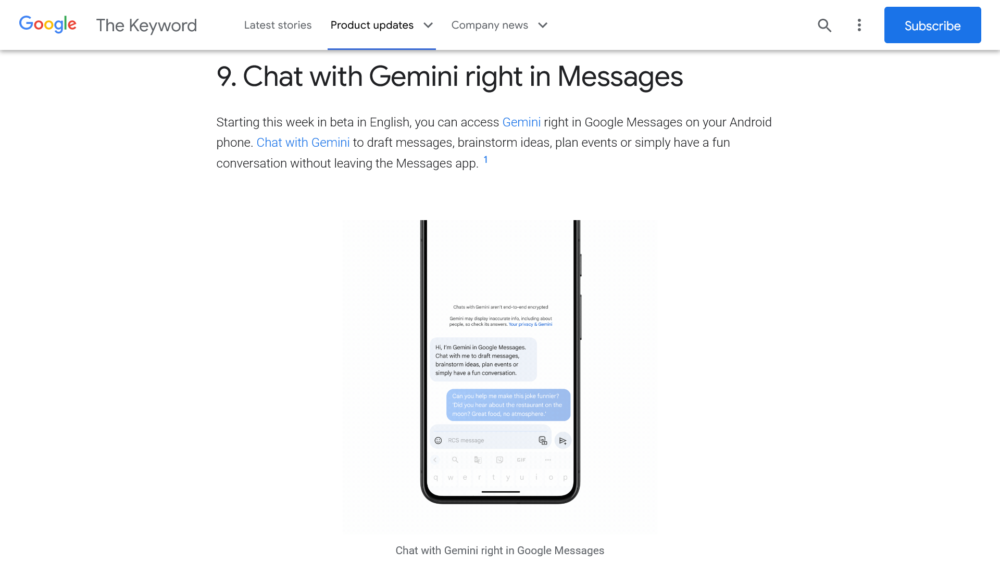

import ArticleCard from "@components/ArticleCard.astro";

2024年2月26日（現地時間）、GoogleはAndroidユーザー向けに、メッセージアプリ内で直接AIアシスタント「Gemini」を活用できる新機能「**Gemini in Google Messages**」のベータ版提供を開始しました。

この機能は、現在英語圏の特定国とカナダ（英語およびフランス語）でのみ利用可能となっており、選択されたAndroidデバイスでのみ対応しています。今回は、「Gemini in Google Messages」についての概要、使い方、そしてその魅力に迫ります。

## 「Gemini in Google Messages」とは？

*画像：[New Android features coming to phones and smartwatches](https://blog.google/products/android/new-android-features-february-2024/)*

「Gemini in Google Messages」は、Googleが提供するAndroidのメッセージアプリ内で直接AIアシスタント「Gemini」に問いかけたり、会話したりするための機能です。この機能により、メッセージの作成、アイデアのブレインストーミング、イベントの計画、楽しい会話をアプリを離れずにできます。

現在この機能はGoogle Messagesのベータテスターに対して段階的にリリースされています。さらに、Geminiとのチャットはエンドツーエンドの暗号化が施されていない点に注意が必要です。

Geminiについては、こちらの記事で解説しています。また、Gemini in Google Messagesの代わりに、GoogleアシスタントとGeminiの統合を利用できます。

<ArticleCard link="/article/2024/02/09/bard-becomes-gemini-and-mobile-app/" />

<ArticleCard link="/article/2024/02/11/google-assistant-gemini-app/" />

:::note[利用するための条件]
Gemini in Google Messagesを利用するためには、記事執筆時点では次の条件を満たす必要があります。

- 次のいずれかのデバイスを利用している
  - Pixel 6以降
  - Pixel Fold
  - Samsung Galaxy S22以降
  - Samsung Galaxy Z Flip / Z Fold
- サポートされている言語設定：英語（対応国すべて）、カナダはフランス語も対応
- Google Messagesの最新バージョン
- 個人管理のGoogleアカウント（Family LinkやGoogle Workspaceのアカウントは利用不可）
- 18歳以上のユーザー
- RCSチャットが有効に設定されている

:::

## 使い方

Geminiとのチャットは、次のようにして開始できます。

1. AndroidスマートフォンでGoogle Messagesを開きます
2. ［chat with Gemini（Geminiとチャット）］をタップするか、［Start chat（チャットを開始）］をタップしてから［Gemini］を選択します
3. はじめての場合は、画面上の指示に従います
4. 質問やプロンプトを入力し、送信します

Geminiはユーザーの正確な位置情報にはアクセスしません。しかし、IPアドレスから得られる一般的なエリアまたはGoogleアカウント内の自宅や勤務先の住所を使用して、天気予報などの質問に関連する回答を提供するとのことです。

### フィードバックの提供

Geminiからの回答に対してフィードバックを提供できます。そのためには、該当する回答を長押ししてから、上部に表示される［Good response］または［Bad response］をタップします。

### Geminiチャットの削除

チャットを削除することで、そのチャットがGeminiによってアクセス不可能になります。Google Messages内でチャットを削除すると、対応するアクティビティからも削除されます。ただし、Geminiのデータの保存をオフにしても、データは一時的に保存されます。

Geminiにどのようなデータが保存されていて、どうすれば削除できるかについては、こちらの記事で解説しています。

<ArticleCard link="/article/2024/02/10/how-to-delete-gemini-data-from-your-google-account/" />

## まとめ

「Gemini in Google Messages」は、ユーザーとAIの対話をより身近なものにし、日常のコミュニケーションを強化します。今後さらなる言語や地域への拡大が期待されますが、現時点では英語圏の特定国とカナダ（英語およびフランス語）でのみ利用可能です。

## 参考

- [New Android features coming to phones and smartwatches](https://blog.google/products/android/new-android-features-february-2024/)
- [Use Gemini in Google Messages - Gemini Apps ヘルプ](https://support.google.com/gemini/answer/14599070)
