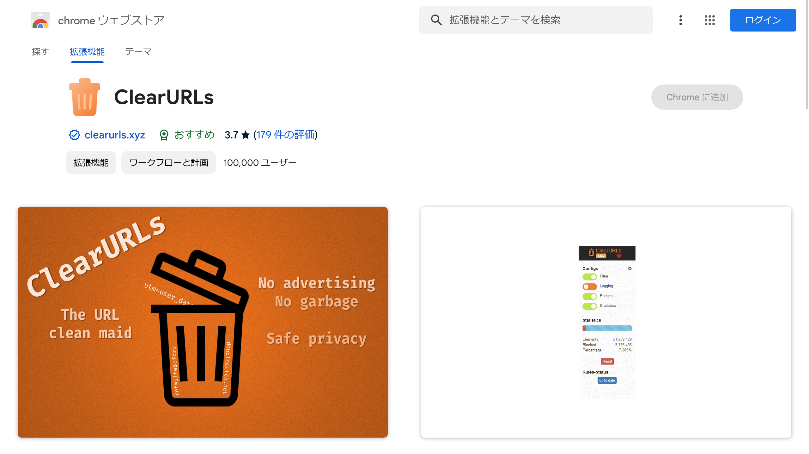

インターネット上でのプライバシー保護は大きな話題です。Webを見ているとき、オンラインでの行動を追跡するための要素を含むURLに頻繁に遭遇することがあります。

そんなときに便利な「**ClearURLs**」のインストール方法や使い方を解説します。

## ClearURLsとは？


*画像：[ClearURLsのストアページ](https://chromewebstore.google.com/detail/clearurls/lckanjgmijmafbedllaakclkaicjfmnk)*

ClearURLsは、インターネットでのプライバシーを保護するために、URLから追跡要素を自動的に削除するブラウザー拡張機能です。FirefoxやChromeを含むブラウザーに最適化されています。

たとえば、インターネットを使っていると、次のようなURLに遭遇することがあります。

```ansi
https://example.com?utm_source=newsletter1&utm_medium=email&utm_campaign=sale
```

このURLはトラッキングパラメーター（水色の部分）を含んでおり、あなたのオンライン行動を追跡するために使用されます。これらのパラメーターは、サイトが動作するためには必須ではありません。

ClearURLsは、このような追跡要素を自動的に削除し、次のようなクリーンなURLに変換します。

```ansi
https://example.com
```

トラッキングパラメーターを削除すると、プライバシーを保護できるだけでなく、URLが短く簡潔になります。

他にも、たとえばAmazonでは次のようなURLが使われています。

```ansi
https://www.amazon.com/dp/exampleProduct/ref=sxin_0_pb?__mk_de_DE=ÅMÅŽÕÑ&keywords=tea&pd_rd_i=exampleProduct&pd_rd_r=8d39e4cd-1e4f-43db-b6e7-72e969a84aa5&pd_rd_w=1pcKM&pd_rd_wg=hYrNl&pf_rd_p=50bbfd25-5ef7-41a2-68d6-74d854b30e30&pf_rd_r=0GMWD0YYKA7XFGX55ADP&qid=1517757263&rnid=2914120011
```

ClearURLsを使うと、次のようなURLになります。

```ansi
https://www.amazon.com/dp/exampleProduct
```

### ClearURLsの他の機能

ClearURLsには、他にも次のような機能があります。

- URLから追跡要素を自動的に削除
- 一部の一般的な広告ドメインをブロック（オプション）
- 複数のURLを一度にクリーニングするための内蔵ツール
- トラッキングサービスを介さずに、目的地へリダイレクトをサポート
- リンクを迅速かつ清潔にコピーできるように、コンテキストメニューにエントリを追加
- ハイパーリンク監査のブロック
- ETag追跡のブロック
- [履歴API](https://developer.mozilla.org/ja/docs/Web/API/History_API)を介した追跡を防止
- GoogleとYandexによる検索結果の書き換えを防止

## 使い方

ClearURLsは、とくに設定が不要で簡単に利用できます。Chrome、Edge、Firefoxの各ブラウザーの拡張機能ストアからダウンロードし、インストールするだけで、自動的にURLの追跡要素を削除します。

- [Chrome版](https://chrome.google.com/webstore/detail/clearurls/lckanjgmijmafbedllaakclkaicjfmnk)
- [Edge版](https://microsoftedge.microsoft.com/addons/detail/mdkdmaickkfdekbjdoojfalpbkgaddei)
- [Firefox版](https://addons.mozilla.org/firefox/addon/clearurls/)

## 注意点

ClearURLsは広範なルールカタログを用いて追跡要素を削除するため、多くのケースで効果的ですが、すべてをカバーする訳ではありません。

ClearURLsは非常に効率的に動作し、それを使うことでブラウジング速度が顕著に遅くなることはありません。

## まとめ

インターネット上で個人のプライバシーを保護することは、非常に重要です。ClearURLsは、簡単に設定できる上に、プライバシーを保護してくれる強力なツールです。

インターネット上でのプライバシー保護に興味がある場合は、ぜひこの拡張機能を試してみてください。

## 参考

- [ClearURLs](https://docs.clearurls.xyz/1.26.1/)
