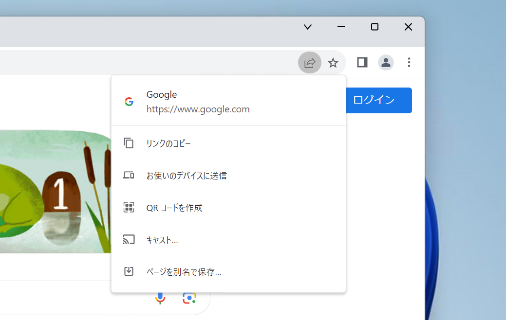
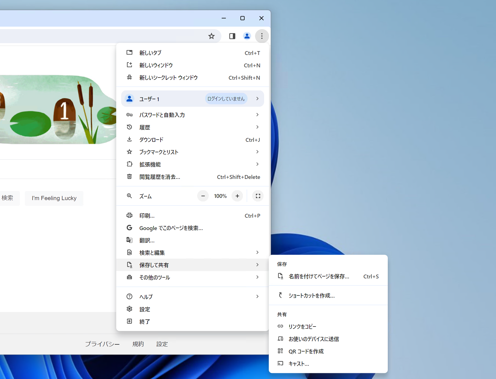

import ArticleCard from "@components/ArticleCard.astro";

Google Chromeは高いシェア率を誇り、世界中のユーザーに愛用されています。

しかし、最近**Chromeのアドレスバーに共有アイコンが表示されなくなりました**。Chromeの共有ボタンは消滅したのでしょうか？

この記事では、**共有ボタンがどこへ行ってしまったのか**、そしてそれを**復活させる方法**について詳しく解説します。

## Chromeの共有ボタンはどこに行ったのか

*以前のChromeの共有ボタンのスクリーンショット*

以前は、Google Chromeのアドレスバーには、簡単にWebページを他の人と共有できる「共有ボタン」がありました。しかし最近、この共有ボタンが姿を消し、多くのユーザーが戸惑っています。

その共有ボタンのメニューは、Chromeの右上にあるメニューの［**保存して共有**］の中に移動しました。このメニュー内には、次のような以前の共有ボタンで利用できた機能がすべて含まれています。

- **名前を付けてページを保存…**
- **ショートカットを作成…**
- **リンクをコピー**
- **お使いのデバイスに送信**
- **QRコードを作成**
- **キャスト…**

移動後も共有機能は健在ですが、操作までのステップ数が増えたことで、少し不便になっています。

*以前の共有ボタンの中身は［保存して共有］の中に移動した*

## 共有ボタンを復活させる方法

共有ボタンがなくなった現実を受け入れられない人のために、幸いにも共有ボタンを復活させる方法があります。それは**Chrome Refresh 2023と呼ばれるデザイン変更を元に戻すこと**です。

Chromeは15周年を記念して、2023年に大幅なデザイン変更を実施しました。それがChrome Refresh 2023です。

Chrome Refresh 2023の変更を元に戻すことで、共有ボタンをアドレスバーに再び表示させられます。Chrome Refresh 2023の変更を元に戻す方法は、こちらの記事で詳しく解説しています。

<ArticleCard link="/article/2023/11/10/revert-chrome-refresh-2023/" />

:::note
この方法を利用すれば、共有ボタンのアイコンが再びアドレスバーの横に表示されるようになります。ただし、GoogleがChromeのアップデートによって、将来的にこの方法が使えなくなる可能性があることに注意してください。
:::

## まとめ

Chromeの共有ボタンが消えたことにより、一部のユーザーは不便に感じています。

しかし、その機能自体は完全に失われたわけではなく、［保存して共有］メニュー内に移行した形です。そして、昔のデザインに戻したい場合には、Chrome Refresh 2023の変更を元に戻す方法が存在します。

共有ボタンがなくなったことで、Chromeの使い勝手が悪くなったと感じる人は、この方法を試してみてください。
