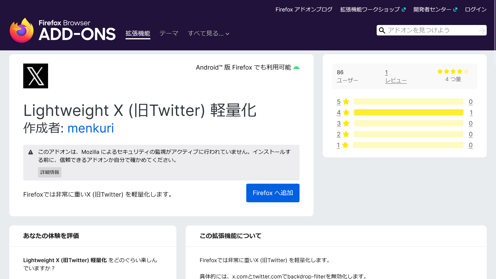

import ArticleCard from "@components/ArticleCard.astro";

X（旧：Twitter）は多種多様な情報を瞬時に入手できることで人気ですが、メニューにぼかし効果を採用しているため、**サイトのレスポンスが遅く感じることがあります**。とくに、低スペックのPCやスマホを使ってFirefoxで閲覧している場合は、このような現象がより顕著になります。

この記事では、FirefoxでXを軽量化する「**Lightweight X**」という拡張機能を紹介します。

## Lightweight Xとは？

*画像：[Lightweight Xのストアページ](https://addons.mozilla.org/addon/lightweight-x-formerly-twitter/)*

**Lightweight Xは、X（旧：Twitter）のページを軽量化することを目的としたFirefox用の拡張機能です**。

この拡張機能は、Xのページに適用される「ぼかし効果」に着目しています。ぼかし効果は見た目には美しいものの、処理を重くする一因となっています。

Lightweight Xは、このぼかし効果を無効化し、ページの動作を軽快にできます。

### なぜぼかし効果が問題なのか？

多くのWebサイトやアプリでは、ユーザーインターフェース（UI）の美しさを追求するため、ぼかし効果やアニメーションなどを採用しています。

しかし、これらのグラフィック機能は計算処理を要求されるため、とくに低スペックのデバイスではパフォーマンスの低下を引き起こします。これは、メモリー容量やCPUの処理能力が限られているデバイスにおいて顕著です。

さらに、Android版のFirefoxは他のブラウザーと比べて遅い傾向があり、ぼかし効果の影響は深刻です。

### Lightweight Xの特徴

Lightweight Xには、次のような特徴があります。

- **軽量化**：ぼかし効果を無効にすることで、Xのページを軽量化し、動作をスムーズにします
- **専用設計**：X専用に設計されており、X以外のサイトには影響を与えません
- **簡単なインストール**：インストール後の特別な設定は必要ありません
- **Android対応**：PC版だけでなく、Android版のFirefoxにも対応しています

## 拡張機能のインストール方法

Lightweight Xの利用を開始するには、Firefoxに拡張機能をインストールする必要があります。

まずは、Firefoxを起動し、拡張機能のストアページを開きます。

- [Lightweight X (旧Twitter) 軽量化 – 🦊 Firefox (ja) 向け拡張機能を入手](https://addons.mozilla.org/firefox/addon/lightweight-x-formerly-twitter/)

次に、［Firefoxに追加］ボタンをクリックして、拡張機能をインストールします。

インストール後の追加設定は必要ありません。このアドオンはインストールするだけで利用できます。

## 効果の実感について

**Lightweight X**は、とくに低スペックのデバイスでその効果を実感できます。

高スペックのPCやスマホでは、ぼかし効果の影響よりもFirefox自体の動作の遅さが足を引っ張るため、効果を実感しにくいかもしれません。

Firefox自体の動作速度を改善する方法は、こちらの記事で解説しています。

<ArticleCard link="/article/2024/02/28/speed-up-your-firefox-for-android/" />

## まとめ

X（旧：Twitter）の使用時にパフォーマンス低下に悩まされている場合は、Lightweight Xのインストールが効果的です。

この拡張機能を導入することで、低スペックのデバイスでのXの動作が改善されます。インストールも簡単で設定不要、そして無料で利用できる点も大きな魅力です。

Xをより快適に使用したいと考えている方は、ぜひ一度試してみてください。
