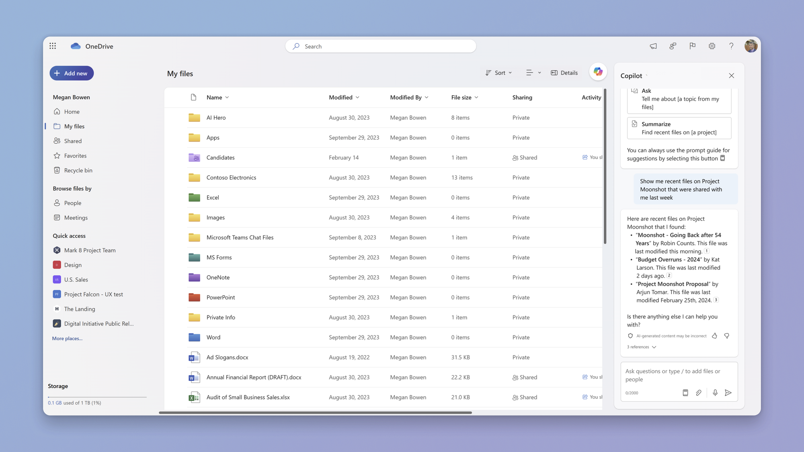

import ArticleCard from "@components/ArticleCard.astro";

OneDriveがさらに便利になります。

2024年4月末から段階的に**Copilot in OneDrive**が展開されます。Copilot in OneDriveにより、ファイルの検索や情報抽出がこれまで以上に簡単になります。

この記事では、Copilot in OneDriveの概要から、具体的な使い方まで紹介します。

## Copilot in OneDriveとは？

*Copilot in OneDriveのスクリーンショット。OneDriveの右上にCopilotのロゴが配置されており、サイドパネルにCopilotとの会話が表示されている。 画像：「[Copilot in OneDrive: A New Wave of File Interaction - Microsoft Community Hub](https://techcommunity.microsoft.com/t5/microsoft-onedrive-blog/copilot-in-onedrive-a-new-wave-of-file-interaction/ba-p/4070738?lightbox-message-images-4070738=556716i05BBF5960519F808)」より*

Copilot in OneDriveは、**OneDrive内のファイルから迅速に情報を取得するための新しい機能**です。

Web上のOneDriveや、Microsoft Teams、SharePoint内のファイルビューワーから直接アクセスできます。Copilot for Microsoft 365ライセンスをもつビジネスおよび教育機関のユーザーが利用できます。

Copilot in OneDriveを利用できる場合は、OneDriveの右上にCopilotのロゴが表示されます。このロゴをクリックすると、サイドパネルにCopilotとのチャット画面が表示されます。

ちなみに、Copilot ProとCopilot for Microsoft 365は別物です。Copilot Proについては、こちらの記事で解説しています。

<ArticleCard link="/article/2024/01/20/copilot-pro-feature-comparison-pricing-usage/" />

### 主な機能

Copilot in OneDriveには次のような機能があります。

- **質問してファイルから答えを得る**：文書、プレゼンテーション、スプレッドシートなどから、情報を直感的に抽出します
- **自然言語を使ってファイルを検索**：Copilotに質問してファイルを検索できます
- **コンテンツからアウトライン、テーブル、FAQを作成**：既存のファイルをもとにCopilotが新たなコンテンツを作成します
- **コンテンツの改善提案**：文書やプレゼンテーションをさらに良くするための提案を得られます
- **ファイル要約の生成**：複数のファイルを簡潔に要約し、重要な情報に素早くアクセスできます

### ファイル形式と言語

Copilot in OneDriveは、DOC、DOCX、PPT、PPTX、XLSXなどのオフィスドキュメント、PDF、TXT、RTFなどの汎用フォーマット、さらにはASPX、HTM、HTMLなどのWebファイルにも対応しています。また、FLUID、LOOP、ODT、ODPにも対応しています。

言語サポートも幅広く、英語、フランス語、ドイツ語、イタリア語、日本語、ポルトガル語、スペイン語、簡体字中国語をはじめとする多数の言語がサポートされています。

## Copilot in OneDriveの便利な使い方

### 1. 情報の素早い取得

たとえば、「先週の飲料の総売り上げは？日別で表にして」という質問をCopilotに投げることで、関連するファイルから答えを速やかに抽出し、表形式で表示してくれます。

### 2. ファイルの検索

「プロジェクトMoonshotに関する最新のファイルを見せて」と質問すると、Copilotが関連するファイルを見つけてくれます。

### 3. 新しいコンテンツの作成

「/sales-enablement.docxを参考に、新規顧客向けのセールスピッチの概要を作成して」と指示すると、Copilotはその文書をもとにアウトラインを作成します。

### 4. コンテンツの改善

「/new-sales-process.pptの改善案を教えて」と尋ねると、Copilotはプレゼンテーションをより良くするための提案をします。

### 5. 要約の生成

「moonshot-plan.pdf、Moonshot-timeline.docx、moonshot-GTM.pptの要点をまとめて」というプロンプトを使用すると、Copilotはこれらのファイルの要約を提供します。

### 6. 共有文書の要約

2024年3月から、共有文書の通知に要約を追加する機能も提供されます。これにより、受信者はファイルを開かずとも、そのファイルの概要を把握できます。

## まとめ

Copilot in OneDriveは、OneDrive内のファイルから迅速に情報を取得するための新しい機能です。ファイルの検索や情報抽出がこれまで以上に簡単になります。

2024年4月末から段階的に展開されるCopilot in OneDrive。ぜひ、その便利な機能を活用してみてください。

## 参考

- [Copilot in OneDrive: A New Wave of File Interaction - Microsoft Community Hub](https://techcommunity.microsoft.com/t5/microsoft-onedrive-blog/copilot-in-onedrive-a-new-wave-of-file-interaction/ba-p/4070738)
