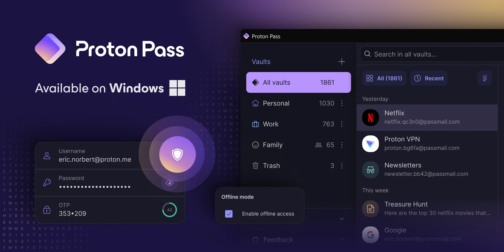

2024年2月29日、**Proton Pass**のWindowsアプリがついにリリースされました。Proton Passにデスクトップから直接アクセス可能となることで、使い勝手が向上します。

## Proton Passとは？

利便性の高いオンラインサービスが増える一方で、セキュリティリスクや個人情報の管理がますます重要になっています。

**Proton Pass**は、[Proton Mail](https://account.proton.me/ja/mail)や[Proton VPN](https://protonvpn.com/)などで知られる[Proton](https://proton.me/)が提供しているパスワードマネージャーです。基本的な機能は無料で利用でき、エンドツーエンドの暗号化により、パスワードの安全な保管が可能です。

Proton Passはパスワードの安全な保管だけでなく、メールアドレスの隠蔽、2要素認証の管理など、さまざまな機能に対応しています。

## Windowsアプリの特徴

*画像：「[Proton Pass Windows app is now available for everyone | Proton](https://proton.me/blog/proton-pass-windows-app)」より*

今回ProtonがリリースしたWindowsアプリは、Proton Passの利便性をさらに向上させるものです。その特徴をいくつか紹介します。

### オフラインでもパスワードにアクセス

インターネット接続が不安定な場所や旅行中でも、**オフラインモードを有効にすることでパスワードにアクセスできます**。この機能は、Proton Passのプレミアム機能を含むサブスクリプションがある場合に利用可能です。

オフラインモードは、**Argon2暗号化**によって保護されており、ブルートフォース攻撃にも耐えうる設計となっています。

### オープンソースで信頼性が担保

Proton PassのWindowsアプリは、**オープンソース**として[公開](https://github.com/protonpass)されています。

これにより、誰でもコードを確認できるようになっています。また、コミュニティによる厳しいチェックも可能となり、セキュリティや信頼性の向上が期待できます。

### ダウンロード方法

すでにProtonアカウントを持っている場合は、Proton PassのWindowsアプリをダウンロードしてすぐに利用できます。

ログイン後、有料プランの場合はオフラインモードを有効化できます。

https://proton.me/pass/download

## 今後の展望

Protonは近い将来、macOSやLinux用のアプリもリリースする予定とのことです。これにより、より多くのユーザーがProton Passを利用できるようになり、オンライン上でのプライバシー保護とセキュリティがさらに向上します。

## まとめ

インターネット利用が日常不可欠となる今日、自分のオンライン上のアイデンティティを守ることは非常に重要です。Proton Passのようなツールを活用し、セキュリティ意識を高めましょう。

## 参考

- [Proton Pass Windows app is now available for everyone | Proton](https://proton.me/blog/proton-pass-windows-app)
