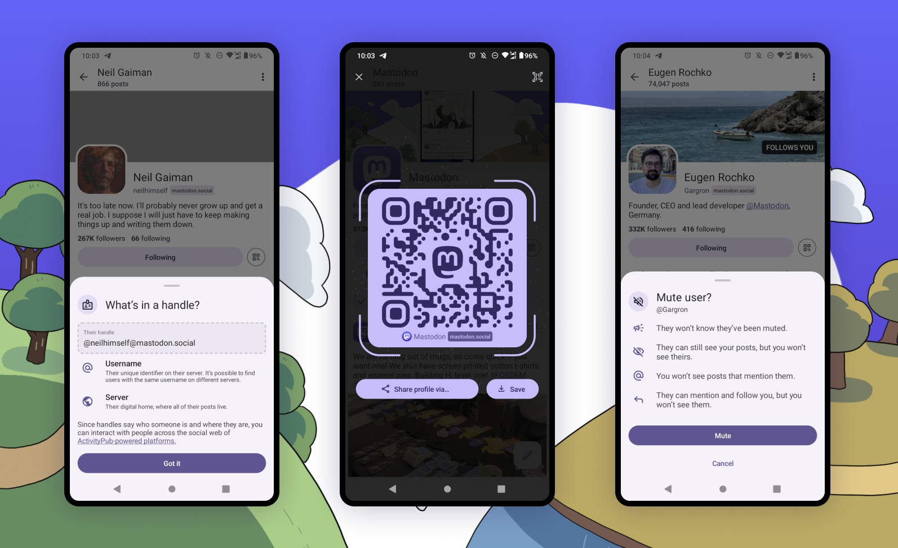

Mastodonは、オープンソースの分散型SNSで、ユーザーが自由にコミュニケーションを取り合う場所を提供しています。

今回注目するのは**プロフィールのQRコード共有機能**です。2024年2月、MastodonのAndroidアプリのアップデートで、この便利な機能が追加されました。

これにより、簡単にプロフィールを共有できるようになります。この記事では、その使い方を詳しく解説します。

## QRコードでの共有機能のメリット

QRコードを使ったプロフィール共有は、主に次のようなメリットがあります。

- **手軽さ**：ユーザーネームを口頭で伝える手間が省け、簡単に情報を共有できる
- **正確性**：誤字脱字の心配がなく、正確に相手のプロフィールにアクセスできる
- **速さ**：すぐにプロフィールページを開くことができ、時間を節約できる
- **分かりやすさ**：とくに紙媒体では、URLよりもQRコードの方が分かりやすくアクセスしやすい

このように、QRコードでの共有機能は一部の場面で非常に役に立ちます。

ここからは、MastodonのアプリでQRコードを使ってプロフィールを共有する方法を、詳しく解説します。

## プロフィールのQRコードを生成する方法

### ステップ1：MastodonのAndroidアプリを開く

はじめに、MastodonのAndroidアプリを開きます。まだインストールしていない場合は、Google Playストアからダウンロードしてください。

- [Mastodon - Google Play のアプリ](https://play.google.com/store/apps/details?id=org.joinmastodon.android)

### ステップ2：プロフィールにアクセス

アプリが開いたら、自分または他人のプロフィールページにアクセスします。自分のプロフィールは画面下部のナビゲーションバーからアクセスできます。

### ステップ3：QRコードアイコンをクリック

プロフィールページにあるQRコードアイコンをタップします。すると、現在開いているプロフィールを示すQRコードが表示されます。

### ステップ4：QRコードを共有

表示されたQRコードを、相手にスキャンしてもらいます。これで、相手は簡単にあなたのプロフィールページへアクセスできるようになります。

また、QRコードの下にはアカウントのURLを共有するボタンと、QRコードを保存するボタンがあります。

## QRコードをスキャンしてプロフィールにアクセスする方法

受け取ったQRコードを読み取る方法は2つあります。

### カメラアプリを使う

一部のスマートフォンに搭載されているカメラアプリは、QRコードを自動的に読み取る機能を持っています。カメラアプリを開いて、QRコードを読み取るだけで、プロフィールページにアクセスできます。

または、[Googleレンズ](https://play.google.com/store/apps/details?id=com.google.ar.lens)などのアプリを利用するという選択肢もあります。

### Mastodonアプリを使う

任意のプロフィールのQRコードを表示すると、右上にQRコードをスキャンするアイコンが表示されます。このボタンをタップすると、Google Play開発者サービスのQRコードスキャナーが起動します。

## その他の変更点

*画像：「[Mastodon for Android update - Mastodon Blog](https://blog.joinmastodon.org/2024/02/mastodon-for-android-update/)」より*

今回のアップデートでは、QRコードの生成・読み取り機能以外にも、いくつかの変更が加えられています。

プロフィールのデザインがアップデートされ、アカウントの「ドメイン名」が強調されるようになりました。プロフィールページにドメイン情報をタップすると、Mastodonの分散型の性質についての詳細な説明が表示されます。

さらに、ミュートやブロック機能についても、各アクションがどのような影響を及ぼすかを説明する確認ダイアログが更新され、アプリの挙動に対する理解を深められるようになっています。

## まとめ

MastodonのAndroidアプリのアップデートで、プロフィールのQRコード共有機能が追加されました。これにより、簡単にプロフィールを共有できるようになりました。

QRコードを使ったプロフィール共有は、手軽さ、正確性、速さ、分かりやすさなどのメリットがあります。また、プロフィールのデザインがアップデートされ、ミュートやブロック機能についての確認ダイアログが更新されました。

Mastodonのアプリを使って、QRコードを使ったプロフィール共有を試してみてください。

## 参考

- [Mastodon for Android update - Mastodon Blog](https://blog.joinmastodon.org/2024/02/mastodon-for-android-update/)
