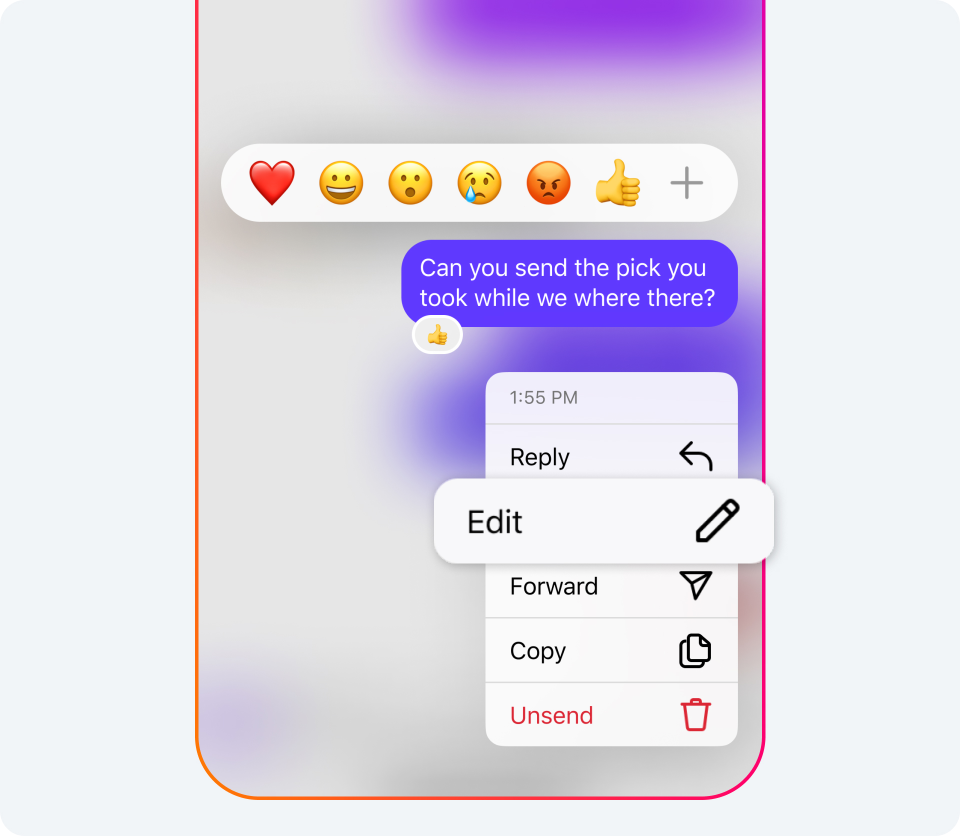

import ArticleCard from "@components/ArticleCard.astro";

Instagram（インスタグラム）は、ユーザー同士のコミュニケーションをよりスムーズに、そして柔軟にするために日々進化を続けています。

そして最近、多くのユーザーが待ち望んでいた**DM（ダイレクトメッセージ）の編集機能**が追加されました。これまで誤って送信してしまったメッセージに対して、送信取り消しのオプションはありましたが、**メッセージの編集**はできませんでした。この新機能により、タイポ（打ち間違い）や表現の修正が可能になり、コミュニケーションがグッと楽になります。

この記事では、**InstagramのDMを送信取り消ししたり編集したりする方法**について詳しく解説します。

<!-- toc -->

## DMの送信取り消し

**メッセージを送信してしまった後に取り消す**には、次の手順に従います。

1. まず、インスタグラムを開いて、下部にあるメッセージアイコンをタップしてDM画面を開きます
2. 間違って送信してしまったメッセージがあるチャットを開きます
3. 取り消したいメッセージを長押しします
4. 表示されるメニューから［**送信を取り消す**］を選択します

これで、メッセージの送信が取り消され、あたかもそのメッセージがなかったかのようになります。

:::note
メッセージを取り消すと、基本的には相手に届いていた通知も削除されます。

ただし、**機種によっては通知が消えない可能性がある**ことに注意してください。また、相手がすでにメッセージを見ていた場合は、取り消してもあまり意味がありません。
:::

## DMの編集

*Instagramのメッセージを長押しすると、［編集］ボタンが表示される。画像：[Edit Your Messages, Pin Your Chats and More Instagram DM Updates | Meta](https://about.fb.com/news/2024/03/instagram-dm-updates/)*

次は、**最近追加されたDMの編集機能**について詳しく見ていきましょう。編集機能を利用することで、送信後15分以内ならメッセージの内容を変更できます。

1. 送信したメッセージを見つけます
2. 編集したいメッセージを長押しします
3. 表示されるメニューから［**編集**］を選択します
4. メッセージの内容を修正し、完了したら［送信］をタップします

:::tip
編集したメッセージには、元のメッセージが編集されたことを示す「**編集済み**」のラベルが付きます。

また、メッセージを編集する時間は送信後15分以内と限られているので、修正が必要な場合は早めに編集しましょう。
:::

この機能により、誤って情報を送信してしまった際にも迅速に修正が可能になり、誤解を招くことが少なくなります。

## 同時に実装された他の機能

DMの編集機能と同時に、Meta（Instagramの運営元）は次のような便利な機能も追加しています。

### 既読機能をオフにする設定

すべてのチャットや特定のチャットに対して既読表示をオン・オフする機能も追加されています。既読機能をオフにする方法は、こちらの記事で解説しています。

<ArticleCard link="/article/2024/03/05/how-to-disable-read-receipts-in-instagram-messages/" />

### チャットのピン留め

最大3つのグループチャットや1：1のチャットをピン留めし、簡単にアクセスできるようになりました。

### ステッカーの保存

自分のお気に入りのステッカーを保存できるようになり、メッセージの返信にステッカーやGIF、動画、写真、音声メッセージを使えるようになりました。

これらの機能により、InstagramのDMはこれまで以上に使いやすく、また楽しいものになります。

とくにチャットのピン留め機能は、頻繁に連絡を取り合う相手へのアクセスが簡単になりますし、ステッカーの保存機能は自分の好きなリアクションをすぐに使用できるようになるため、表現の幅が広がります。

## まとめ

InstagramのDMの編集機能を使えば、誤って送信してしまったメッセージを取り消したり、内容を修正したりできます。また、同時に実装されたチャットのピン留め機能やステッカーの保存機能も、コミュニケーションをより便利で楽しいものにしてくれます。

これらの機能を上手に活用して、Instagramでのコミュニケーションをより円滑に、そして楽しく行ってみてください。

## 参考

- [Edit Your Messages, Pin Your Chats and More Instagram DM Updates | Meta](https://about.fb.com/news/2024/03/instagram-dm-updates/)
