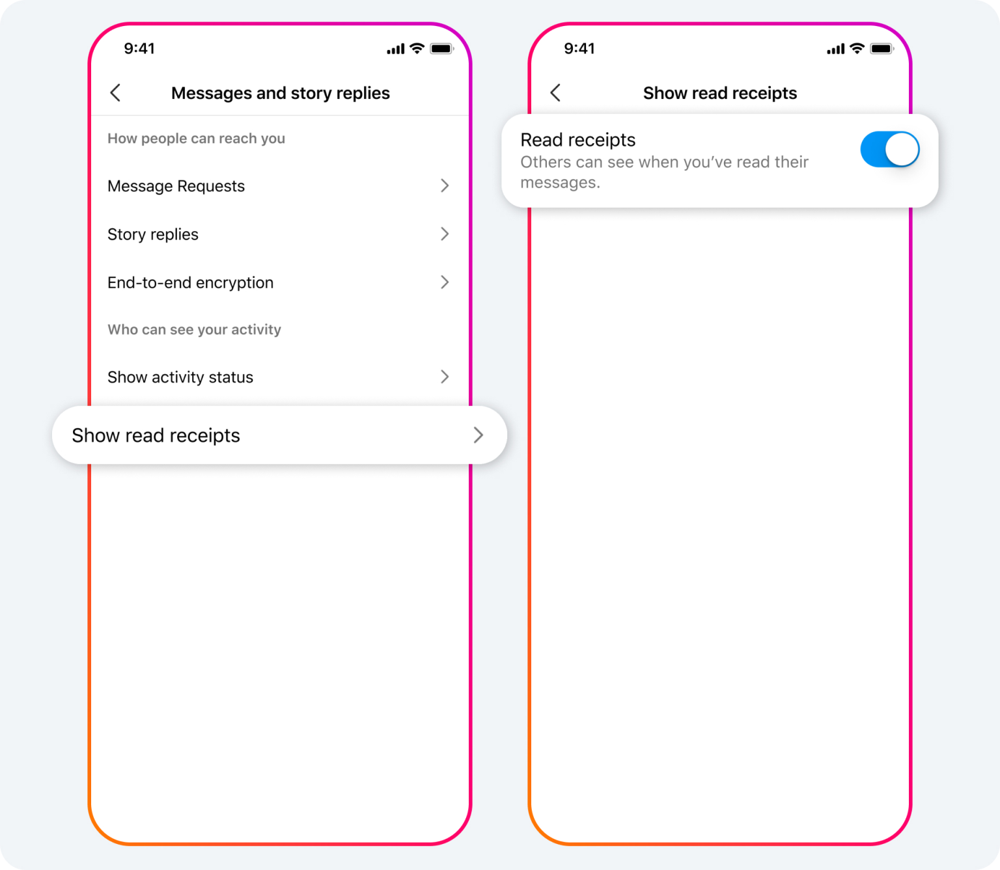

import ArticleCard from "@components/ArticleCard.astro";

Instagramのダイレクトメッセージ（DM）は、世界中のユーザーが友達やフォロワーと簡単にコミュニケーションを取る手段として広く利用されています。しかし、メッセージを受信した相手に「既読」が伝わると、何らかの返信が期待されることになり、プレッシャーを感じることがあります。

Instagramの運営元のMetaは最近、**ユーザーが既読をつけずにメッセージを読むオプション**を追加しました。

この記事では、その方法や他に追加された便利な機能について紹介します。

<!-- toc -->

## 既読機能をオフにする方法

*DMの既読機能をオフにする設定が追加された。画像：[Edit Your Messages, Pin Your Chats and More Instagram DM Updates | Meta](https://about.fb.com/news/2024/03/instagram-dm-updates/)*

これまでInstagramのDMでは、メッセージを読むと自動的に既読通知が相手に送信されていました。しかし、**2024年3月4日（現地時間）のアップデート**によって、これをカスタマイズすることが可能になりました。

具体的には、すべてのチャットや特定のチャットの既読表示を**オン/オフ**で切り替えることができるようになりました。

### すべてのチャットで既読をオフにする

1. Instagramの設定にアクセスします
2. ［メッセージとストーリーズへの返信］をタップします
3. ［開封証明を表示］をタップし、［開封証明］のトグルスイッチをオフにします

:::note
この設定は、すべてのチャットでの既読表示をオフにします。チャットごとに個別に設定したい場合は、次の手順を参照してください。

また、既読機能をオンに戻したい場合は、同様の手順で設定できます。
:::

### 特定のチャットで既読をオフにする

1. フィードの右上にあるDMアイコンをタップしてチャットリストを開きます
2. 既読表示をオフにしたいチャット・スレッドを開きます
3. 画面上部に表示されているチャット名をタップし、［プライバシーと安全］を選択します
4. 「開封証明」の横にあるトグルスイッチをタップして、このチャットでの既読表示をオフにします

:::caution
個別のチャットで既読表示をオフに設定したあとに、すべてのチャットに対する設定を変更しても、その個別のチャットの設定には影響しません。また、エンドツーエンド暗号化されたチャットでは既読表示の設定は利用できません。
:::

## 他に追加されたInstagram DMの新機能

Instagramはこの既読表示のオン/オフ機能の他にも、新しい機能をいくつか追加しました。

### メッセージの編集

送信後15分以内なら、誤字や表現の修正などを行うためにメッセージを編集できます。詳しくはこちらの記事で解説しています。

<ArticleCard link="/article/2024/03/05/how-to-delete-or-edit-instagram-messages/" />

### チャットのピン留め

最大3つのグループチャットまたは1対1のチャットをピン留めして、簡単にアクセスできるようにする機能です。大事な会話をすぐに見つけられるようになります。

### ステッカーの保存と返信

お気に入りのステッカーを保存して、メッセージへの返信に使用したり、GIF、動画、写真、ボイスメッセージで返信したりできるようになりました。

これらの新機能により、InstagramのDMはより便利になりました。とくに既読表示のカスタマイズ機能は、プライバシーを保ちつつ、自分のペースでメッセージをチェックしたい場合に役立ちます。

## まとめ

InstagramのDMの新機能により、ユーザーはより柔軟にコミュニケーションを取ることができるようになりました。既読表示のカスタマイズ機能をはじめ、メッセージの編集やチャットのピン留め、ステッカーの保存と返信など、使いやすさが向上しました。

これらの機能を使いこなして、InstagramのDMをより楽しいものにしましょう。

## 参考

- [Edit Your Messages, Pin Your Chats and More Instagram DM Updates | Meta](https://about.fb.com/news/2024/03/instagram-dm-updates/)
- [Instagramでチャットの開封証明を管理する | Instagramヘルプセンター](https://help.instagram.com/1586876252167004/?cms_platform=android-app&helpref=platform_switcher)
