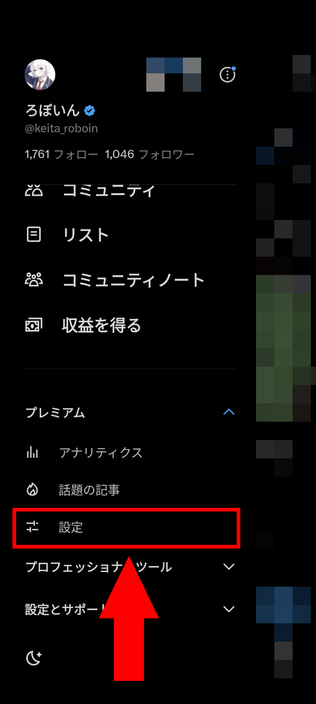
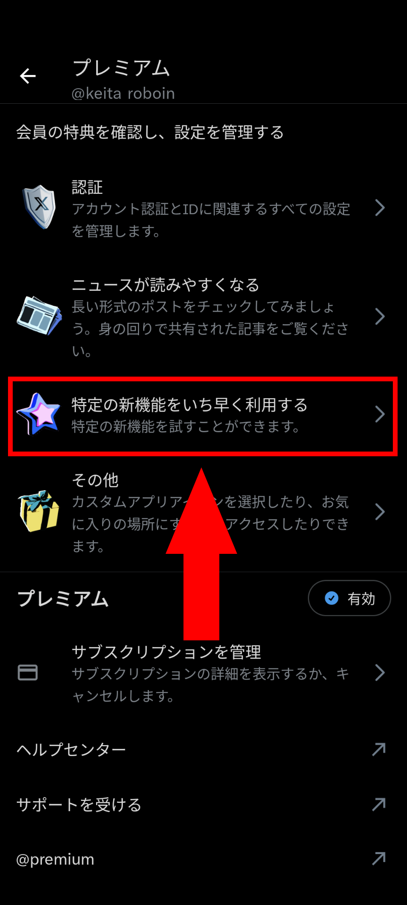
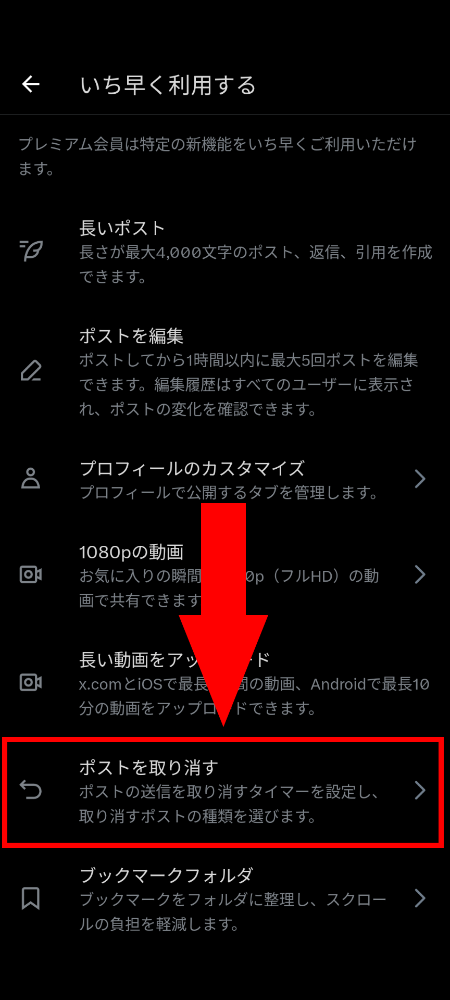
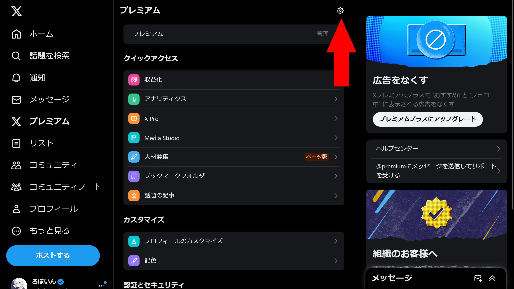
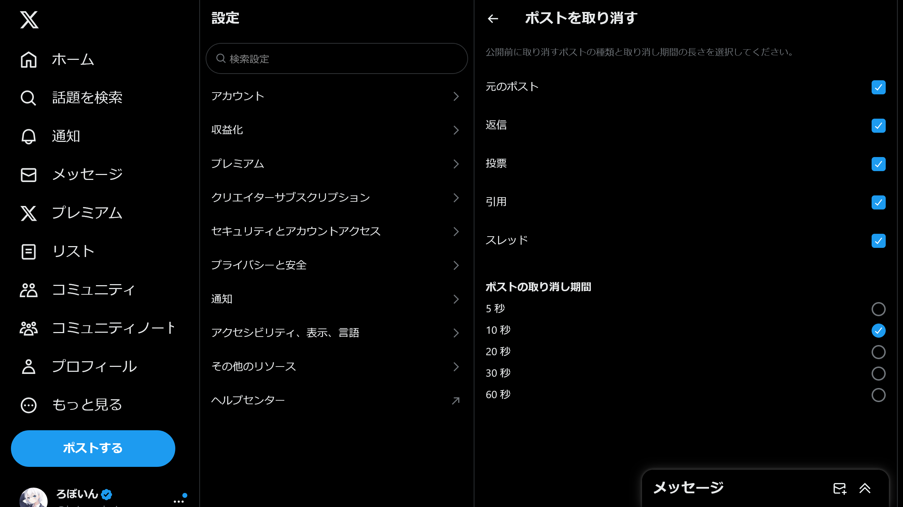

import ArticleCard from "@components/ArticleCard.astro";

X（旧：Twitter）でのコミュニケーションはスピードが命ですが、急いでポスト（ツイート）したあとに「あっ、誤字が…！」と後悔した経験はありませんか？

そんなときに心強いのが、「**ポストを取り消す**」機能です。

この記事では、その使い方や設定変更方法、さらには機能をオフにする方法までを詳しく説明します。

<!-- toc -->

## 「ポストを取り消す」機能とは？

「ポストを取り消す」機能は、ツイートの送信ボタンを押してから一定時間以内であれば送信を取り消せる、というものです。Gmailの送信取り消し機能に似ており、**送信直後に誤字や脱字に気づいた場合などにすぐに対応できる点**が大きなメリットです。

この機能は、**課金しているユーザーのみが利用可能**です。有料プランには「ベーシック」「プレミアム」「プレミアムプラス」がありますが、どのプランでも利用できます。Webとアプリの両方が対応しています。

有料プランの機能や違いについて、詳しくはこちらの記事を参照してください。

<ArticleCard link="/article/2023/10/28/differences-between-3-twitter-plans/" />

:::caution
この機能を使うと、**設定した時間が経過するまで実際にはツイートが送信されない**という点が欠点となる場合があります。実際に送信されるまでの時間は自分で変更可能です。

また、Web版では実際に送信される前にページを閉じてしまうと投稿が送信されないことに注意が必要です。
:::

### 送信取り消しと編集機能の違い

Xには、**ポストの編集機能**も存在しています。

ポストの編集機能と送信取り消し機能の最大の違いは、**変更可能なタイミング**です。取り消し機能は実際の送信を遅らせることで、公開前に内容のプレビューを表示し、変更を加えられる機能です。一方で、編集機能は公開後に内容を修正できる点が特徴です。

ポストの編集機能については、別の記事で詳しく解説しています。

<ArticleCard link="/article/2024/04/20/how-to-edit-tweet/" />

## 設定の変更方法

「ポストを取り消す」機能の設定を変更する方法は、アプリとWebで若干異なります。詳しく見ていきましょう。

:::note
アプリやブラウザー間で設定は同期されないため、端末ごとに設定する必要があります。
:::

### アプリでの設定変更方法

Twitterアプリを開き、メニューの［**プレミアム**］セクションの［**設定**］を選択します。

:::caution
通常の［設定］とは異なるので注意してください。
:::

［**特定の新機能をいち早く利用する**］>［**ポストを取り消す**］の順に進みます。

この画面で［元のポスト］のトグルスイッチをオンにすると通常の投稿でポストを取り消せるようになります。［返信］をオンにすると返信も取り消せるようになります。

さらに、同じ画面で **実際に送信されるまでの時間（取り消し可能な期間の長さ）** も変更できます。

### Webでの設定変更方法

TwitterのWebサイトにアクセスし、メニューから［**プレミアム**］を選択します。次に、右上にある小さな歯車のアイコンをクリックします。

［**ポストを取り消す**］を選択します。この画面で、アプリと同様に機能のオン・オフや取り消し期間の設定が可能です。

機能のオン・オフについては、アプリよりも細かく設定できます。具体的には次のとおりです。

- 元のポスト
- 返信
- 投票
- 引用
- スレッド

これにより、自分のツイートスタイルに合わせた詳細な設定ができます。

## 機能をオフにする方法

「ポストを取り消す」機能を使用したくない場合や、ツイートがすぐ送信されるのを好む場合は、前述の設定画面から該当機能をオフにすることで、機能を無効化できます。

これにより、送信ボタンを押した瞬間にツイートが送信される従来の方式に戻ります。

## 「ポストを取り消す」ができないときは？

ポストを取り消す機能が使えない場合は、次の項目を確認してください。

### 課金しているか

ポストの取り消し機能は、課金しているユーザーしか利用できません。

無料ユーザーは利用できないので、いずれかの有料プランに加入していることを確認してください。

### 機能がオンになっているか

当然ですが、ポストを取り消す機能がオフになっていると利用できません。

設定から、機能がオンになっているか確認してください。とくに、Web版ではデフォルトでオフになっているので注意が必要です。

### 取り消し期間を過ぎていないか

ポストを取り消す機能は、いつでも取り消せるわけではありません。

自分で設定した時間の分だけ送信を遅らせ、その間は取り消し可能になるという機能です。そのため、取り消し期間が過ぎて送信されたあとの投稿は取り消せません。

代わりに、取り消し期間を過ぎても、1時間以内であればポストの編集機能を利用できます。

### アプリは最新バージョンか

アプリが最新バージョンにアップデートされているか確認してください。古いバージョンを使っていると、一部の機能を利用できない可能性があります。

また、アプリのアップデートでは、一般的にバグやセキュリティの修正も含まれているので、常に最新バージョンにアップデートしておくことが推奨されます。

## まとめ

Twitterの「ポストを取り消す」機能は、誤字や脱字に気づいたとき、または思わぬ誤送信をしたときに非常に便利な機能です。

しかし、リアルタイム性を重視する場合は、この機能をオフにしておくのもひとつの選択肢です。Twitterの利用の幅を広げるこの機能を、ぜひ上手に活用してみてください。
