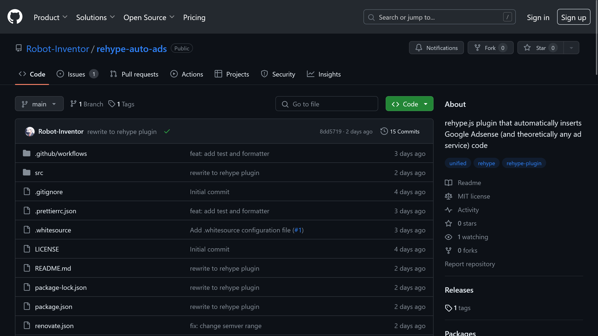

import ArticleCard from "@components/ArticleCard.astro";

Markdownで作成した記事に自動的に広告を挿入する「rehype-auto-ads」というrehypeプラグインを開発しました！



この記事では、rehype-auto-adsを開発した経緯や使い方について詳しく説明します。使い方だけ読みたい方は、そこまで飛ばしていただいて構いません。

<!-- toc -->

## rehype-auto-adsとは

rehype-auto-adsは、Markdownで作成した記事に、自動でいい感じに広告を挿入してくれるrehypeプラグインです。指定した段落数ごと（デフォルトでは5段落ごと）に自動で広告を挿入します。

https://github.com/robot-Inventor/rehype-auto-ads

https://www.npmjs.com/package/rehype-auto-ads

Google Adsenseの自動広告と違い、コードブロックや引用ブロックなどの途中に広告が挿入されることはありません。また、何段落ごとに広告を挿入するか設定できるので、Adsenseの自動広告よりも柔軟性が高くなっています。

たとえば、次のようなMarkdownを書いたとします。

```markdown
# Hello, world!

This is a paragraph.

This is a paragraph.

This is a paragraph.

This is a paragraph.
```

説明のために、rehype-auto-adsを使って2段落ごとに`<ad-code />`というコードを挿入する場合を考えます。この場合、次のようなHTMLが生成されます。もちろん、何段落ごとにどのようなコードを挿入するかはオプションで設定できます。

```html mark="<AD-CODE />"
<h1>Hello, world!</h1>
<p>This is a paragraph.</p>
<p>This is a paragraph.</p><AD-CODE />
<p>This is a paragraph.</p>
<p>This is a paragraph.</p><AD-CODE />
```

### rehype-auto-adsのメリット

Markdownベースのサイトで、サイトの上部や記事の末尾、サイドバーなどに広告を挿入する際には、テンプレートを編集するだけなのでプラグインは不要です。

しかし、記事の本文中に広告を挿入する場合は、途端に面倒になります。

Google Adsenseの自動広告は評判が悪いですし、手動で広告コードを挿入するのも大変です。さらに、手動で挿入した場合は、サイトから広告を削除したくなった場合や広告サービスを変更する場合に、すべての記事を修正しなければなりません。

rehype-auto-adsは、このような問題を解決します。Google AdSenseの広告コードを想定していますが、他のサービスのコードも利用できるはずです。

## 開発した経緯

このブログでは、静的サイトジェネレーターの「[Astro](https://astro.build/)」を利用しています。AstroではMarkdownのパースに[remark](https://github.com/remarkjs/remark)、HTMLの生成に[rehype](https://github.com/rehypejs/rehype)が使われています。

以前、Qiitaの[Note記法](https://qiita.com/Qiita/items/c686397e4a0f4f11683d#note---%E8%A3%9C%E8%B6%B3%E8%AA%AC%E6%98%8E)を使えるようにするための[Marked](https://github.com/markedjs/marked)プラグイン「[qnote-parser](https://github.com/Robot-Inventor/qnote)」を開発したことがありました。しかし、Markedに比べてremark/rehypeは処理が抽象化されており、ASTを操作する必要があるため、難しいという印象を持っていました。

Google Adsenseの自動広告は評判が良くないので代替手段を探していましたが、remark/rehypeやAstroでそういったプラグインが存在しないので放置していました。

そして最近、Astroで任意の位置に任意の構造の目次を挿入できる「astro-custom-toc」というAstro integrationを開発するために、remark/rehypeのプラグイン開発に挑戦しました。

<ArticleCard link="/article/2024/03/03/astro-custom-toc/" />

astro-custom-tocについての記事を投稿したところ、FFの方から「コードブロックの中に広告が入ってしまっている」という指摘を受けました。Google Adsenseの自動広告の評判が悪いのは知っていましたが、まさかここまでとは…。

ということで、広告をいい感じに挿入するプラグインを開発することにしました。

もともとはremarkプラグインとして[remark-auto-ads](https://github.com/Robot-Inventor/remark-auto-ads)という名前で開発していました。しかし、remarkのプラグイン一覧に追加するPull Requestを出したときに、rehypeプラグインにした方がよいという[指摘](https://github.com/Robot-Inventor/remark-auto-ads)を受けました。

こうして、rehypeプラグインに書き換えたのがrehype-auto-adsです。

## 使い方

まずは、rehype-auto-adsをインストールします。

```bash
npm install rehype-auto-ads
```

rehype-auto-adsは、通常のrehypeプラグインと同様に利用できます（rehypeプラグインなので当たり前ですが）。たとえば、Markdownをremarkでパースし、rehype-auto-adsを適用したrehypeでHTMLに変換する場合は、次のようになります。

```javascript mark={5,7-9,14-15}
import remarkParse from "remark-parse";
import rehypeStringify from "rehype-stringify";
import remarkRehype from "remark-rehype";
import { unified } from "unified";
import rehypeAutoAds from "rehype-auto-ads";

const options = {
    // オプション
};

const processor = unified()
    .use(remarkParse)
    .use(remarkRehype)
    // rehype-auto-adsを適用
    .use(rehypeAutoAds, options)
    .use(rehypeStringify);

const markdown = `
# Hello, world!

This is a paragraph.

This is a paragraph.

This is a paragraph.

This is a paragraph.
`;

processor.process(markdown).then((result) => {
    console.log(result.toString());
});
```

こうすると、オプションで指定した段落数ごとに、オプションで指定したコードが挿入されます。Astroで使う場合は、こんな感じですね。

```javascript title="astro.config.mjs" ins={2,9-14}
import { defineConfig } from "astro/config";
import rehypeAutoAds from "rehype-auto-ads";

// https://astro.build/config
export default defineConfig({
    site: "https://example.com",
    markdown: {
        rehypePlugins: [
            [
                rehypeAutoAds,
                {
                    // オプション
                }
            ]
        ]
    }
});
```

### オプション

rehype-auto-adsのオプションは、次のようになっています。

```typescript
export interface RehypeAutoAdsOptions {
    adCode: string;
    countFrom?: number;
    paragraphInterval?: number;
}
```

#### ``adCode``

挿入する広告コードです。たとえば、Google Adsenseのディスプレイ広告のコードを指定します。このオプションは必須です。

#### ``countFrom``

段落カウンターの初期値です。つまり、このオプションには``paragraphInterval``の値から最初の広告を挿入したい段落数を引いた値を設定します。

たとえば、3段落目から5段落ごとに広告コードを挿入したい場合は、この値を``2``に設定します。

デフォルト：``0``

#### ``paragraphInterval``

何段落ごとに広告コードを挿入するか指定します。たとえば、``5``を指定すると、5段落ごとに広告コードが挿入されます。

デフォルト：``5``

### まとめ

rehype-auto-adsは、Markdownで作成した記事に、自動でいい感じに広告を挿入してくれるrehypeプラグインです。Google Adsenseの自動広告と違い、コードブロックや引用ブロックなどの途中に広告が挿入されることはありません。

また、何段落ごとに広告を挿入するか設定できるので、Adsenseの自動広告よりも柔軟性が高くなっています。

このプラグインを使うことで、記事の本文中に広告を挿入する際の手間を省けます。また、広告サービスを変更する際にも、すべての記事を修正する必要がなくなります。

ブログでMarkdownを使っている方は、ぜひrehype-auto-adsを使ってみてください！
