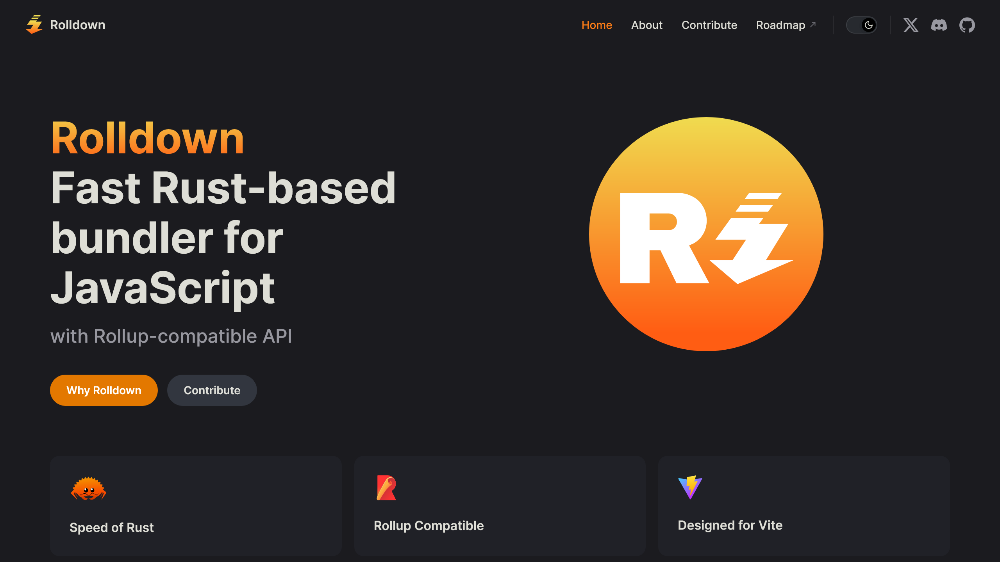

JavaScriptのビルドツール「[Rolldown](https://rolldown.rs/)」がオープンソースとして公開されました。

Rolldownは、高速なビルドツールの[Vite](https://vitejs.dev/)の将来のバンドラーとして開発された、Rust製のJavaScriptバンドラーです。この記事では、Rolldownについて深掘りします。

<blockquote class="twitter-tweet" data-dnt="true" data-theme="dark">
Hello world!  Rolldown is now open source on GitHub: <a href="https://t.co/RnIrJ05MOU">https://t.co/RnIrJ05MOU</a>
&mdash; Rolldown (@rolldown_rs) <a href="https://twitter.com/rolldown_rs/status/1766013359932297275?ref_src=twsrc%5Etfw">March 8, 2024</a></blockquote> 

<!-- toc -->

## Rolldownとは

*画像：[Rolldownの公式サイト](https://rolldown.rs/)*

Rolldownは、JavaScriptコードをひとつのファイルにまとめるためのツール、すなわちバンドラーです。

しかし、Rolldownは単なるバンドラーではありません。Rustで開発されており、**RollupのAPIとプラグインインターフェースに互換性をもつ**一方で、**esbuildのようなネイティブレベルの性能と幅広い機能**を目指しています。

ただし、高度なオプションを利用する場合や特殊なケースでは、Rollupと若干の違いが生じる可能性があるとのことです。

:::note
[Rollup](https://github.com/rollup/rollup)は、豊富なプラグインエコシステムをもつJavaScriptのモジュールバンドラーです。JavaScriptライブラリーやアプリケーションを配布するために、複数のファイルをひとつにまとめられます。

[esbuild](https://github.com/evanw/esbuild)は、極めて高速なビルドを実現するためにGo言語で書かれたビルドツールです。
:::

### Rolldownの必要性

Rolldownの開発の背後には、現在のJavaScriptビルドツールの状況に対する課題意識があります。

Viteは、開発速度を極限まで高速化するためにesbuildを使用していますが、プロダクションビルドに関しては、より適切なバンドリングのためにRollupを使用しています。

このふたつのツールを同時に使用する現状にはいくつかの課題があります。たとえば、開発ビルドとプロダクションビルドの間で挙動の差異が生まれることや、ソースコードを異なるツールが何度も解析・変換することで発生するオーバーヘッドなどです。

これらの課題解決のために、Rolldownが開発されました。

## Rolldownの特徴

### パフォーマンス

Rolldownは、Rust言語で開発されており、Rustのもつ高いパフォーマンスを生かしたバンドリングが期待できます。これにより、大規模なアプリケーションでも高速なビルドが可能になることを目指しています。

### Rollupとの互換性

Rolldownは、現在多くのプロジェクトで使用されているRollupとの互換性を意識し、そのAPIとプラグインインターフェースを可能な限り維持することを目標にしています。これにより、既存のRollupを使用しているプロジェクトもRolldownへの移行がスムーズになることが見込まれます。

### esbuildのような広範な機能

esbuildがもつ高速なビルド速度だけでなく、CommonJSのサポートや``node_modules``の解決、TypeScriptやJSXの変換、Minify化（圧縮）などの機能もサポートされる予定です。これにより、JavaScriptのアプリケーション開発において、よりシームレスな体験を提供します。

## 開発の現状

**Rolldownは現在も活発な開発中のため、プロダクション環境での使用にはまだ適していません**。しかし、オープンソース化されたことで、コミュニティとの協力を通じてさらなる進化が期待されます。

長期的には、Viteを使用する開発者がRolldownを内部的に利用することで、さらなるビルドパフォーマンスの向上や、ビルドプロセスの最適化を経験できるようになることを目指しています。

## まとめ

Rust製のJavaScriptバンドラー「Rolldown」がオープンソースとして公開されました。Rolldownは、高速なビルドツールのViteの将来のバンドラーとして開発された、Rust製のJavaScriptバンドラーです。

Rolldownは、高いパフォーマンスとRollupとの互換性、esbuildのような広範な機能を特徴としています。現在は開発中のため、プロダクション環境での使用にはまだ適していませんが、今後の進化が期待されます。

詳細は[公式サイト](https://rolldown.rs/)や[GitHubリポジトリ](https://github.com/rolldown-rs/rolldown)を参照してください。

## 参考

- [About Rolldown | Rolldown](https://rolldown.rs/about)
